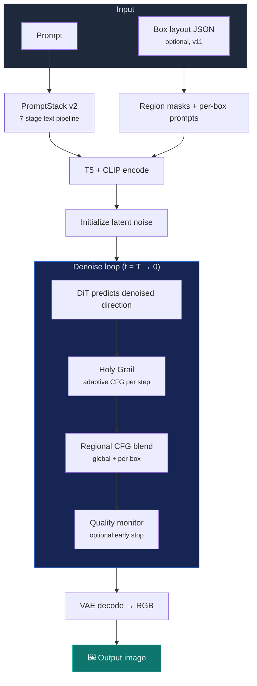

<!-- markdownlint-disable MD033 MD041 -->

<div align="center">


<br/><br/>

<pre style="color: #38bdf8; font-weight: bold; font-size: 14px; line-height: 1.15;">
 ███████╗ ██████╗ ██╗  ██╗
 ██╔════╝██╔═══██╗╚██╗██╔╝
 ███████╗██║   ██║ ╚███╔╝ 
 ╚════██║██║   ██║ ██╔██╗ 
 ███████║╚██████╔╝██╔╝ ██╗
 ╚══════╝ ╚═════╝ ╚═╝  ╚═╝
</pre>

<h3>Train, layout, and deploy custom text-to-image models — with full transparency</h3>

<p>
  <a href="https://www.python.org/"></a>
  <a href="https://pytorch.org/"></a>
  <a href="docs/releases/v11.md"></a>
  <a href="LICENSE"></a>
  
</p>

<p>
  <a href="#quick-start"><strong>Quick Start</strong></a> ·
  <a href="#pipelines"><strong>Pipelines</strong></a> ·
  <a href="#new-in-v11"><strong>v11</strong></a> ·
  <a href="#how-sdx-compares"><strong>Compare</strong></a> ·
  <a href="#documentation"><strong>Docs</strong></a>
</p>

<br/>

</div>

---

## What is SDX?

**SDX** (Stable Diffusion Transformer eXtended) is an open research framework for building **your own** text-to-image systems — not a wrapper around someone else's checkpoint.

You get readable entry points (`train.py`, `sample.py`), every training objective in one place (flow matching, DPO, distillation, GRPO), adaptive inference (Holy Grail), a full quality stack, and **v11** adds **regional box layout control** plus a dedicated research sandbox (`frontier/`).

| Closed APIs | Typical research repos | **SDX** |
|---|---|---|
| No fine-tuning | Partial training scripts | **End-to-end training + sampling** |
| Black box | Scattered docs | **~500 LOC entry points you can read** |
| Vendor lock-in | Hard to reproduce | **Full metadata + 648 tests** |

---

## Pipelines

SDX has two main loops. Each stage below maps to real code you can open and modify.

### Training — `train.py`

**Goal:** teach a DiT to denoise latents conditioned on text (and optionally your layout, style, or preferences).


| Step | What happens | Why it matters |
|------|----------------|----------------|
| **1. Load data** | Image folders or JSON with captions | Same format for fine-tunes and from-scratch runs |
| **2. VAE encode** | RGB → compact latent tensor | Trains 64× faster in latent space |
| **3. Noise @ t** | Flow matching *or* classic diffusion timestep | Flow = simpler math, ~20% faster convergence |
| **4. DiT predict** | Transformer sees noisy latent + text embed | Core learnable model |
| **5. Loss** | MSE on noise/velocity; optional DPO, bridge, GRPO aux | One codebase, many objectives |
| **6. Save** | `best.pt` + training metadata | Reproducible resume and eval |

```bash
python train.py --data-path images/ --flow-matching-training --num-epochs 20
```

**Training modes:** Flow matching · DPO (preference pairs) · Knowledge distillation · GRPO (6 variants)

---

### Sampling — `sample.py`

**Goal:** start from random noise and iteratively denoise into an image that matches your prompt (and optional regional layout).



| Step | What happens | Why it matters |
|------|----------------|----------------|
| **PromptStack** | Cleans, expands, and structures your prompt | Same logic in train *and* sample — no train/serve skew |
| **Box layout** | Normalized regions with local prompts, sketches, refs | Ideogram-style spatial control without a closed API |
| **Encode** | Text → conditioning tensors the DiT attends to | Triple-encoder modes for hard prompts |
| **Denoise loop** | 20–50 steps of guided prediction | Holy Grail adjusts CFG: explore early, lock in late |
| **Regional blend** | Global prediction + per-region predictions merged by mask | Each box gets its own prompt strength |
| **Decode** | Latent → pixels via VAE | Final image |

```bash
# Standard generation
python sample.py --ckpt outputs/best.pt --prompt "a red car on a beach" --out out.png

# v11: regional layout
python sample.py --ckpt outputs/best.pt \
  --box-layout examples/box_layout_sketch.example.json \
  --prompt "fantasy battlefield" --out layout.png
```

---

## New in v11

<table>
<tr>
<td width="33%" valign="top">

**📦 Regional box prompting**

Draw boxes, describe each region, add stroke sketches and reference images.

`utils/generation/regional_box_prompting.py`

</td>
<td width="33%" valign="top">

**🔬 Frontier research**

Experimental layout, guidance, and narrative modules in `frontier/` — try before promoting to production.

[frontier/README.md](frontier/README.md)

</td>
<td width="33%" valign="top">

**🗂 Package restructure**

`innovations/` replaces `advanced_innovations/`. Sampling moves to `diffusion/sampling/` with compat shims.

[innovations/README.md](innovations/README.md)

</td>
</tr>
</table>

[Full v11 release notes →](docs/releases/v11.md)

---

## Quick Start

```bash
git clone https://github.com/Llunarstack/sdx.git && cd sdx
pip install -r requirements.txt

# Generate (demo checkpoint)
python demo.py

# Train on your images/
python train.py --data-path images/ --flow-matching-training --num-epochs 20

# Sample from your checkpoint
python sample.py --ckpt outputs/best.pt --prompt "your prompt" --out result.png
```

Verify install: `python -m toolkit.training.env_health` · Run tests: `pytest tests/ -q`

---

## Core Features

<details open>
<summary><strong>Style Genome</strong> — invent original aesthetics, not copies</summary>

<br/>

Structured 5-axis styles (palette, line, surface, camera, signature) that don't exist in training data.

```bash
python sample.py --ckpt model.pt --prompt "warrior at sunset" \
  --invent-styles 1 --style-chaos-level 0.8
```

</details>

<details>
<summary><strong>Holy Grail + TCIS</strong> — adaptive inference and hard-prompt committee scoring</summary>

<br/>

Holy Grail varies CFG by noise level. TCIS generates multiple candidates and a ViT committee picks the best for text-in-image and layout-heavy prompts.

```bash
python sample.py --ckpt model.pt --prompt "poster with HELLO WORLD text" \
  --holy-grail-preset auto
```

</details>

<details>
<summary><strong>Agentic quality stack (v10+)</strong> — ELIQ, artifacts, drift, explainability</summary>

<br/>

| System | Purpose |
|--------|---------|
| ELIQ | Label-free adaptive quality |
| Artifact detector | GAN/diffusion-specific defects |
| Semantic drift | Stops refinement from corrupting intent |
| Real-time monitor | Early stopping during generation |
| Explainable scoring | Human-readable quality breakdown |

```bash
python sample.py --ckpt model.pt --prompt "portrait" \
  --use-quality-monitoring --explain-quality --out out.png
```

</details>

---

## How SDX Compares

SDX is a **framework you train** — not a single hosted model. This table compares **capabilities you control**, not out-of-the-box photorealism scores.

| Capability | SD 1.5 | SDXL | SD3 | Flux | Ideogram | GPT Image | **SDX** |
|---|:---:|:---:|:---:|:---:|:---:|:---:|:---:|
| Full training pipeline | ◐ | ◐ | ◐ | ◐ | ✗ | ✗ | **✓** |
| Flow / DPO / GRPO native | ✗ | ✗ | ◐ | ◐ | ✗ | ✗ | **✓** |
| Regional box prompting | ext | ext | ✗ | ext | **✓** | ✗ | **✓** |
| Style invention (Genome) | LoRA | LoRA | ✗ | ✗ | presets | ✗ | **✓** |
| Quality + explainability stack | ext | ext | ✗ | ext | ◐ | ✗ | **✓** |
| Self-improving training loops | ✗ | ✗ | ✗ | ✗ | ✗ | ✗ | **✓** |
| Open / self-host weights | ✓ | ✓ | ◐ | ◐ | ✗ | ✗ | **✓** |

◐ = partial / via extensions · ✗ = not available · ✓ = built in

**Closed APIs** still win on zero-setup polish. **SDX** wins when you need your data, your layout control, and every line of the pipeline.

---

## Project Structure

```
sdx/
├── train.py · sample.py          # Entry points
├── models/                       # DiT architecture + conditioning
├── diffusion/                    # Flow matching, schedulers, sampling/
├── innovations/                  # Quality, semantics, control, agentic
├── frontier/                     # Experimental layout + guidance research
├── utils/generation/             # Regional box prompting, CFG helpers
├── data/                         # Datasets, caption processing
└── tests/                        # 648 tests
```

---

## System Requirements

| Component | Minimum | Recommended |
|-----------|---------|-------------|
| Python | 3.10 | 3.11+ |
| PyTorch | 2.0 | 2.11+ |
| GPU VRAM | 16 GB | 24 GB+ |
| Training data | 50 images | 500+ |

---

## Version History

| Version | Focus | Notes |
|---------|-------|-------|
| **[v11](docs/releases/v11.md)** | Box layout, frontier, package restructure | **Current** |
| [v10](docs/releases/v10.md) | Quality & explainability (ELIQ, artifacts) | |
| [v9](docs/releases/v9.md) | GRPO, Superior Stack, Agentic | |
| [v8](docs/releases/v8.md) | Style Genome, PromptStack v2 | |
| [v7–v3](docs/releases/) | CI, acceleration, benchmarks, filtering | |
| [v0.2 / v0.1](docs/releases/v0.2.0.md) | Flow, DPO, core framework | |

---

## Documentation

| Topic | Link |
|-------|------|
| Getting started | [GETTING_STARTED.md](docs/GETTING_STARTED.md) |
| Codebase map | [CODEBASE_GUIDE.md](docs/CODEBASE_GUIDE.md) |
| Holy Grail scheduling | [HOLY_GRAIL_OVERVIEW.md](docs/HOLY_GRAIL_OVERVIEW.md) |
| Frontier research | [frontier/README.md](frontier/README.md) |
| Innovations package | [innovations/README.md](innovations/README.md) |
| v11 release | [docs/releases/v11.md](docs/releases/v11.md) |

---

## Contributing

See [CODEBASE.md](docs/CODEBASE.md). Before submitting:

```bash
ruff check . --fix && ruff format .
pytest tests/ -q
```

Do not add `Co-authored-by` trailers for AI tools — use `scripts/tools/dev/prepare-commit-msg` as a git hook if needed.

---

## Citation

```bibtex
@software{sdx_2026,
  title={SDX: Advanced Text-to-Image Generation Framework},
  author={Llunarstack},
  year={2026},
  version={11.0.0},
  url={https://github.com/Llunarstack/sdx}
}
```

---

<div align="center">

<br/>

**Apache 2.0** · [Issues](https://github.com/Llunarstack/sdx/issues) · [Discussions](https://github.com/Llunarstack/sdx/discussions) · [Releases](https://github.com/Llunarstack/sdx/releases)

<br/>

</div>
