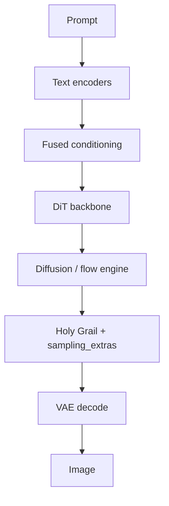

<!-- markdownlint-disable MD033 MD041 -->

<div align="center">

# SDX

### Text-to-image diffusion transformers — research depth, operator clarity

<p align="center">
  <a href="https://www.python.org/"></a>
  <a href="https://pytorch.org/"></a>
  <a href="LICENSE"></a>
  <a href="docs/README.md"></a>
  <a href="LICENSE"></a>
  <a href="docs/README.md"></a>
</p>

<p align="center">
  <a href="#quick-start"><strong>Quick start</strong></a> ·
  <a href="#training">Training</a> ·
  <a href="#sampling">Sampling</a> ·
  <a href="#system-diagram">Diagram</a> ·  <a href="#architecture">Architecture</a> ·
  <a href="#data-formats">Data formats</a> ·
  <a href="#key-docs">Docs</a>
</p>

</div>

---

## System diagram

End-to-end path from prompt to pixels. **Mermaid** renders on [github.com](https://github.com); the **ASCII** diagram shows up in any editor, preview, or `git show`.



```text
                    +-------------+
                    |   Prompt    |
                    +------+------+
                           |
        +------------------+------------------+
        |                  |                  |
   +-----v-----+      +-----v-----+      +-----v-----+
   |  T5-XXL   |      |  CLIP-L   |      | CLIP-bigG |
   +-----+-----+      +-----+-----+      +-----+-----+
        |                  |                  |
        +------------------+------------------+
                           |
                    +------v------+
                    |    Fused    |
                    | conditioning|
                    +------+------+
                           |
                    +------v------+
                    |     DiT     |
                    +------+------+
                           |
                    +------v------+
                    | Diffusion / |
                    | flow engine |
                    +------+------+
                           |
                    +------v------+
                    | Holy Grail  |
                    | + extras    |
                    +------+------+
                           |
                    +------v------+
                    | VAE decode  |
                    +------+------+
                           |
                    +------v------+
                    |    Image    |
                    +-------------+
```

---

SDX is a modular text-to-image training and inference framework built on Diffusion Transformers (DiT). It is designed to be transparent — training lives in `train.py`, sampling in `sample.py`, and every module boundary is explicit.

**What SDX is not:** a fork of Stable Diffusion 1.5 / SDXL graph runtimes (e.g. ComfyUI checkpoint graphs). SDX is a **DiT-centric** training and sampling codebase with its own checkpoints, CLIs, and module layout.

**Core stack:** DiT · T5 / triple text encoders · LoRA/DoRA/LyCORIS routing · VP diffusion + flow matching + bridge/OT objectives · Holy Grail adaptive sampling · optional native CUDA acceleration.

**Source releases:** [v7.1.0](docs/releases/v7.md) (latest) · [v6.0.0](docs/releases/v6.md) · [v5.0.0](docs/releases/v5.md) · [earlier tags](docs/README.md#releases-versioned-source)

---

## Vision

SDX is an **open, modular stack** for **Diffusion Transformers**: training objectives, text conditioning, sampling policies, evaluation hooks, and native accelerators live in explicit modules—not behind a single opaque pipeline. The goal is to **experiment and ship methodology** (schedules, guidance, adapters, hybrid DiT+ViT loops) faster than forking a monolithic UI stack.

This repository is a **framework and reference implementation**, not a promise of a specific pretrained product checkpoint. You can train your own models, plug in your weights, and use the tooling (manifests, benchmarks, readiness checks) to make runs reproducible.

## Roadmap (honest)

| Phase | Focus |
| :--- | :--- |
| **Now (v7.x)** | Dependabot + optional pre-commit; wider basedpyright slice; `inference_stages`; local CI recipe; plus Ruff, doc links, `.editorconfig`, evaluation recipes, `run_artifacts`; Holy Grail / `sampling_extras`, `sdx_native`, book/visual-memory, architecture docs. |
| **Next** | Curated **evaluation recipes** and optional **small public checkpoints** when licensing/training capacity allow—not required to use the code. |
| **Later** | Optional **hosted demos** (HF Space / Pages), APIs, or product packaging—deployment choices on top of this repo. |

## Core innovations (what to highlight)

- **Holy Grail adaptive sampling** — per-step CFG / control / adapter scheduling; see [`docs/HOLY_GRAIL_OVERVIEW.md`](docs/HOLY_GRAIL_OVERVIEW.md).
- **TCIS hybrid loop** — DiT proposals scored by a ViT committee with disagreement-aware ranking; see [`docs/TCIS_OVERVIEW.md`](docs/TCIS_OVERVIEW.md).
- **Triple text encoding** — T5-XXL default; optional CLIP-L + CLIP-bigG for stronger prompt structure.
- **Training objective menu** — VP diffusion, flow matching, bridge auxiliary, OT-style noise–latent coupling—selectable without rewriting the whole trainer.
- **Adapter algebra** — role-aware LoRA / DoRA / LyCORIS stacking with depth routing.
- **Operator tooling** — env health, startup readiness, JSONL/manifest tools, preference / hard-case mining hooks—built for serious iteration, not a one-off script.

**GitHub topics** (for discoverability): add tags such as `diffusion`, `diffusion-models`, `pytorch`, `transformer`, `generative-ai`, `text-to-image`, `dit`, `research` on the repository settings page.

## Try it in one command

```bash
python demo.py
```

Downloads DiT-XL/2 ImageNet weights from HF automatically and generates a sample image. No checkpoint required.

With your own text-conditioned checkpoint:

```bash
python demo.py --ckpt results/.../best.pt --prompt "your prompt" --preset auto
```

---

## Why SDX

Most diffusion repos are either a research prototype that's hard to operate, or a polished wrapper that hides the model stack. SDX sits in the middle.

| | SDX | diffusers DiT | ComfyUI / Forge |
|---|---|---|---|
| Training loop | First-class (`train.py`) | Not included | Not included |
| Sampling controls | Explicit, composable | Wrapped | Node graph |
| Multi-LoRA routing | Role-aware + depth policies | Basic | Plugin-dependent |
| Prompt adherence | Grounding losses + token coverage | None | None |
| Holy Grail adaptive CFG | Built-in | None | None |
| Flow matching | Native | Separate pipeline | None |
| Reproducibility | Run manifests + config snapshots | None | None |
| Native acceleration | CUDA/Rust/C++ with Python fallbacks | Triton/CUDA | Varies |

SDX is for people who want to understand and modify what's happening — not just run it.

---

## What SDX gives you

| Capability | Details |
| :--- | :--- |
| **Core model** | DiT with text conditioning via `models/dit_text.py` |
| **Text encoders** | T5-XXL (default) or triple mode: T5 + CLIP-ViT-L/14 + CLIP-ViT-bigG/14 |
| **Training objectives** | VP diffusion · flow matching · bridge auxiliary · OT noise-latent coupling |
| **Prompt adherence** | Part-aware attention grounding + token coverage auxiliary losses |
| **Adapter system** | Multi-LoRA/DoRA/LyCORIS stacking with per-role budgets and depth routing |
| **Adaptive sampling** | Holy Grail: per-step CFG/control/adapter scheduling + CADS condition annealing |
| **Inference controls** | CFG schedulers · speculative CFG · SAG · reference-token injection · img2img |
| **Hybrid generation loop** | TCIS: DiT(+AR) proposal + ViT committee scoring + iterative self-correction |
| **Reproducibility** | Per-run `run_manifest.json` + `config.train.json` snapshots |
| **Performance** | bf16 · `torch.compile` · gradient checkpointing · DDP-ready |

---

## Gallery

> Generate your own gallery: `python -m scripts.tools make_gallery --ckpt results/.../best.pt`
>
> Images will be saved to `docs/assets/gallery/` and a grid to `docs/assets/gallery/gallery_grid.png`.

**Public demo (optional):** publish docs/assets/gallery/ via **GitHub Pages** or wrap sample.py in a **Hugging Face Space** when you have a license-clear checkpoint to pin—both are deployment choices, not required to use the repo.

---

## Quick start

**GPU requirements:** DiT-XL/2 at 256px needs ~10 GB VRAM for training (batch 8, bf16, grad checkpointing). Run `python -m toolkit.training.env_health` to check your setup and get a memory estimate before starting.

```bash
# Install dependencies
pip install -r requirements.txt

# Check your environment (VRAM estimate, CUDA version, optional deps)
python -m toolkit.training.env_health

# One-command demo (downloads weights automatically)
python demo.py

# Train on your dataset
python train.py --data-path datasets/train --results-dir results

# Sample from a trained checkpoint
python sample.py \
  --ckpt results/000-DiT-XL-2-Text/checkpoints/best.pt \
  --prompt "cinematic portrait, dramatic lighting" \
  --out out.png
```

Verify the setup runs without errors before committing to a full training run:

```bash
python -m scripts.tools quick_test
```

Startup-first readiness report (no training run required):

```bash
python -m scripts.tools startup_readiness \
  --out-json startup_readiness_report.json \
  --out-md startup_readiness_report.md
```

Optional: refresh to CUDA 12.8 wheels:

```bash
pip install --force-reinstall -r requirements-cuda128.txt
```

---

## Training

### Minimal run

```bash
python train.py \
  --data-path datasets/train \
  --model DiT-XL/2-Text \
  --results-dir results
```

### Common training recipes

**Flow matching** (recommended for new checkpoints):

```bash
python train.py \
  --data-path datasets/train \
  --flow-matching-training \
  --results-dir results
```

**Triple text encoders** (T5 + CLIP-L + CLIP-bigG):

```bash
python train.py \
  --data-path datasets/train \
  --text-encoder-mode triple \
  --results-dir results
```

**Part-aware training** with attention grounding:

```bash
python train.py \
  --data-path datasets/train \
  --use-hierarchical-captions \
  --attn-grounding-loss-weight 0.1 \
  --attn-token-coverage-loss-weight 0.05 \
  --results-dir results
```

**Resume from checkpoint:**

```bash
python train.py \
  --data-path datasets/train \
  --resume results/000-DiT-XL-2-Text/checkpoints/best.pt \
  --results-dir results
```

### Multi-GPU (DDP)

SDX uses PyTorch `DistributedDataParallel` and is `torchrun`-compatible:

```bash
# 2 GPUs on one machine
torchrun --nproc_per_node=2 train.py --data-path datasets/train --results-dir results

# 4 GPUs
torchrun --nproc_per_node=4 train.py --data-path datasets/train --global-batch-size 256
```

Note: `--resolution-buckets` is single-GPU only in the current version.

### Loading existing DiT weights

You can fine-tune from the original `facebookresearch/DiT` ImageNet checkpoints:

```bash
# Download and convert automatically
python demo.py --no-download  # skips generation, just converts

# Or convert manually
python -c "
from demo import _download_dit_imagenet, _convert_dit_imagenet_to_sdx
from pathlib import Path
raw = _download_dit_imagenet(Path('pretrained/dit-xl-2-imagenet'))
_convert_dit_imagenet_to_sdx(raw, Path('pretrained/dit-xl-2-imagenet/sdx.pt'))
"

# Fine-tune from the converted checkpoint
python train.py \
  --data-path datasets/train \
  --resume pretrained/dit-xl-2-imagenet/sdx.pt \
  --results-dir results
```

Note: the original DiT uses class conditioning (ImageNet 1000 classes), not text. Fine-tuning for text-to-image requires a dataset with captions and enough steps to shift the conditioning pathway.

### Key training flags

| Flag | Default | Purpose |
| :--- | :--- | :--- |
| `--model` | `DiT-XL/2-Text` | Model variant |
| `--text-encoder-mode` | `t5` | `t5` or `triple` |
| `--flow-matching-training` | off | Use flow objective instead of VP |
| `--bridge-aux-weight` | `0.0` | Bridge regularization weight |
| `--ot-noise-pair-reg` | `0.0` | OT noise-latent coupling |
| `--use-hierarchical-captions` | off | Compose global/local/entity captions |
| `--attn-grounding-loss-weight` | `0.0` | Foreground attention grounding loss |
| `--attn-token-coverage-loss-weight` | `0.0` | Token coverage auxiliary loss |
| `--val-split` | `0.0` | Fraction of data held out for validation |
| `--early-stopping-patience` | `0` | Stop after N val checks with no improvement |
| `--grad-checkpointing` | on | Reduce VRAM at cost of speed |
| `--use-bf16` | on | Mixed precision training |
| `--strict-warnings` | off | Escalate project warnings to errors |

Run `python train.py --help` for the full list.

---

## Sampling

### Basic usage

```bash
python sample.py \
  --ckpt results/.../best.pt \
  --prompt "your prompt here" \
  --out out.png
```

### With adapters and style blending

```bash
python sample.py \
  --ckpt results/.../best.pt \
  --prompt "hero character, dynamic pose, city at night" \
  --lora char.safetensors:0.9:character style.safetensors:0.6:style \
  --lora-stage-policy auto \
  --cfg-scale 6.0 \
  --steps 40 \
  --out out.png
```

Adapter format: `path:scale:role` where role is one of `character`, `style`, `detail`, `composition`, `other`.

Style blending: `--style "anime::0.7 | cinematic::0.3"` — weights are normalised automatically.

### Holy Grail adaptive sampling

Holy Grail applies per-step CFG, control, and adapter scheduling automatically. Enable with a preset:

```bash
python sample.py \
  --ckpt results/.../best.pt \
  --prompt "photoreal portrait, soft window light" \
  --holy-grail-preset auto \
  --out out.png
```

Available presets: `auto` · `balanced` · `photoreal` · `anime` · `illustration` · `aggressive`

`auto` picks a preset heuristically from your prompt, style, and LoRA roles.

Fine-grained control:

```bash
python sample.py \
  --ckpt results/.../best.pt \
  --prompt "..." \
  --holy-grail \
  --holy-grail-cfg-early-ratio 0.72 \
  --holy-grail-cfg-late-ratio 1.0 \
  --holy-grail-cads-strength 0.03 \
  --holy-grail-unsharp-sigma 0.6 \
  --holy-grail-unsharp-amount 0.18 \
  --out out.png
```

See [`diffusion/holy_grail/README.md`](diffusion/holy_grail/README.md) for the full flag reference.

### Flow-trained checkpoint

```bash
python sample.py \
  --ckpt results/.../best.pt \
  --prompt "cinematic sci-fi alley, volumetric fog" \
  --flow-matching-sample \
  --flow-solver heun \
  --cfg-scale 6.0 \
  --steps 32 \
  --out out.png
```

### Key sampling flags

| Flag | Purpose |
| :--- | :--- |
| `--cfg-scale` | Classifier-free guidance scale (default: 7.5) |
| `--steps` | Number of denoising steps |
| `--scheduler` | Timestep schedule: `ddim`, `euler`, `karras_rho`, etc. |
| `--solver` | Solver: `ddim` or `heun` |
| `--negative-prompt` | Negative conditioning text |
| `--lora` | One or more adapters as `path:scale:role` |
| `--lora-stage-policy` | Depth routing: `auto`, `character_focus`, `style_focus`, `balanced` |
| `--flow-matching-sample` | Use flow-matching sampler (for flow-trained checkpoints) |
| `--holy-grail-preset` | Adaptive sampling preset |
| `--width` / `--height` | Output resolution (default: model native) |
| `--seed` | Random seed for reproducibility |

Run `python sample.py --help` for the full list.

### Test-time scaling, beam search, and pick reports (v5)

- **`--pick-best` / `--pick-best auto`**: score multiple candidates (`--num`) and keep the best. With `--pick-vit-ckpt`, auto routes to ViT-aware metrics (`combo_vit_hq`, `combo_count_vit`, `combo_vit_realism`).
- **`--pick-auto-no-clip`**: auto pick with minimal CLIP use (`aesthetic`, `aesthetic_realism`, `ocr`; count mode still uses CLIP inside `combo_count`).
- **Beam search** (`--beam-width`, `--beam-steps`): multi-seed early denoise, score previews, continue the winner. **Micro-beam** (`--beam2-*`): branch again mid-sample. Default beam metric is **`combo_vit_hq`** when `--pick-vit-ckpt` is set.
- **CLIP monitor + rewind** (`--clip-monitor-every`, `--clip-monitor-rewind`): optional CFG boost and soft latent rewind on low CLIP alignment.
- **`--pick-report-json`**: JSON sidecar (beam + final pick scores) for debugging and preference mining toward Diffusion DPO.

```bash
python sample.py --ckpt results/.../best.pt --prompt "..." --num 4 --pick-best auto \
  --pick-vit-ckpt vq/runs/best.pt --pick-report-json out/pick_report.json --out out.png

python sample.py --ckpt results/.../best.pt --prompt "..." --num 1 --steps 40 \
  --beam-width 6 --beam-steps 10 --pick-vit-ckpt vq/runs/best.pt --out out.png
```

**Data curation:** `python -m scripts.tools manifest_enrich` (adds `aesthetic_proxy`, optional `clip_sim`); `python -m scripts.tools data_quality` with `--min-clip-sim` / `--min-aesthetic-proxy`.

**Training:** `python -m scripts.tools train_diffusion_dpo` supports `--dpo-logit-clip` and `--sync-ref-every`. **ViT:** `vit_quality/train.py` accepts `--timm-kwargs` JSON for advanced timm backbones.

### Hybrid TCIS generation loop (recommended for hard prompts)

Use the dispatcher tool to run iterative generation with consensus scoring, optional shape-first scaffold synthesis, and adaptive candidate budgeting:

```bash
python -m scripts.tools hybrid_dit_vit_generate \
  --ckpt results/.../best.pt \
  --vit-ckpt vq/runs/best.pt \
  --prompt "poster with title \"NEON STORM\", exactly 2 characters, full body, cinematic rain" \
  --out outputs/tcis.png \
  --num 6 \
  --iterations 4 \
  --auto-shape-scaffold \
  --pareto-elite \
  --adaptive-num \
  --constraint-anneal up \
  --uncertainty-threshold 0.42 \
  --uncertainty-extra-iterations 1 \
  --elite-memory-size 8 \
  --diversity-bonus-weight 0.05 \
  --reflection-update \
  --self-correct-prompt \
  --pick-best combo_hq
```

TCIS combines:
- DiT(+AR) multi-candidate proposal
- ViT quality/adherence committee scoring
- OCR/count/saturation-aware consensus ranking
- Pareto elite filtering for multi-objective robustness
- prompt reflection updates across iterations
- uncertainty-triggered extra iteration budget (test-time scaling)
- cross-iteration elite memory with diversity bonus (v4)

---

## Architecture

**Diagram:** see [System diagram](#system-diagram) at the top of this README (Mermaid + ASCII). This section is the **operator view**: where files and stages live.

Training vs inference: `train.py` optimises the DiT + objectives path; `sample.py` runs the denoising loop through **Holy Grail** and optional **sampling_extras** hooks.

### Pipeline overview

```text
datasets/train/  -->  train.py  -->  checkpoints/*.pt  -->  sample.py  -->  images
                         |                                      |
                    DiT + objectives                    CFG + scheduler + adapters
```

### Model stack

| Component | Location | Notes |
| :--- | :--- | :--- |
| DiT core | `models/dit_text.py` | Patch embed → DiT blocks → head |
| Text encoders | `utils/modeling/text_encoder_bundle.py` | T5-XXL or T5 + CLIP-L + CLIP-bigG |
| Adapter routing | `models/lora.py` | LoRA/DoRA/LyCORIS, per-role budgets |
| ControlNet | `models/controlnet.py` | Optional image conditioning |
| Diffusion engine | `diffusion/gaussian_diffusion.py` | VP + flow + Holy Grail wiring |
| Flow matching | `diffusion/flow_matching.py` | Rectified-flow objective |
| Holy Grail | `diffusion/holy_grail/` | Adaptive per-step scheduling |
| VAE / RAE | via `diffusers` | Latent encode/decode |

### Training objectives

SDX supports composable training objectives:

- **VP diffusion** — standard epsilon/v/x0 prediction with min-SNR weighting
- **Flow matching** — rectified-flow velocity prediction (`--flow-matching-training`)
- **Bridge auxiliary** — VP bridge regularisation on shuffled latent pairs (`--bridge-aux-weight`)
- **OT coupling** — optimal-transport noise-latent pairing (`--ot-noise-pair-reg`)
- **Part-aware losses** — attention grounding + token coverage (`--attn-grounding-loss-weight`)
- **REPA** — representation alignment with a frozen DINOv2/CLIP encoder (`--repa-weight`)

---

## Data formats

### Folder mode

```text
datasets/train/
  subject_a/
    img_001.png
    img_001.txt      ← caption on line 1, optional negative on line 2
  subject_b/
    img_002.jpg
    img_002.txt
```

```bash
python train.py --data-path datasets/train --results-dir results
```

### JSONL manifest mode

One JSON object per line:

```json
{"image_path": "/abs/path/img.png", "caption": "your caption here"}
```

Extended fields (all optional):

```json
{
  "image_path": "/abs/path/img.png",
  "caption": "main caption",
  "negative_caption": "blurry, low quality",
  "caption_global": "scene description",
  "caption_local": "subject detail",
  "style": "anime",
  "grounding_mask": "relative/path/mask.png",
  "weight": 1.5
}
```

```bash
python train.py --manifest-jsonl /path/to/manifest.jsonl --results-dir results
```

---

## Pretrained weights

Download T5, VAE, and optional LLMs into `pretrained/`:

```bash
# Minimal recommended set (T5-XXL + VAE)
python scripts/download/download_models.py --t5 --vae

# Everything including CLIP and LLM
python scripts/download/download_models.py --all

# Optional advanced stack (LongCLIP, moondream2, Marigold, TAESD, CodeFormer, etc.)
python scripts/download/download_models.py --advanced

# Download a specific LLM for prompt expansion
python scripts/download/download_llm.py --best
```

Weights are resolved automatically at runtime via `utils/modeling/model_paths.py`. If a local `pretrained/<name>` folder exists and is non-empty, it is used; otherwise the Hugging Face hub ID is used as fallback.

| Model | Local path | HF fallback |
| :--- | :--- | :--- |
| T5-XXL | `pretrained/T5-XXL` | `google/t5-v1_1-xxl` |
| CLIP ViT-L/14 | `pretrained/CLIP-ViT-L-14` | `openai/clip-vit-large-patch14` |
| CLIP ViT-bigG/14 | `pretrained/CLIP-ViT-bigG-14` | `laion/CLIP-ViT-bigG-14-laion2B-39B-b160k` |
| DINOv2-Large | `pretrained/DINOv2-Large` | `facebook/dinov2-large` |
| DINOv2-Giant | `pretrained/DINOv2-Giant` | `facebook/dinov2-giant` |
| Gen-Searcher 8B | `pretrained/GenSearcher-8B` | `GenSearcher/Gen-Searcher-8B` |
| ImageReward | `pretrained/ImageReward` | `zai-org/ImageReward` |
| PickScore v1 | `pretrained/PickScore_v1` | `yuvalkirstain/PickScore_v1` |
| GroundingDINO Base | `pretrained/GroundingDINO-Base` | `IDEA-Research/grounding-dino-base` |
| CountGD | `pretrained/CountGD` | `nikigoli/CountGD` |
| TrOCR Large Printed | `pretrained/TrOCR-Large-Printed` | `microsoft/trocr-large-printed` |
| PerceptCLIP IQA | `pretrained/PerceptCLIP_IQA` | `PerceptCLIP/PerceptCLIP_IQA` |
| Depth Anything V2 Large | `pretrained/Depth-Anything-V2-Large` | `depth-anything/Depth-Anything-V2-Large` |
| SAM2 Hiera Large | `pretrained/SAM2-Hiera-Large` | `facebook/sam2-hiera-large-hf` |
| Real-ESRGAN | `pretrained/Real-ESRGAN` | `ai-forever/Real-ESRGAN` |
| LongCLIP-L | `pretrained/LongCLIP-L` | `creative-graphic-design/LongCLIP-L` |
| moondream2 | `pretrained/moondream2` | `vikhyatoolkit/moondream2` |
| Marigold Depth v1.1 | `pretrained/Marigold-Depth-v1-1` | `prs-eth/marigold-depth-v1-1` |
| Marigold Normals v1.1 | `pretrained/Marigold-Normals-v1-1` | `prs-eth/marigold-normals-v1-1` |
| TAESD | `pretrained/TAESD` | `madebyollin/taesd` |
| TAESDXL | `pretrained/TAESDXL` | `madebyollin/taesdxl` |
| CodeFormer | `pretrained/CodeFormer` | `sczhou/CodeFormer` |
| Consistency Decoder | `pretrained/Consistency-Decoder` | `openai/consistency-decoder` |
| ConvNeXtV2 Large | `pretrained/ConvNeXtV2-Large` | `facebook/convnextv2-large-22k-384` |
| LAION Aesthetic v2 | `pretrained/LAION-Aesthetic-v2` | `camenduru/improved-aesthetic-predictor` |
| AnyDoor (reference) | `pretrained/AnyDoor-Ref` | `camenduru/AnyDoor` |
| VAE (default) | `pretrained/sd-vae-ft-mse` | `stabilityai/sd-vae-ft-mse` |

Inspect active local-vs-HF model resolution at any time:

```bash
python -m scripts.tools pretrained_status --out-json pretrained_status.json
```

---

## Repo layout

```text
sdx/
├── train.py                  # Main training entry point
├── sample.py                 # Main inference entry point
├── inference.py              # Lightweight programmatic inference API
│
├── config/                   # TrainConfig dataclass + model build kwargs + defaults
├── data/                     # Dataset loaders, caption processing, bucket sampler
├── diffusion/                # Diffusion engine, schedules, losses, Holy Grail
│   └── holy_grail/           # Adaptive per-step CFG/control/adapter scheduling
├── models/                   # DiT core, attention, adapters, ControlNet, MoE
├── tr/                 # CLI parser + config mapping (split from train loop)
├── utils/                    # Training, generation, prompt, checkpoint, modeling utils
│
├── scripts/                  # Download, setup, and tooling scripts
├── native/                   # Optional C++/CUDA/Rust acceleration
├── vq/              # Canonical ViT quality/adherence package
├── ViT/                      # Legacy compatibility namespace for vit_quality
├── pipelines/                # High-level generation pipelines (book/comic, etc.)
├── toolkit/                  # QoL helpers: env health, seeds, timing, manifest digest
│
├── pretrained/               # Downloaded model weights (gitignored)
├── datasets/                 # Your training data (gitignored)
├── results/                  # Training run outputs (gitignored)
├── docs/                     # All documentation
└── external/                 # Reference repos (DiT, ControlNet, Flux, etc.)
```

Canonical command/import surface uses `vit_quality.*`; legacy `ViT.*` launchers/imports are retained as compatibility shims:

```bash
# Canonical
python -m vit_quality.train --help

# Legacy-compatible (shim)
python -m ViT.train --help
```

---

## Key docs

| Document | What it covers |
| :--- | :--- |
| [`docs/README.md`](docs/README.md) | Full documentation index |
| [`docs/CODEBASE.md`](docs/CODEBASE.md) | Where things live and why |
| [`scripts/tools/README.md`](scripts/tools/README.md) | Tooling index for benchmarking, auto-improve loop, hardcase mining, and ops checks |
| [`docs/HOW_GENERATION_WORKS.md`](docs/HOW_GENERATION_WORKS.md) | End-to-end train → checkpoint → sample walkthrough |
| [`docs/PROMPT_STACK.md`](docs/PROMPT_STACK.md) | Prompt assembly, controls, and filtering |
| [`docs/MODEL_STACK.md`](docs/MODEL_STACK.md) | Model weights, roles, and download paths |
| [`docs/DIFFUSION_LEVERAGE_ROADMAP.md`](docs/DIFFUSION_LEVERAGE_ROADMAP.md) | High-impact quality priorities |
| [`docs/MODEL_WEAKNESSES.md`](docs/MODEL_WEAKNESSES.md) | Known failure modes and mitigations |
| [`docs/COMMON_SHORTCOMINGS_AI_IMAGES.md`](docs/COMMON_SHORTCOMINGS_AI_IMAGES.md) | Common image-gen failure catalog and mitigation mapping |
| [`DEPRECATIONS.md`](DEPRECATIONS.md) | Canonical import paths and active compatibility shims |
| [`docs/QUALITY_AND_ISSUES.md`](docs/QUALITY_AND_ISSUES.md) | Practical quality playbook |
| [docs/TCIS_OVERVIEW.md](docs/TCIS_OVERVIEW.md) | TCIS hybrid loop: DiT propose → ViT critique → consensus rank → optional iterate (Mermaid flow) |
| [docs/research/IMAGE_QUALITY_LEVERS_2026.md](docs/research/IMAGE_QUALITY_LEVERS_2026.md) | **Quality research map** (2025–26 papers → SDX hooks: CFG, flow, data, DPO) |
| [docs/HOLY_GRAIL_OVERVIEW.md](docs/HOLY_GRAIL_OVERVIEW.md) | Holy Grail adaptive sampling: preset → per-step CFG/control/adapters (Mermaid flow) |
| [`docs/TCIS_MODEL.md`](docs/TCIS_MODEL.md) | TCIS hybrid architecture: iterative consensus, shape-first scaffold, and constraint-aware ranking |
| [docs/releases/v5.md](docs/releases/v5.md) | **v5.0.0** release: test-time scaling, beam/pick reports, data curation, DPO/ViT |
| [docs/recipes/quick_eval_holy_grail.md](docs/recipes/quick_eval_holy_grail.md) | **Evaluation recipe**: demo, sample.py + Holy Grail, training manifests |
| [docs/recipes/local_ci_mirror.md](docs/recipes/local_ci_mirror.md) | **Local CI**: same commands as GitHub Actions (Ruff, basedpyright, doc links, pytest). |
| [docs/releases/v6.md](docs/releases/v6.md) | **v6.0.0** release: native fast layer, `sampling_extras`, book/visual memory, IDE tooling, CI |
| [`docs/releases/v4.md`](docs/releases/v4.md) | v4 release: uncertainty-scaled TCIS, elite-memory diversity bonus, and annealed constraint consensus |
| [`docs/releases/v3.md`](docs/releases/v3.md) | v3 source release notes (benchmark + hardcase-aware improvement stack) |
| [`diffusion/holy_grail/README.md`](diffusion/holy_grail/README.md) | Holy Grail adaptive sampling reference |

---

## Contributing

Small, focused PRs are preferred. Docs, tooling, and quality improvements are all welcome.

```bash
# Lint before submitting
ruff check .
ruff format .

# Run the test suite
pytest tests/ -v

# Quick smoke test (no GPU needed)
python -m scripts.tools quick_test
```

See [`CONTRIBUTING.md`](CONTRIBUTING.md) for the full guide.

Good first contributions:
- Tighten docs for one module (`data/`, `diffusion/`, `models/`, `utils/`)
- Add a dry-run test for a new flag in `sample.py` or `train.py`
- Improve a CLI help string
- Profile and document one inference or training path

---

## FAQ

**Is SDX production-ready?**
The codebase is production-oriented in structure and tooling. Output quality depends on your data, training budget, and checkpoint.

**Do I need the native CUDA modules?**
No. All core train/sample paths work without them. Native modules improve specific performance paths (RMSNorm, RoPE, SiLU-gate).

**Is this only for anime/illustration?**
No. The stack is domain-agnostic. Anime/manga is one well-tested path, but the system supports photoreal, illustration, and other domains with appropriate data.

**What is Holy Grail?**
An adaptive sampling system that schedules CFG scale, ControlNet strength, and adapter multipliers per denoising step — rather than keeping them fixed. See [`diffusion/holy_grail/README.md`](diffusion/holy_grail/README.md).

---

## Acknowledgements

SDX builds on ideas from the broader diffusion research community.

- [facebookresearch/DiT](https://github.com/facebookresearch/DiT)
- [lllyasviel/ControlNet](https://github.com/lllyasviel/ControlNet)
- [black-forest-labs/flux](https://github.com/black-forest-labs/flux)
- [Stability-AI/generative-models](https://github.com/Stability-AI/generative-models)

See [`docs/INSPIRATION.md`](docs/INSPIRATION.md) for extended context.

---

## License

Apache 2.0 — see [`LICENSE`](LICENSE).
