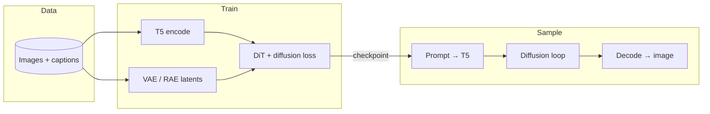
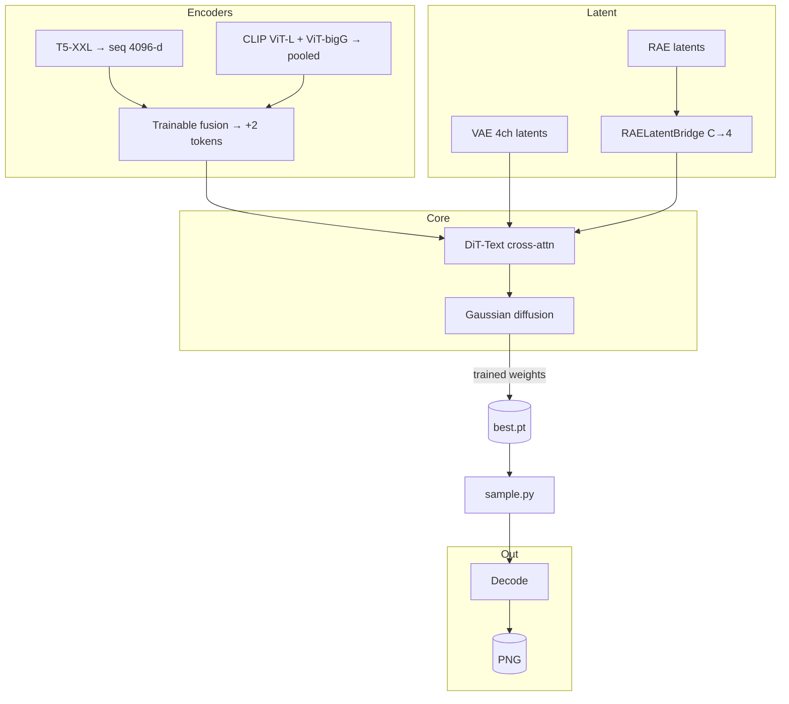

<div align="center">

# SDX

### Diffusion Transformer · Text-to-image · Built for *your* data

**DiT** + **xformers** + optional **block AR** (ACDiT-style), T5 conditioning, and a large set of training & sampling upgrades  
(ViT-Gen, REPA, MoE, MDM, RAE bridge, test-time pick, and more).

No reference image required — quality comes from **the dataset and captions you train on**.

[](https://www.python.org/)
[](https://pytorch.org/)
[](docs/IMPROVEMENTS.md)

[Quick start](#quick-start) · [Train](#training) · [Sample](#sampling) · [Docs hub](#documentation-hub) · [Layout](#project-layout)

</div>

---

## Table of contents

| | |
|:---|:---|
| **Start here** | [Quick start](#quick-start) · [Setup](#setup) · [Data format](#data-format) |
| **Workflows** | [Pipeline showcase](#pipeline-showcase) · [Training](#training) · [Sampling](#sampling) · [JSONL fields](#data-jsonl-fields) |
| **Reference** | [CLI options](#train-cli-quick-reference) · [SD/XL-style features](#sd--sdxl-style-features) · [Extra features](#extra-features) |
| **Deep dives** | [Documentation hub](#documentation-hub) · [Project layout](#project-layout) · [References](#references) |

---

## At a glance

| | What you get |
|:---|:---|
| **Model** | Text-conditioned DiT with cross-attention (**T5**; optional **triple**: T5 + CLIP-L + CLIP-bigG fusion), optional AR blocks, variants up to **Supreme** / **Predecessor** |
| **Training** | Passes-based schedule, EMA, best checkpoint, val + early stopping, bf16, compile, DDP |
| **Sampling** | CFG, schedulers, img2img, inpainting, LoRA, ControlNet-style conditioning, refinement, pick-best |
| **Data** | Folders + `.txt` / `.caption` or **JSONL** manifest; caption emphasis & domain boosts |

### Pipeline showcase

**High level** — data → text + image latents → DiT training → checkpoint → prompt → sample → decode.



**Detailed** — optional paths you can enable (see [docs/MODEL_STACK.md](docs/MODEL_STACK.md) for local `model/` layout).



| Stage | What runs |
|:------|:----------|
| **Text** | Default: T5 only. **Triple mode** (`--text-encoder-mode triple`): T5 sequence + CLIP-L + CLIP-bigG → fused conditioning (checkpoint stores `text_encoder_fusion`). |
| **Image latents** | **VAE** (`AutoencoderKL`) or **RAE** + optional `rae_latent_bridge` for non-4ch latents. |
| **Core** | DiT blocks + diffusion objective; optional REPA (DINOv2/CLIP vision), MDM masks, MoE, size embed, patch-SE. |
| **Sample** | `sample.py` loads config + `ema` weights + optional fusion/RAE bridge; CFG; schedulers; decode. |
| **Extras** | **ViT/** quality & prompt tools; optional **Stable Cascade** script; **Qwen** helper in `utils/llm_client.py` for prompt expansion. |

---

## Highlights

<details open>
<summary><strong>Core training & data</strong></summary>

| Feature | Notes |
|:--------|:------|
| **Passes, not blind epochs** | `--passes N` = N full sweeps over the dataset; optional `--max-steps` cap |
| **Quality of training** | Cosine LR, **EMA**, **save best**, optional **val split + early stopping** |
| **Captions** | `(tag)` / `((tag))` emphasis, `[tag]` de-emphasis, subject-first order |
| **Negative prompts** | Trained as *positive − w×negative* so the model avoids unwanted concepts |
| **JSONL** | `caption`, `negative_*`, `style`, `control_*`, `init_image`, weights, etc. |

</details>

<details open>
<summary><strong>Architecture & speed</strong></summary>

| Feature | Flag / entry |
|:--------|:-------------|
| **Block-wise AR** | `--num-ar-blocks 2` or `4` — see [docs/AR.md](docs/AR.md) |
| **xformers + compile** | Memory-efficient attention; `torch.compile`; bf16; grad checkpointing |
| **Register tokens, RoPE, KV merge** | `--num-register-tokens`, `--use-rope`, `--kv-merge-factor` |
| **SSM mixer** | `--ssm-every-n` replaces every Nth self-attn block |
| **MoE FFN** | `--moe-num-experts`, `--moe-top-k` |
| **REPA** | `--repa-weight` + vision encoder alignment |
| **Size conditioning** | `--size-embed-dim` (PixArt-style H,W → timestep) |
| **Patch SE (zero-init)** | `--patch-se` — starts as identity, learns channel gating |
| **MDM masking** | `--mdm-mask-ratio`, schedules, inpaint-friendly training |

</details>

<details open>
<summary><strong>Sampling & polish</strong></summary>

| Feature | Notes |
|:--------|:------|
| **CFG + rescale / dynamic threshold** | High-CFG friendly; see quality docs |
| **Img2img / inpaint / from-z** | `--init-image`, `--mask`, `--init-latent`, `--inpaint-mode` |
| **LoRA & control** | `--lora`, `--control-image`, style via `--style` or `--auto-style-from-prompt` |
| **Test-time pick** | `--pick-best clip\|edge\|ocr\|combo` with `--num` |
| **RAE bridge** | Checkpoints can carry `rae_latent_bridge` for non-4ch RAE latents |

</details>

> **Model presets** live in `config/model_presets.py`; domain prompts in `config/prompt_domains.py`; caption pipeline in `data/t2i_dataset.py`.

---

## Quick start

```bash
cd sdx
pip install -r requirements.txt
python scripts/tools/quick_test.py    # env smoke test (no dataset)
```

**Train** (single GPU):

```bash
python train.py --data-path /path/to/image_folders --results-dir results
```

**Sample**:

```bash
python sample.py --ckpt results/.../best.pt --prompt "your prompt" --steps 50 --width 256 --height 256 --out out.png
```

**Multi-GPU**:

```bash
torchrun --nproc_per_node=4 train.py --data-path /path/to/data --global-batch-size 256
```

---

## Setup

Run commands from the **repo root** (`sdx/`) so `config`, `data`, `diffusion`, `models`, and `utils` import correctly.

| Topic | Where |
|:------|:------|
| **Hardware & storage** (VRAM tiers, huge booru-scale data) | [docs/HARDWARE.md](docs/HARDWARE.md) |
| **HF gated models** | Copy `.env.example` → `.env`, set `HF_TOKEN` |
| **Download weights** (T5, VAE, optional CLIP/LLM) | `python scripts/download/download_models.py --all` → `model/` |
| **Curated stack** (T5 + CLIP + DINOv2 + Qwen + Cascade, optional) | `python scripts/download/download_revolutionary_stack.py` — see [docs/MODEL_STACK.md](docs/MODEL_STACK.md) |
| **Optional native tools** (Rust/Zig/C++/Go/Node) | [native/README.md](native/README.md) |

**Clone reference repos** (optional, for reading upstream code):

```bash
# Windows (PowerShell)
.\scripts\clone_repos.ps1

# Linux / macOS
./scripts/setup/clone_repos.sh
```

Pulls **DiT**, **ControlNet**, **flux**, **Stability-AI/generative-models** into `external/`. Runtime is **pip-only**; clones are for reference.

---

## Documentation hub

| Doc | Purpose |
|:----|:--------|
| [docs/README.md](docs/README.md) | Index of all docs |
| [docs/IMPROVEMENTS.md](docs/IMPROVEMENTS.md) | Roadmap, quality ideas, what’s implemented |
| [docs/HOW_GENERATION_WORKS.md](docs/HOW_GENERATION_WORKS.md) | Prompt → T5 → DiT → VAE → image |
| [docs/CONNECTIONS.md](docs/CONNECTIONS.md) | Config ↔ data ↔ checkpoint ↔ sample |
| [docs/CIVITAI_QUALITY_TIPS.md](docs/CIVITAI_QUALITY_TIPS.md) | CFG, hands, resolution, oversaturation |
| [docs/AR.md](docs/AR.md) | Block AR: 0 vs 2 vs 4 |
| [docs/STYLE_ARTIST_TAGS.md](docs/STYLE_ARTIST_TAGS.md) | Style / artist extraction |
| [docs/INSPIRATION.md](docs/INSPIRATION.md) | Upstream repos & ideas |
| [docs/FILES.md](docs/FILES.md) | File map |
| [docs/MODEL_STACK.md](docs/MODEL_STACK.md) | Local `model/` paths, triple encoders, Qwen, Stable Cascade |
| [docs/REPRODUCIBILITY.md](docs/REPRODUCIBILITY.md) | Seeds & determinism |

---

## Data format

### Option A — Folder layout

- `data_path` = directory with subdirs; images + sidecar captions.
- For `img.png`, add `img.txt` or `img.caption` (one caption per file).

### Option B — JSONL manifest

One JSON object per line, e.g.  
`{"image_path": "/path/to/img.png", "caption": "your caption"}`

Use `--manifest-jsonl /path/to/manifest.jsonl` (and you can leave `--data-path` empty per your workflow).

### Caption tips

- **Tags**: `1girl, long hair, outdoors` — `()` / `(())` emphasis, `[]` de-emphasis; subject moved forward when possible.
- **Quality tags**: `masterpiece`, `best quality`, `highres` are boosted in the dataset pipeline.
- **Negative**: JSONL `negative_caption` / `negative_prompt`, or **second line** in `.txt`.
- **Domains** (3D, photoreal, interior, etc.): see [docs/DOMAINS.md](docs/DOMAINS.md) and [docs/MODEL_WEAKNESSES.md](docs/MODEL_WEAKNESSES.md).

**Utilities**: `python scripts/tools/ckpt_info.py results/.../best.pt` — config + step info.

---

## Training

**Block AR** (see [docs/AR.md](docs/AR.md)):

```bash
python train.py --data-path /path/to/data --num-ar-blocks 2
```

**Passes (recommended)**:

```bash
python train.py --data-path /path/to/data --passes 3
# Optional cap: --max-steps 100000
```

**Stronger variants**

- **`--model DiT-P/2-Text`** — QK-norm, SwiGLU, AdaLN-Zero, larger default width/depth.
- **`--model DiT-Supreme/2-Text`** — RMSNorm, QK-norm in self+cross, SwiGLU, optional `--size-embed-dim`.

**Triple text encoders** (T5 + CLIP-L + CLIP-bigG with trainable fusion — matches a full `model/` download):

```bash
python train.py --data-path /path/to/data --text-encoder-mode triple
```

Use **`--text-encoder`**, **`--clip-text-encoder-l`**, **`--clip-text-encoder-bigg`** to override paths; empty defaults use `utils/model_paths.py` (local folders first).

**Avoid overtraining** — use val loss as the quality signal:

```bash
python train.py --data-path /path/to/data --passes 5 \
  --val-split 0.05 --val-every 2000 --early-stopping-patience 3
```

Use **`best.pt`** for inference.

**Refinement training**: `--refinement-prob` (default 0.25), `--refinement-max-t`.  
**Inference refinement**: `inference.py` / sample refinements; **`--allow-imperfect`** skips refinement where applicable.

**No xformers**:

```bash
python train.py --data-path /path/to/data --no-xformers
```

---

## Sampling

```bash
python sample.py --ckpt .../best.pt --prompt "..." --negative-prompt "..." \
  --steps 50 --width 256 --height 256 --out out.png
```

**Often-used flags**: `--cfg-scale`, `--cfg-rescale`, `--scheduler ddim|euler`, `--num N`, `--grid`, `--vae-tiling`, `--deterministic`, `--style`, `--auto-style-from-prompt`, `--control-image`, `--lora`, `--init-image`, `--mask`, `--inpaint-mode legacy|mdm`, `--sharpen`, `--contrast`, `--preset`, `--op-mode`, `--pick-best`, `--no-refine`.

**Prompt tricks**: `(word)` / `[word]` emphasis in `sample.py`; `--tags` / `--tags-file`; `--gender-swap`, anatomy/object/scene scales, `--character-sheet` JSON.

**OCR repair**: e.g. `--expected-text "OPEN" --ocr-fix` (pytesseract + masked inpaint).

**Programmatic load**: `python inference.py --ckpt .../best.pt` (use **`--allow-imperfect`** for raw output).

**Book / manga**: [scripts/book/generate_book.py](scripts/book/generate_book.py) — multi-page, optional face/speech-bubble anchoring, OCR.

```powershell
python scripts/book/generate_book.py --ckpt "C:\path\best.pt" `
  --output-dir out_book --book-type manga --model-preset anime `
  --prompts-file pages.txt --expected-text "OPEN" --ocr-fix --ocr-iters 2 `
  --anchor-face --edge-anchor --anchor-speech-bubbles
```

`pages.txt` per-line optional OCR override: `prompt text here|||OPEN`

---

## Data (JSONL) fields

| Field | Description |
|:------|:------------|
| `caption` | Positive prompt (required) |
| `negative_caption` / `negative_prompt` | Concepts to avoid |
| `style` | Style text; blended with `style_strength` |
| `control_image` / `control_path` | Control image path |
| `init_image` / `init_image_path` / `source_image` | Img2img source (with `--img2img-prob` in training) |

For `.txt`: line 1 = positive, line 2 = negative.

---

## Train CLI (quick reference)

<details>
<summary><strong>Click to expand full option table</strong></summary>

| Flag | Default | Description |
|:-----|:--------|:------------|
| `--data-path` | (required*) | Image/caption root |
| `--manifest-jsonl` | None | JSONL manifest |
| `--negative-prompt-weight` | 0.5 | Negative conditioning scale |
| `--model` | DiT-XL/2-Text | DiT-B/L/XL, DiT-P*, DiT-Supreme* |
| `--image-size` | 256 | Train resolution (latent = ÷8) |
| `--global-batch-size` | 128 | Total batch (all GPUs) |
| `--passes` | 0 | Full-dataset passes |
| `--max-steps` | 0 | Step cap |
| `--epochs` | 100 | If passes and max-steps are 0 |
| `--lr` | 1e-4 | Learning rate |
| `--num-workers` | 8 | DataLoader workers |
| `--no-bf16` | False | Disable bf16 |
| `--no-compile` | False | Disable torch.compile |
| `--no-grad-checkpoint` | False | Disable checkpointing |
| `--num-ar-blocks` | 0 | AR: 0, 2, or 4 |
| `--no-xformers` | False | PyTorch SDPA fallback |
| `--min-lr` | 1e-6 | Cosine floor |
| `--refinement-prob` | 0.25 | Refinement training probability |
| `--refinement-max-t` | 150 | Refinement t cap |
| `--no-save-best` | False | Disable best-by-train-loss ckpt |
| `--beta-schedule` | linear | `linear` or `cosine` |
| `--prediction-type` | epsilon | `epsilon` or `v` |
| `--noise-offset` | 0 | SD-style noise offset |
| `--min-snr-gamma` | 5 | Min-SNR weighting (0=off) |
| `--resume` | None | Resume path |
| `--val-split` | 0 | Val fraction |
| `--val-every` | 2000 | Val frequency |
| `--early-stopping-patience` | 0 | Early stop (0=off) |
| `--val-max-batches` | None | Cap val batches |
| `--deterministic` | False | Reproducible mode |
| `--latent-cache-dir` | None | Precomputed latents |
| `--img2img-prob` | 0 | Img2img training prob |
| `--mdm-mask-ratio` | 0 | MDM patch mask ratio |
| `--mdm-mask-schedule` | None | `t,r,...` schedule |
| `--mdm-patch-size` | 2 | MDM patch size |
| `--mdm-min-mask-patches` | 1 | Min masked patches |
| `--no-mdm-loss-only-masked` | False | Loss on full latent |
| `--moe-num-experts` | 0 | MoE experts |
| `--moe-top-k` | 2 | MoE top-k |
| `--moe-balance-loss-weight` | 0 | Router balance loss |
| `--text-encoder` | auto | T5 path or HF id; empty → `model/T5-XXL` if present |
| `--text-encoder-mode` | t5 | `t5` or `triple` (T5 + CLIP-L + CLIP-bigG fusion) |
| `--clip-text-encoder-l` | "" | CLIP-L path (triple mode) |
| `--clip-text-encoder-bigg` | "" | CLIP-bigG path (triple mode) |

</details>

---

## SD / SDXL-style features

| Feature | Flag | Description |
|:--------|:-----|:------------|
| Offset noise | `--noise-offset` | Light/dark balance |
| Min-SNR | `--min-snr-gamma` | Timestep loss balance |
| V-pred | `--prediction-type v` | Velocity parameterization |
| Cosine β | `--beta-schedule cosine` | Alternative noise schedule |

Sampling: DDIM-style loop with cond/uncond; use **`--cfg-rescale`**, **`--num`**, **`--vae-tiling`** as needed.

---

## Extra features

<details>
<summary><strong>Expand: resume, logging, export, ViT-Gen, REPA, RAE, book workflow, …</strong></summary>

| Feature | How |
|:--------|:----|
| Resume | `--resume path/to/best.pt` |
| Sample weights | JSONL `weight` / `aesthetic_score` |
| Crops | `--crop-mode center\|random\|largest_center` |
| Caption dropout schedule | `--caption-dropout-schedule 0,0.2,10000,0.05` |
| Polyak average | `--save-polyak N` |
| WandB / TensorBoard | `--wandb-project`, `--tensorboard-dir` |
| Dry run | `--dry-run` |
| Log samples | `--log-images-every`, `--log-images-prompt` |
| Data quality script | `scripts/tools/data_quality.py` |
| Export ONNX | `scripts/tools/export_onnx.py` |
| Latent cache | `scripts/training/precompute_latents.py` + `--latent-cache-dir` |
| AdaGen / PBFM | `sample.py` `--ada-early-exit`, `--pbfm-edge-boost`, … |
| Test-time pick | `--num 4 --pick-best clip\|edge\|ocr\|combo` |
| RAE bridge | Train with RAE + bridge; ckpt stores `rae_latent_bridge` |
| Safetensors export | `scripts/tools/export_safetensors.py` |

</details>

---

## Styles, ControlNet, LoRA

- **Style**: Train with `--style-embed-dim 4096` (match T5 dim) + `style` in JSONL. Sample: `--style "..." --style-strength 0.7` or `--auto-style-from-prompt`.
- **Control**: Train `--control-cond-dim 1` + control paths in JSONL. Sample: `--control-image ... --control-scale 0.85`.
- **LoRA**: Sample-only: `--lora path.safetensors` or `path.pt:0.6`, optional `--lora-trigger`.

Keep strengths moderate (e.g. style 0.6–0.8, control 0.7–1.0) to avoid muddy blending.

---

## Img2img · inpainting · from-z

| Mode | Usage |
|:-----|:------|
| Img2img | `--init-image path.png --strength 0.75` |
| Inpaint | `--init-image ref.png --mask mask.png` — try `--inpaint-mode mdm` |
| From latent | `--init-latent z.pt --strength 0.8` |
| Output size | `--width` / `--height` (decode/resize) |
| Train img2img | JSONL `init_image` + `--img2img-prob 0.2` |

---

## Project layout

<details>
<summary><strong>Directory tree</strong></summary>

```
sdx/
├── config/           # TrainConfig, model_presets, domains, style artists
├── data/             # Text2ImageDataset, caption_utils
├── diffusion/        # gaussian_diffusion, schedules
├── docs/             # All markdown docs
├── model/            # Downloaded weights (gitignored)
├── models/           # dit_text, attention, controlnet, moe, cascaded_multimodal_diffusion, …
├── ViT/              # Quality scoring, prompt breakdown, EMA/ranking tools
├── native/           # Optional Rust/Zig/C++/Go helpers
├── scripts/
│   ├── setup/        # clone external refs
│   ├── download/     # HF download scripts
│   ├── training/     # precompute_latents, self_improve, …
│   └── tools/        # ckpt_info, export_*, quick_test, …
├── utils/
├── train.py
├── sample.py
├── inference.py
├── requirements.txt
└── README.md
```

</details>

---

## References

| Project | Link | Role |
|:--------|:-----|:-----|
| **DiT** | [facebookresearch/DiT](https://github.com/facebookresearch/DiT) | Transformer diffusion baseline |
| **ControlNet** | [lllyasviel/ControlNet](https://github.com/lllyasviel/ControlNet) | Structural conditioning |
| **FLUX** | [black-forest-labs/flux](https://github.com/black-forest-labs/flux) | Modern diffusion reference |
| **generative-models** | [Stability-AI/generative-models](https://github.com/Stability-AI/generative-models) | SD3-era reference |

Local clones: `external/` after running the clone scripts.

---

## License

Licensed under the **Apache License 2.0**. See [`LICENSE`](LICENSE).

---

<div align="center">

**SDX** — train once on your data, sample with the stack you choose.

[↑ Back to top](#sdx)

</div>
