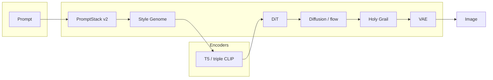

<!-- markdownlint-disable MD033 MD041 -->

<div align="center">

<br/>

```
   ███████╗██████╗ ██╗  ██╗
   ██╔════╝██╔══██╗╚██╗██╔╝
   ███████╗██║  ██║ ╚███╔╝ 
   ╚════██║██║  ██║ ██╔██╗ 
   ███████║██████╔╝██╔╝ ██╗
   ╚══════╝╚═════╝ ╚═╝  ╚═╝
```

### Diffusion transformers for people who want to **see** the stack

**Train · sample · invent styles · adapt per step**

<br/>

<a href="https://www.python.org/"></a>
<a href="https://pytorch.org/"></a>
<a href="docs/releases/v8.md"></a>
<a href="LICENSE"></a>

<br/>

[**Quick start**](#quick-start) · [**What's new in v8**](#whats-new-in-v8) · [**Style Genome**](#style-genome-invent-original-looks) · [**Training**](#training) · [**Sampling**](#sampling) · [**Architecture**](#architecture) · [**Docs**](#documentation)

<br/>

</div>

> **New in [v8](docs/releases/v8.md):** **Style Genome** (invent orthogonal aesthetics, not artist-name clones) · **PromptStack v2** (one pipeline for `sample.py` and training captions) · chaos / fusion / apocalypse modes · native style ops (Rust, CUDA, Go, Mojo) with Python fallbacks.

---

## What's new in v8

| | v7 | **v8** |
|---|:--:|:--:|
| Prompt path | Fragmented helpers | **PromptStack v2** — staged, traceable, training parity |
| Style creativity | Tag / artist banks | **Style Genome** — palette, line, surface, camera, signature axes |
| Exploration | Manual prompts | **`explore_styles`** CLI + JSONL manifests + dedupe |
| Native | General fast paths | **Style pick / merge / manifest** + cleaned `native/cpp/cuda/` layout |

Full notes: **[`docs/releases/v8.md`](docs/releases/v8.md)** · prior: [v7](docs/releases/v7.md) · [v6](docs/releases/v6.md) · [v5](docs/releases/v5.md)

---

## Game-changing capabilities

<table>
<tr>
<td width="33%" valign="top">

### Style Genome

Invent **novel** look systems as structured genomes — compile to pos/neg/style-channel text. Modes from `normal` to `apocalypse`; fusion, hypermutation, and chaos presets.

```bash
python -m scripts.tools explore_styles \
  --prompt "samurai at dusk" --mode chimera --chaos 0.9
```

</td>
<td width="33%" valign="top">

### PromptStack v2

One ordered pipeline: intelligence → genome → guidance → negatives → controls → clauses → filter. **Same guidance stage** in training via `caption_utils`.

```bash
python -m scripts.tools preview_prompt_stack \
  --prompt "portrait, rim light" --json
```

</td>
<td width="33%" valign="top">

### Holy Grail + TCIS

Per-step **CFG / control / adapter** scheduling — not fixed constants. **TCIS** loops DiT proposals through a ViT committee for hard prompts.

```bash
python sample.py ... --holy-grail-preset auto
python -m scripts.tools hybrid_dit_vit_generate ...
```

</td>
</tr>
</table>

---

## System diagram



<details>
<summary>ASCII fallback (any editor)</summary>

```text
  Prompt → PromptStack v2 → Style Genome? → T5/triple → DiT → diffusion/flow
         → Holy Grail + extras → VAE → image
```

</details>

---

## Why SDX

SDX is a **DiT-centric** research framework — not a ComfyUI checkpoint graph fork. Training lives in `train.py`, sampling in `sample.py`, boundaries are explicit.

| | SDX | diffusers DiT | ComfyUI |
|---|:---:|:---:|:---:|
| Training loop | ● | ○ | ○ |
| Flow + VP + bridge objectives | ● | partial | ○ |
| Multi-LoRA role routing | ● | basic | plugins |
| Holy Grail adaptive CFG | ● | ○ | ○ |
| Style Genome invention | ● | ○ | ○ |
| Run manifests + config snapshots | ● | ○ | ○ |

---

## Quick start

```bash
pip install -r requirements.txt
python -m toolkit.training.env_health    # VRAM + CUDA check
python demo.py                           # one-command image (HF weights)
python -m scripts.tools quick_test       # smoke (no GPU)
```

**Your checkpoint:**

```bash
python sample.py --ckpt results/.../best.pt \
  --prompt "cinematic portrait, dramatic lighting" --out out.png
```

---

## Style Genome — invent original looks

A **genome** is an invented aesthetic bundle (not “in the style of Artist X”):

| Axis | Example |
|------|---------|
| palette | oxidized copper, tea-stained paper |
| line | broken contour, dry brush |
| surface | chalk dust, cracked glaze |
| camera | worm's-eye, tilted horizon |
| signature | recurring motif, border bleed |

**Single image with invention:**

```bash
python sample.py --ckpt results/.../best.pt \
  --prompt "lone figure in rain" \
  --invent-styles 1 --style-inventor-mode insane \
  --style-chaos-level 0.8 --out out.png
```

**Explore many genomes → manifest → batch:**

```bash
python -m scripts.tools explore_styles \
  --prompt "void priest in cathedral" --genomes 6 --mode apocalypse

python sample.py --ckpt ... --explore-styles-insane --num 4 --out dir/
```

**Insane shortcut on sample.py:** `--explore-styles-insane` (invents + chaos clauses + multi-candidate pick).

Modules: `utils/prompt/style_genome.py`, `style_inventor.py`, `style_explore.py`, `style_genome_chaos.py` · stack stage: `utils/prompt/stack/stages/style_genome.py`

---

## Training

```bash
python train.py --data-path datasets/train --results-dir results
```

**Flow matching (recommended for new runs):**

```bash
python train.py --data-path datasets/train --flow-matching-training --results-dir results
```

**Triple encoders (T5 + CLIP-L + CLIP-bigG):**

```bash
python train.py --data-path datasets/train --text-encoder-mode triple --results-dir results
```

**Multi-GPU:**

```bash
torchrun --nproc_per_node=2 train.py --data-path datasets/train --results-dir results
```

| Flag | Purpose |
|------|---------|
| `--flow-matching-training` | Rectified-flow objective |
| `--bridge-aux-weight` | Bridge regularization |
| `--use-hierarchical-captions` | Global / local / entity captions |
| `--attn-grounding-loss-weight` | Part-aware attention grounding |
| `--grad-checkpointing` | Lower VRAM (default on) |

`python train.py --help` for the full list · [TRAINING_TEXT_TO_PIXELS.md](docs/TRAINING_TEXT_TO_PIXELS.md)

---

## Sampling

```bash
python sample.py --ckpt results/.../best.pt --prompt "..." \
  --holy-grail-preset auto --cfg-scale 6 --steps 40 --out out.png
```

**Adapters:** `--lora path:scale:role` · **styles:** `--style "anime::0.7 | cinematic::0.3"`

**Flow-trained ckpt:** add `--flow-matching-sample --flow-solver heun`

**Pick-best / beam:** `--num 4 --pick-best auto --pick-vit-ckpt vq/runs/best.pt`

**Hard prompts (TCIS):**

```bash
python -m scripts.tools hybrid_dit_vit_generate \
  --ckpt results/.../best.pt --vit-ckpt vq/runs/best.pt \
  --prompt "poster title NEON STORM, exactly 2 characters" \
  --num 6 --iterations 4 --pick-best combo_hq --out out.png
```

See [Holy Grail README](diffusion/holy_grail/README.md) · [TCIS overview](docs/TCIS_OVERVIEW.md)

---

## Architecture

| Layer | Location |
|-------|----------|
| DiT + text | `models/dit_text.py` |
| Encoders | `utils/modeling/text_encoder_bundle.py` |
| PromptStack | `utils/prompt/stack/` |
| Style Genome | `utils/prompt/style_*.py` |
| Diffusion / flow | `diffusion/` |
| Holy Grail | `diffusion/holy_grail/` |
| Native (optional) | `native/` → [native/README.md](native/README.md) |

```text
datasets/ → train.py → checkpoints/ → sample.py → images
```

---

## Data formats

**Folder mode** — `image.png` + `image.txt` (caption line 1, optional negative line 2).

**JSONL** — one object per line:

```json
{"image_path": "/path/img.png", "caption": "...", "negative_caption": "blurry"}
```

```bash
python train.py --manifest-jsonl data/train.jsonl --results-dir results
```

---

## Repo layout

```text
sdx/
├── train.py · sample.py · demo.py · inference.py
├── config/ · data/ · diffusion/ · models/ · utils/
│   └── utils/prompt/stack/     # PromptStack v2
│   └── utils/prompt/style_*    # Style Genome
├── scripts/tools/              # explore_styles, preview_prompt_stack, …
├── native/                     # Rust · Zig · C · C++ · cuda · Go · Mojo
├── vit_quality/                # ViT quality / TCIS scoring
├── pipelines/book_comic/       # sequential art
└── docs/                       # full index → docs/README.md
```

---

## Documentation

| Doc | Topic |
|-----|--------|
| [docs/README.md](docs/README.md) | Full index |
| [docs/releases/v8.md](docs/releases/v8.md) | **v8 release notes** |
| [docs/PROMPT_STACK.md](docs/PROMPT_STACK.md) | PromptStack v2 stages |
| [docs/HOLY_GRAIL_OVERVIEW.md](docs/HOLY_GRAIL_OVERVIEW.md) | Adaptive sampling |
| [docs/TCIS_OVERVIEW.md](docs/TCIS_OVERVIEW.md) | Hybrid DiT + ViT loop |
| [docs/HOW_GENERATION_WORKS.md](docs/HOW_GENERATION_WORKS.md) | Train → sample walkthrough |
| [native/README.md](native/README.md) | Native build + layout |
| [scripts/tools/README.md](scripts/tools/README.md) | CLI tooling index |

---

## Pretrained weights

```bash
python scripts/download/download_models.py --t5 --vae
python -m scripts.tools pretrained_status
```

Local `pretrained/<name>` overrides Hugging Face hub IDs — see [MODEL_STACK.md](docs/MODEL_STACK.md).

---

## Contributing

```bash
ruff check . && ruff format .
pytest tests/ -m "not cuda and not slow" -q
python -m scripts.tools quick_test
```

[CONTRIBUTING.md](CONTRIBUTING.md) · mirror CI: [docs/recipes/local_ci_mirror.md](docs/recipes/local_ci_mirror.md)

---

## FAQ

**Is this production-ready?**  
Structure and tooling are operator-grade; image quality depends on your data and training budget.

**Need native CUDA/Rust?**  
No — Python fallbacks cover style ops, manifest stats, and pick-best paths.

**v7 vs v8?**  
v7 = CI + eval + security baseline. v8 = **Style Genome + PromptStack v2 + native style layer** on top of that baseline.

---

## Acknowledgements

Built on ideas from [DiT](https://github.com/facebookresearch/DiT), [ControlNet](https://github.com/lllyasviel/ControlNet), [FLUX](https://github.com/black-forest-labs/flux), and the broader diffusion research community — [INSPIRATION.md](docs/INSPIRATION.md).

## License

Apache 2.0 — [LICENSE](LICENSE)
