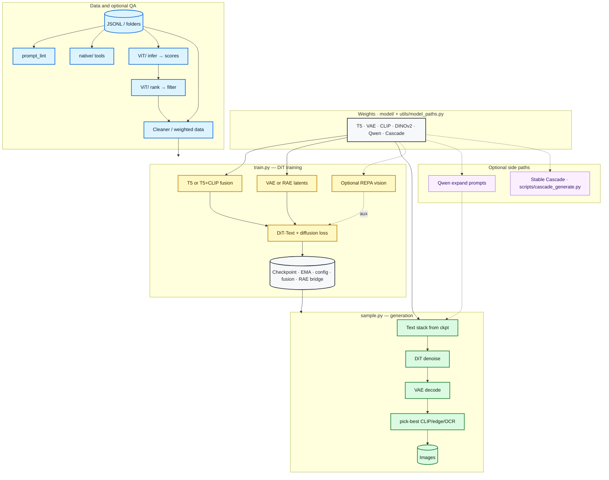
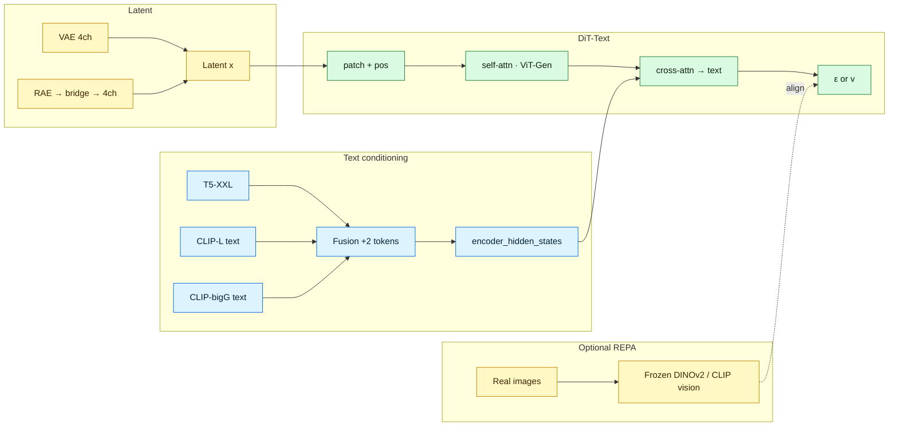
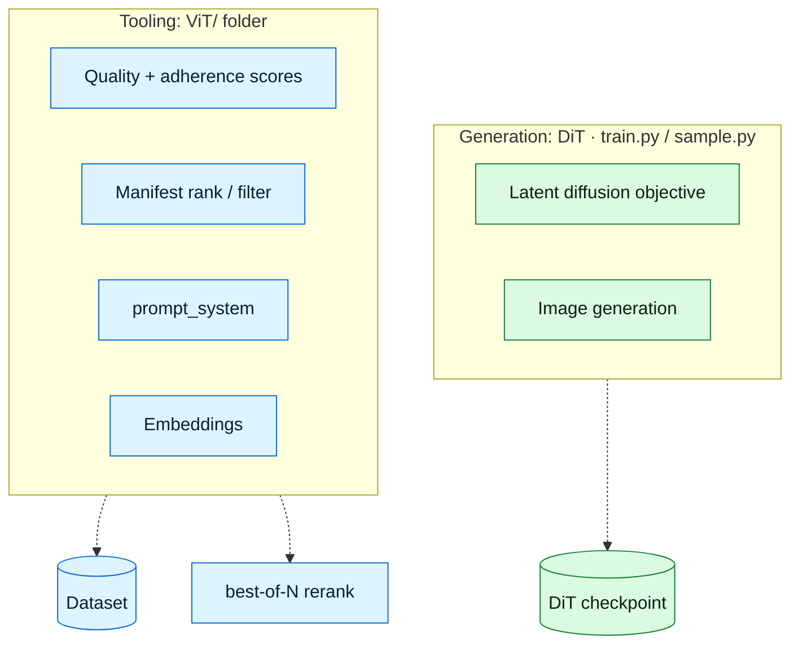

<!-- markdownlint-disable MD033 MD041 -->

<div align="center">

# SDX

### Text-to-image **Diffusion Transformer** · Your data, your captions

<p align="center">
  <a href="https://www.python.org/"></a>
  <a href="https://pytorch.org/"></a>
  <a href="LICENSE"></a>
  <a href="docs/IMPROVEMENTS.md"></a>
</p>

**Stack:** DiT · xformers · T5 (optional **triple:** T5 + CLIP-L + CLIP-bigG) · optional block **AR** · REPA · MoE · MDM · RAE bridge · test-time **pick-best**

*No reference image required — quality follows what you train on.*

**What SDX is:** a **modular diffusion-transformer stack** for **dataset-faithful** text-to-image research—clean separation of data, diffusion math, DiT, sampling, and tooling—so you can experiment with modern ideas (fusion encoders, MoE, AR blocks, REPA, test-time rerank) without rewriting a pipeline from scratch.

| Start | Train | Timesteps | Sample | Docs |
| :---: | :---: | :---: | :---: | :---: |
| [Quick start](#quick-start) | [Training](#training) | [Timestep sampling](#modern-diffusion-training-timestep-sampling) | [Sampling](#sampling) | [Doc hub](#documentation-hub) |

</div>

---

> **New here?** Run `python scripts/tools/quick_test.py`, skim [Architecture and pipeline](#architecture-and-pipeline), then open [Quick start](#quick-start).

<details>
<summary><strong>Table of contents</strong></summary>

| Section | Links |
| :--- | :--- |
| **Context** | [Status & expectations](#project-status-compute-and-expectations) · [Pipelines (2 lines)](pipelines/README.md) |
| **Start** | [Quick start](#quick-start) · [Setup](#setup) · [Data format](#data-format) |
| **Workflow** | [Pipeline](#architecture-and-pipeline) · [Training](#training) · [Timestep sampling](#modern-diffusion-training-timestep-sampling) · [Sampling](#sampling) · [JSONL fields](#data-jsonl-fields) |
| **Reference** | [Train CLI](#train-cli-quick-reference) · [SDXL-style features](#sdxl-inspired-training-features) · [Extra features](#extra-features) |
| **Deep dives** | [Documentation hub](#documentation-hub) · [2026 landscape](docs/LANDSCAPE_2026.md) · [Project layout](#project-layout) · [Contributing](#contributing--community) · [References](#references) |

</details>

---

## Project status, compute, and expectations

**Honest framing:** SDX is built as a **research-grade pipeline and architecture blueprint**, not a guarantee that every configuration has a pretrained checkpoint or benchmark table in-repo. Serious text-to-image training usually needs **multi-GPU clusters**, **large VRAM**, and **lots of storage** for data and latents. If you don’t have that yet, you’re not behind—you’re in the same boat as many solo and academic setups.

| Topic | What to expect |
| :--- | :--- |
| **What this repo optimizes for** | Modular **code**: `train.py` / `sample.py`, `GaussianDiffusion`, DiT variants, encoders, dataset tools, optional ViT QA—so “future you” or a lab can plug in compute without redesigning the stack. |
| **What we don’t claim** | A single **official** base model, fixed **leaderboard** numbers, or a gallery of **example images** for every variant—unless someone trains and publishes them (contributions welcome). |
| **Credibility without a huge model** | The implementation is **runnable**: `quick_test`, unit tests, `dit_variant_compare`, timestep previews, docs. A **tiny** training run (synthetic data + `DiT-B`) proves the full loop—see **[docs/SMOKE_TRAINING.md](docs/SMOKE_TRAINING.md)** and [docs/HARDWARE.md](docs/HARDWARE.md). |

### If you only have a consumer GPU (e.g. ~16 GB VRAM)

You can still get value **without** training a billion-parameter model:

1. **Smoke / micro-runs** — `python scripts/tools/make_smoke_dataset.py --out data/smoke_tiny` then `train.py` with **`DiT-B/2-Text`**, `--dry-run` or `--max-steps 5` ([docs/SMOKE_TRAINING.md](docs/SMOKE_TRAINING.md)).
2. **Frozen encoders + train DiT only** — Use off-the-shelf VAE + T5 (and CLIP if triple mode); memory goes mostly to the DiT forward, not retraining encoders.
3. **Infrastructure first** — Dataset JSONL, `scripts/tools/*`, ViT ranking, export scripts: these pay off before you ever touch a cluster.
4. **Memory tricks** (typical across diffusion repos): gradient checkpointing, mixed precision (bf16), smaller batch + accumulation, smaller `image-size`, fewer simultaneous options (MoE/REPA off until needed).

### Roadmap shape (not a promise of dates)

| Phase | Focus |
| :--- | :--- |
| **Now** | Architecture clarity, docs, small tests, optional micro-training. |
| **Next** | Run **[docs/SMOKE_TRAINING.md](docs/SMOKE_TRAINING.md)** on your GPU when ready; iterate from there. |
| **Later** | Serious training when you have **GPU time**, **storage**, and a **dataset** you trust. |

**Want to help?** You don’t need a cluster—see **[Contributing & community](#contributing--community)** (docs, tests, tooling, and small reproducible runs all count).

---

## Overview

| Pillar | What you get |
|:-------|:-------------|
| **Model** | Text-conditioned **DiT** + cross-attention (**T5**; optional **triple** fusion), optional **AR** blocks, up to **Supreme** / **Predecessor** variants |
| **Training** | Pass-based schedule, **EMA**, **best** checkpoint, val + early stopping, bf16, compile, **DDP**, optional **non-uniform timestep sampling** (SD3-style / high-noise bias) |
| **Sampling** | CFG, schedulers, img2img, inpainting, LoRA, Control-style conditioning, refinement, **pick-best** |
| **Data** | Folders + `.txt` / `.caption` or **JSONL**; caption emphasis & domain boosts |

---

## Architecture and pipeline

**End-to-end:** `data/` and optional manifest → `train.py` (uses `config/`, `diffusion/`, `models/`, `utils/`) → **checkpoint** → `sample.py` → **images**. Downloaded weights live in `model/` (gitignored); paths resolve via `utils/model_paths.py`.

**Two training / product lines** (same engine, different docs and workflows): **[pipelines/image_gen/](pipelines/image_gen/README.md)** (general T2I) and **[pipelines/book_comic/](pipelines/book_comic/README.md)** (books, comics, manga). See **[pipelines/README.md](pipelines/README.md)**.

<pre align="center">
┌────────────┐    ┌────────────┐    ┌────────────┐    ┌────────────┐    ┌────────────┐
│ <b>Data</b>      │───▶│ <b>train.py</b> │───▶│ <b>Checkpoint</b>│───▶│ <b>sample.py</b> │───▶│ <b>Images</b>    │
│ JSONL, QA  │    │ DiT, loss  │    │ EMA, cfg   │    │ CFG, VAE   │    │ grid, pick │
└────────────┘    └────────────┘    └────────────┘    └────────────┘    └────────────┘
</pre>

### Repository map

| Area | Role | Consumed by |
|:-----|:-----|:------------|
| **`config/`** | `TrainConfig`, `get_dit_build_kwargs`, presets | `train.py`, `sample.py`, checkpoints |
| **`data/`** | `Text2ImageDataset`, captions | `train.py` |
| **`diffusion/`** | `GaussianDiffusion`, schedules, loss weights, **`timestep_sampling`**, respacing | `train.py`, `sample.py` |
| **`models/`** | DiT, ControlNet, MoE, RAE bridge, optional cascaded / multimodal **scaffolds** | `train.py`, `sample.py`, tests |
| **`utils/`** | Checkpoint load, text-encoder bundle, REPA helpers, QC, **pick-best**, metrics | `train.py`, `sample.py`, scripts |
| **`ViT/`** | Standalone scoring / prompt tools (**not** the DiT generator) | CLI, optional dataset QA |
| **`scripts/`** | Downloads, tools, Cascade stub | Ops & CI |
| **`pipelines/`** | **image_gen** vs **book_comic** docs + book workflow script (no second DiT copy) | Contributors, multi-page / OCR workflows |
| **`native/`** | Fast JSONL helpers (Rust, Go, …) | Optional; not imported by training by default |
| **`model/`** | Downloaded HF weights | Paths via `utils/model_paths.py` |

Full index → **[docs/FILES.md](docs/FILES.md)**

### Local weights (`model/`)

| Role | Typical folder / fallback |
|:-----|:--------------------------|
| T5-XXL | `model/T5-XXL` or `google/t5-v1_1-xxl` |
| CLIP (L + bigG) | `model/CLIP-ViT-L-14`, `model/CLIP-ViT-bigG-14` or HF ids |
| DINOv2 (REPA) | `model/DINOv2-Large` or `facebook/dinov2-large` |
| Qwen LLM | `model/Qwen2.5-14B-Instruct` (optional prompt expansion) |
| Stable Cascade | `model/StableCascade-Prior`, `model/StableCascade-Decoder` (optional; **not** DiT) |

**Download:** [docs/MODEL_STACK.md](docs/MODEL_STACK.md) · `scripts/download/download_models.py` · `scripts/download/download_revolutionary_stack.py`

### Who is who (easy to confuse)

| Name | What it is | Where |
|:-----|:-----------|:------|
| **DiT** | **Diffusion Transformer** — **generator**: patch latents, predict ε/v, **cross-attend text** | `models/dit_text.py`, `train.py`, `sample.py` |
| **ViT-style blocks inside DiT** | **ViT-Gen** (registers, RoPE, KV-merge, SSM…) — still **one DiT** | `--num-register-tokens`, `--use-rope`, … |
| **REPA vision encoder** | **Frozen** DINOv2 / CLIP **image** encoder — aux alignment loss | `--repa-weight`, `--repa-encoder-model` |
| **`ViT/` package** | **Separate** timm ViT for **QA**, ranking, embeddings — **not** DiT | `ViT/train.py`, `ViT/infer.py` |
| **Text triple (T5 + CLIP)** | **Text** towers fused → conditions **DiT** | `--text-encoder-mode triple` |

---

### Diagram 1 — Full stack (data → train → sample)



### Diagram 2 — Inside training (text + latent + DiT)



### Diagram 3 — `ViT/` vs DiT (different jobs)



### Stage cheat sheet

| Stage | What runs |
|:------|:----------|
| **Config** | **`config/train_config.py`**: `TrainConfig` + **`get_dit_build_kwargs`** → DiT build args |
| **Data** | **`data/t2i_dataset.py`**: folders or JSONL, emphasis, latent cache |
| **Diffusion** | **`diffusion/`**: `GaussianDiffusion`, schedules, DDIM, CFG rescale, **`respace`**, loss weights |
| **Text → DiT** | Default **T5**. **Triple**: T5 + CLIP-L + CLIP-bigG → **`text_encoder_fusion`** in ckpt |
| **Image → latent** | **VAE** or **RAE** + **`RAELatentBridge`** when channels ≠ 4 |
| **DiT core** | **`models/dit_text.py`**: patch, self/cross-attn, ViT-Gen, **MoE**, **MDM** |
| **REPA** | Frozen **vision** encoder — auxiliary alignment |
| **`ViT/` tools** | Scoring / rank / prompts — **not** the generator |
| **Sample** | **`sample.py`**: CFG, decode, **`utils/test_time_pick`** |
| **API** | **`inference.py`**: programmatic sampling |
| **Other** | **Qwen** (`utils/llm_client.py`); **Cascade** (`scripts/cascade_generate.py`) — separate from DiT forward |

**Optional scaffolds** (not default `train.py`): `diffusion/cascaded_multimodal_pipeline.py`, `models/cascaded_multimodal_diffusion.py`, `models/native_multimodal_transformer.py` — see [docs/FILES.md](docs/FILES.md).

| See also | Doc |
| :--- | :--- |
| **Weights** | [docs/MODEL_STACK.md](docs/MODEL_STACK.md) |
| **Every file** | [docs/FILES.md](docs/FILES.md) |
| **Config, checkpoint, sample** | [docs/CONNECTIONS.md](docs/CONNECTIONS.md) |

---

## Highlights

<details open>
<summary><strong>Core training & data</strong></summary>

| Feature | Notes |
|:--------|:------|
| **Passes, not blind epochs** | `--passes N` = N full sweeps over the dataset; optional `--max-steps` cap |
| **Quality of training** | Cosine LR, **EMA**, **save best**, optional **val split + early stopping** |
| **Captions** | `(tag)` / `((tag))` emphasis, `[tag]` de-emphasis, subject-first order |
| **Negative prompts** | Trained using cond / uncond style signal so the model learns to avoid concepts in the negative prompt |
| **JSONL** | `caption`, `negative_*`, `style`, `control_*`, `init_image`, weights, etc. |

</details>

<details open>
<summary><strong>Architecture & speed</strong></summary>

| Feature | Flag / entry |
|:--------|:-------------|
| **Block-wise AR** | `--num-ar-blocks 2` or `4` — see [docs/AR.md](docs/AR.md) |
| **xformers + compile** | Memory-efficient attention; `torch.compile`; bf16; grad checkpointing |
| **Register tokens, RoPE, KV merge** | `--num-register-tokens`, `--use-rope`, `--kv-merge-factor` |
| **SSM mixer** | `--ssm-every-n` replaces every Nth self-attn block |
| **MoE FFN** | `--moe-num-experts`, `--moe-top-k` |
| **REPA** | `--repa-weight` + vision encoder alignment |
| **Size conditioning** | `--size-embed-dim` (PixArt-style H,W → timestep) |
| **Patch SE (zero-init)** | `--patch-se` — starts as identity, learns channel gating |
| **MDM masking** | `--mdm-mask-ratio`, schedules, inpaint-friendly training |

</details>

<details open>
<summary><strong>Sampling & polish</strong></summary>

| Feature | Notes |
|:--------|:------|
| **CFG + rescale / dynamic threshold** | High-CFG friendly; see quality docs |
| **Img2img / inpaint / from-z** | `--init-image`, `--mask`, `--init-latent`, `--inpaint-mode` |
| **LoRA & control** | `--lora`, `--control-image`, style via `--style` or `--auto-style-from-prompt` |
| **Test-time pick** | `--pick-best clip\|edge\|ocr\|combo` with `--num` |
| **RAE bridge** | Checkpoints can carry `rae_latent_bridge` for non-4ch RAE latents |

</details>

> **Model presets** live in `config/model_presets.py`; domain prompts in `config/prompt_domains.py`; caption pipeline in `data/t2i_dataset.py`.

---

## Quick start

| Step | Command |
|:-----|:--------|
| **1 · Env** | `pip install -r requirements.txt` |
| **2 · Smoke** | `python scripts/tools/quick_test.py` |
| **3 · Train** | `python train.py --data-path ... --results-dir results` |
| **4 · Sample** | `python sample.py --ckpt .../best.pt --prompt "..." --out out.png` |

```bash
cd sdx
pip install -r requirements.txt
python scripts/tools/quick_test.py    # env smoke test (no dataset)
```

**Train** (single GPU):

```bash
python train.py --data-path /path/to/image_folders --results-dir results
```

**Sample**:

```bash
python sample.py --ckpt results/.../best.pt --prompt "your prompt" --steps 50 --width 256 --height 256 --out out.png
```

**Multi-GPU**:

```bash
torchrun --nproc_per_node=4 train.py --data-path /path/to/data --global-batch-size 256
```

---

## Setup

Run commands from the **repo root** (`sdx/`) so `config`, `data`, `diffusion`, `models`, and `utils` import correctly.

| Topic | Where |
|:------|:------|
| **Code layout & conventions** | [docs/CODEBASE.md](docs/CODEBASE.md) · [CONTRIBUTING.md](CONTRIBUTING.md) |
| **Format / lint** | `pip install ruff` → `ruff format .` · `ruff check .` (see `pyproject.toml`) |
| **Hardware & storage** (VRAM tiers, huge booru-scale data) | [docs/HARDWARE.md](docs/HARDWARE.md) |
| **HF gated models** | Copy `.env.example` → `.env`, set `HF_TOKEN` |
| **Download weights** (T5, VAE, optional CLIP/LLM) | `python scripts/download/download_models.py --all` → `model/` |
| **Curated stack** (T5 + CLIP + DINOv2 + Qwen + Cascade, optional) | `python scripts/download/download_revolutionary_stack.py` — see [docs/MODEL_STACK.md](docs/MODEL_STACK.md) |
| **Optional native tools** (Rust/Zig/C++/Go/Node) | [native/README.md](native/README.md) |

**Clone reference repos** (optional, for reading upstream code):

```bash
# Windows (PowerShell)
.\scripts\setup\clone_repos.ps1

# Linux / macOS
./scripts/setup/clone_repos.sh
```

Pulls **DiT**, **ControlNet**, **flux**, **Stability-AI/generative-models** into `external/`. Runtime is **pip-only**; clones are for reference.

---

## Documentation hub

| Doc | Purpose |
| :--- | :--- |
| [docs/README.md](docs/README.md) | Index of all project docs |
| [pipelines/README.md](pipelines/README.md) | **Two lines:** general **image_gen** vs **book_comic** (shared engine; split docs + scripts) |
| [docs/SMOKE_TRAINING.md](docs/SMOKE_TRAINING.md) | Minimal `train.py` loop (synthetic data, `--dry-run`, low VRAM) |
| [docs/DANBOORU_HF.md](docs/DANBOORU_HF.md) | Hugging Face → JSONL + images; **`hf_download_and_train.py`** one-shot |
| [docs/IMPROVEMENTS.md](docs/IMPROVEMENTS.md) | Roadmap, quality ideas, implemented vs planned (incl. §12 industry alignment) |
| [docs/MODERN_DIFFUSION.md](docs/MODERN_DIFFUSION.md) | Recent diffusion and flow ideas, timestep sampling, paper pointers |
| [docs/HOW_GENERATION_WORKS.md](docs/HOW_GENERATION_WORKS.md) | Prompt to T5 to DiT to VAE to image |
| [docs/CONNECTIONS.md](docs/CONNECTIONS.md) | How config, data, checkpoint, and sampling connect |
| [docs/CIVITAI_QUALITY_TIPS.md](docs/CIVITAI_QUALITY_TIPS.md) | CFG, hands, resolution, oversaturation |
| [docs/AR.md](docs/AR.md) | Block autoregressive modes (0 / 2 / 4) |
| [docs/STYLE_ARTIST_TAGS.md](docs/STYLE_ARTIST_TAGS.md) | Style and artist tags |
| [docs/INSPIRATION.md](docs/INSPIRATION.md) | Upstream repos and ideas |
| [docs/FILES.md](docs/FILES.md) | Full file map |
| [docs/REGION_CAPTIONS.md](docs/REGION_CAPTIONS.md) | JSONL `parts` and `region_captions` |
| [docs/MODEL_STACK.md](docs/MODEL_STACK.md) | Local `model/` paths, triple encoders, Qwen, Cascade |
| [docs/REPRODUCIBILITY.md](docs/REPRODUCIBILITY.md) | Seeds and determinism |
| [docs/LANDSCAPE_2026.md](docs/LANDSCAPE_2026.md) | **Industry context (2026):** authenticity, multi-stage pipelines, 4K/AR, text-in-image, grounding—mapped to SDX |

---

## Data format

### Option A — Folder layout

- `data_path` = directory with subdirs; images + sidecar captions.
- For `img.png`, add `img.txt` or `img.caption` (one caption per file).

### Option B — JSONL manifest

One JSON object per line, e.g.  
`{"image_path": "/path/to/img.png", "caption": "your caption"}`

Use `--manifest-jsonl /path/to/manifest.jsonl` (and you can leave `--data-path` empty per your workflow).

**Hugging Face (e.g. Danbooru-style):** if the dataset includes an **`image`** column plus captions/tags, use **`scripts/training/hf_download_and_train.py`** (export + basic `DiT-B` train) or **`scripts/training/hf_export_to_sdx_manifest.py`** alone — see **[docs/DANBOORU_HF.md](docs/DANBOORU_HF.md)** (`pip install datasets`). Example datasets with **`image` + `text`** (verified in that doc): `YaYaB/onepiece-blip-captions`, `KorAI/onepiece-captioned` (`--caption-field text`). Metadata-only dumps (no images in the parquet) need a separate image-download step.

**Regional / layout labels** (optional): add **`parts`** (dict) and/or **`region_captions`** (list) so T5 sees *who/what/where* per region merged after the global `caption` (default `[layout] …`). Helps composition and part-level grounding without changing DiT. See **[docs/REGION_CAPTIONS.md](docs/REGION_CAPTIONS.md)** and `--region-caption-mode append|prefix|off`.

### Caption tips

- **Tags**: `1girl, long hair, outdoors` — `()` / `(())` emphasis, `[]` de-emphasis; subject moved forward when possible.
- **Quality tags**: `masterpiece`, `best quality`, `highres` are boosted in the dataset pipeline.
- **Negative**: JSONL `negative_caption` / `negative_prompt`, or **second line** in `.txt`.
- **Domains** (3D, photoreal, interior, etc.): see [docs/DOMAINS.md](docs/DOMAINS.md) and [docs/MODEL_WEAKNESSES.md](docs/MODEL_WEAKNESSES.md).

**Utilities**: `python scripts/tools/ckpt_info.py results/.../best.pt` — config + step info.

---

## Training

**Block AR** (see [docs/AR.md](docs/AR.md)):

```bash
python train.py --data-path /path/to/data --num-ar-blocks 2
```

**Passes (recommended)**:

```bash
python train.py --data-path /path/to/data --passes 3
# Optional cap: --max-steps 100000
```

**Stronger variants**

- **`--model DiT-P/2-Text`** — QK-norm, SwiGLU, AdaLN-Zero, larger default width/depth.
- **`--model DiT-Supreme/2-Text`** — RMSNorm, QK-norm in self+cross, SwiGLU, optional `--size-embed-dim`.

**Triple text encoders** (T5 + CLIP-L + CLIP-bigG with trainable fusion — matches a full `model/` download):

```bash
python train.py --data-path /path/to/data --text-encoder-mode triple
```

Use **`--text-encoder`**, **`--clip-text-encoder-l`**, **`--clip-text-encoder-bigg`** to override paths; empty defaults use `utils/model_paths.py` (local folders first).

**Avoid overtraining** — use val loss as the quality signal:

```bash
python train.py --data-path /path/to/data --passes 5 \
  --val-split 0.05 --val-every 2000 --early-stopping-patience 3
```

Use **`best.pt`** for inference.

**Refinement training**: `--refinement-prob` (default 0.25), `--refinement-max-t`.  
**Inference refinement**: `inference.py` / sample refinements; **`--allow-imperfect`** skips refinement where applicable.

**No xformers**:

```bash
python train.py --data-path /path/to/data --no-xformers
```

---

## Modern diffusion: training timestep sampling

Classic DDPM training draws each batch’s noise step **`t`** uniformly from `{0, …, T-1}`. Many newer text-to-image stacks treat **which noise levels you train on** as a first-class knob: if the model sees some regimes more often, it can allocate capacity where denoising is hardest or where human perception is most sensitive — **without** changing the underlying VP-DDPM forward process (`q_sample`, beta schedule).

### What SDX does

| Piece | Role |
|:------|:-----|
| [`diffusion/timestep_sampling.py`](diffusion/timestep_sampling.py) | `sample_training_timesteps(...)` — draws integer **`t`** indices for each batch. |
| [`config/train_config.py`](config/train_config.py) | `timestep_sample_mode`, `timestep_logit_mean`, `timestep_logit_std`. |
| [`train.py`](train.py) | Uses the helper for normal training and validation loss (same API as `torch.randint` before). |

**Modes** (CLI: `--timestep-sample-mode`):

| Mode | Idea | Typical use |
|:-----|:-----|:--------------|
| **`uniform`** | Same as classic `randint(0, T)` | Baseline / reproducing older recipes. |
| **`logit_normal`** | Sample continuous `u ~ sigmoid(N(μ, σ))`, map to indices (SD3-style **discrete** analogue) | Emphasize mid/high or mid/low noise depending on μ, σ; common presets use μ=0, σ=1. |
| **`high_noise`** | `u ~ Beta(2,1)` → more samples at **large** `t` | Stress heavily noised latents so the network spends more steps learning coarse structure / hard corruption. |

**Important:** Only the **distribution of `t`** changes. The noise schedule and loss definitions in `GaussianDiffusion` are unchanged—so checkpoints stay comparable, and this composes with **`--min-snr-gamma`** (per-step loss weighting) rather than replacing it.

### Why it can improve models

- **Better compute allocation:** Uniform `t` can under-train regimes that matter for final image quality; biasing `t` is a cheap way to focus optimization (similar in spirit to SNR-aware training analyses, e.g. FasterDiT-style thinking — see [docs/MODERN_DIFFUSION.md](docs/MODERN_DIFFUSION.md)).
- **Match industry practice:** Logit-normal–style time sampling appears in modern pipelines (e.g. SD3 / diffusers discussions); SDX implements a **discrete-index** version that fits the existing **1000-step VP** trainer.
- **Ablations:** Try `logit_normal` vs `uniform` on the **same** data and val protocol; use `high_noise` if samples look clean early but **weak under heavy noise** or composition breaks at high guidance.

### Tools & tests

| | |
|:--|:--|
| **Preview distributions** | `python scripts/tools/training_timestep_preview.py` — histograms / quantiles for each mode before long runs ([`scripts/tools/training_timestep_preview.py`](scripts/tools/training_timestep_preview.py)). |
| **Unit tests** | `pytest tests/test_timestep_sampling.py` |
| **Roadmap / “OP” ideas** | [docs/IMPROVEMENTS.md](docs/IMPROVEMENTS.md) §1.7, §11.9 |

**Example:**

```bash
python train.py --data-path /path/to/data --passes 3 \
  --timestep-sample-mode logit_normal --timestep-logit-mean 0 --timestep-logit-std 1
```

---

## Sampling

```bash
python sample.py --ckpt .../best.pt --prompt "..." --negative-prompt "..." \
  --steps 50 --width 256 --height 256 --out out.png
```

**Often-used flags**: `--cfg-scale`, `--cfg-rescale`, `--scheduler ddim|euler`, `--num N`, `--grid`, `--vae-tiling`, `--deterministic`, `--style`, `--auto-style-from-prompt`, `--control-image`, `--lora`, `--init-image`, `--mask`, `--inpaint-mode legacy|mdm`, `--sharpen`, `--contrast`, `--preset`, `--op-mode`, `--pick-best`, `--no-refine`.

**Prompt tricks**: `(word)` / `[word]` emphasis in `sample.py`; `--tags` / `--tags-file`; `--gender-swap`, anatomy/object/scene scales, `--character-sheet` JSON.

**OCR repair**: e.g. `--expected-text "OPEN" --ocr-fix` (pytesseract + masked inpaint).

**Programmatic load**: `python inference.py --ckpt .../best.pt` (use **`--allow-imperfect`** for raw output).

**Book / manga** — multi-page workflow (same `train.py` / checkpoints as general T2I; see **[pipelines/README.md](pipelines/README.md)**):

| Piece | Role |
|:------|:-----|
| [pipelines/book_comic/scripts/generate_book.py](pipelines/book_comic/scripts/generate_book.py) | Canonical script (legacy: [scripts/book/generate_book.py](scripts/book/generate_book.py) forwards here) |
| [pipelines/book_comic/book_helpers.py](pipelines/book_comic/book_helpers.py) | `--book-accuracy` presets, wiring to **`sample.py`** pick-best / CFG / post-process |
| [utils/test_time_pick.py](utils/test_time_pick.py) | CLIP / edge / OCR **combo** scoring when `--num` > 1 |
| [utils/quality.py](utils/quality.py) | Optional sharpen + **naturalize** after each page |
| [data/caption_utils.py](data/caption_utils.py) | **prepend_quality_if_short** when preset enables it |

**`--book-accuracy`:** `none` (legacy, single sample) \| `fast` \| `balanced` (2 candidates + combo pick + boost + light post) \| `maximum` (4 candidates + stronger post). Override with `--sample-candidates`, `--pick-best`, `--post-sharpen`, `--cfg-scale`, `--vae-tiling`, etc. Full detail: **[pipelines/book_comic/README.md](pipelines/book_comic/README.md)**.

```powershell
python pipelines/book_comic/scripts/generate_book.py --ckpt "C:\path\best.pt" `
  --output-dir out_book --book-type manga --model-preset anime `
  --book-accuracy balanced --text-in-image `
  --prompts-file pages.txt --expected-text "OPEN" --ocr-fix --ocr-iters 2 `
  --anchor-face --edge-anchor --anchor-speech-bubbles
```

`pages.txt` per-line optional OCR override: `prompt text here|||OPEN`

---

## Data (JSONL) fields

| Field | Description |
|:------|:------------|
| `caption` | Positive prompt (required) |
| `negative_caption` / `negative_prompt` | Concepts to avoid |
| `parts` | Dict of regional descriptions (`subject`, `clothing`, `background`, …) merged into training caption |
| `region_captions` / `segments` | List of strings or `{label, text}` — merged with `parts` when both set |
| `style` | Style text; blended with `style_strength` |
| `control_image` / `control_path` | Control image path |
| `init_image` / `init_image_path` / `source_image` | Img2img source (with `--img2img-prob` in training) |

For `.txt`: line 1 = positive, line 2 = negative.

---

## Train CLI (quick reference)

<details>
<summary><strong>Click to expand full option table</strong></summary>

| Flag | Default | Description |
|:-----|:--------|:------------|
| `--data-path` | (required*) | Image/caption root |
| `--manifest-jsonl` | None | JSONL manifest |
| `--negative-prompt-weight` | 0.5 | Negative conditioning scale |
| `--model` | DiT-XL/2-Text | DiT-B/L/XL, DiT-P*, DiT-Supreme* |
| `--image-size` | 256 | Train resolution (latent = ÷8) |
| `--global-batch-size` | 128 | Total batch (all GPUs) |
| `--passes` | 0 | Full-dataset passes |
| `--max-steps` | 0 | Step cap |
| `--epochs` | 100 | If passes and max-steps are 0 |
| `--lr` | 1e-4 | Learning rate |
| `--num-workers` | 8 | DataLoader workers |
| `--no-bf16` | False | Disable bf16 |
| `--no-compile` | False | Disable torch.compile |
| `--no-grad-checkpoint` | False | Disable checkpointing |
| `--num-ar-blocks` | 0 | AR: 0, 2, or 4 |
| `--no-xformers` | False | PyTorch SDPA fallback |
| `--min-lr` | 1e-6 | Cosine floor |
| `--refinement-prob` | 0.25 | Refinement training probability |
| `--refinement-max-t` | 150 | Refinement t cap |
| `--no-save-best` | False | Disable best-by-train-loss ckpt |
| `--beta-schedule` | linear | `linear` or `cosine` |
| `--prediction-type` | epsilon | `epsilon` or `v` |
| `--noise-offset` | 0 | SD-style noise offset |
| `--min-snr-gamma` | 5 | Min-SNR weighting (0=off) |
| `--timestep-sample-mode` | uniform | `uniform` \| `logit_normal` (SD3-style) \| `high_noise` |
| `--timestep-logit-mean` | 0 | For `logit_normal` mode |
| `--timestep-logit-std` | 1 | For `logit_normal` mode |
| `--resume` | None | Resume path |
| `--val-split` | 0 | Val fraction |
| `--val-every` | 2000 | Val frequency |
| `--early-stopping-patience` | 0 | Early stop (0=off) |
| `--val-max-batches` | None | Cap val batches |
| `--deterministic` | False | Reproducible mode |
| `--latent-cache-dir` | None | Precomputed latents |
| `--img2img-prob` | 0 | Img2img training prob |
| `--mdm-mask-ratio` | 0 | MDM patch mask ratio |
| `--mdm-mask-schedule` | None | `t,r,...` schedule |
| `--mdm-patch-size` | 2 | MDM patch size |
| `--mdm-min-mask-patches` | 1 | Min masked patches |
| `--no-mdm-loss-only-masked` | False | Loss on full latent |
| `--moe-num-experts` | 0 | MoE experts |
| `--moe-top-k` | 2 | MoE top-k |
| `--moe-balance-loss-weight` | 0 | Router balance loss |
| `--text-encoder` | auto | T5 path or HF id; empty → `model/T5-XXL` if present |
| `--text-encoder-mode` | t5 | `t5` or `triple` (T5 + CLIP-L + CLIP-bigG fusion) |
| `--clip-text-encoder-l` | "" | CLIP-L path (triple mode) |
| `--clip-text-encoder-bigg` | "" | CLIP-bigG path (triple mode) |

</details>

---

## SDXL-inspired training features

Training options aligned with common Stable Diffusion / SDXL practice (offset noise, Min-SNR, v-pred, cosine schedule, modern timestep sampling).

| Feature | Flag | Description |
|:--------|:-----|:------------|
| Offset noise | `--noise-offset` | Light/dark balance in latents |
| Min-SNR | `--min-snr-gamma` | Per-timestep loss balance |
| Timestep sampling | `--timestep-sample-mode` | Non-uniform training `t` (logit-normal / high-noise bias) — [docs/MODERN_DIFFUSION.md](docs/MODERN_DIFFUSION.md) |
| V-pred | `--prediction-type v` | Velocity parameterization |
| Cosine noise schedule | `--beta-schedule cosine` | Alternative beta schedule |

**Sampling:** DDIM-style loop with cond/uncond; use `--cfg-rescale`, `--num`, `--vae-tiling` when needed.

---

## Extra features

<details>
<summary><strong>Expand: resume, logging, export, ViT-Gen, REPA, RAE, book workflow, …</strong></summary>

| Feature | How |
|:--------|:----|
| Resume | `--resume path/to/best.pt` |
| Sample weights | JSONL `weight` / `aesthetic_score` |
| Crops | `--crop-mode center\|random\|largest_center` |
| Layout / regional text | JSONL `parts` / `region_captions`; `--region-caption-mode append\|prefix\|off`, `--region-layout-tag` — [docs/REGION_CAPTIONS.md](docs/REGION_CAPTIONS.md) |
| Caption dropout schedule | `--caption-dropout-schedule 0,0.2,10000,0.05` |
| Polyak average | `--save-polyak N` |
| WandB / TensorBoard | `--wandb-project`, `--tensorboard-dir` |
| Dry run | `--dry-run` |
| Log samples | `--log-images-every`, `--log-images-prompt` |
| Data quality script | `scripts/tools/data_quality.py` |
| Timestep sampling preview | `scripts/tools/training_timestep_preview.py` (compare `--timestep-sample-mode` distributions) |
| DiT size compare | `scripts/tools/dit_variant_compare.py` (params / GiB per variant) |
| ViT checkpoint inspect | `scripts/tools/vit_inspect.py` (config + optional module tree) |
| Smoke training data | `scripts/tools/make_smoke_dataset.py` + [docs/SMOKE_TRAINING.md](docs/SMOKE_TRAINING.md) |
| HF → JSONL (Danbooru-style) | `scripts/training/hf_export_to_sdx_manifest.py` + [docs/DANBOORU_HF.md](docs/DANBOORU_HF.md) |
| Download + train (basic DiT-B) | `scripts/training/hf_download_and_train.py` (or `--demo` without HF) |
  | Export ONNX | `scripts/tools/export_onnx.py` |
| Latent cache | `scripts/training/precompute_latents.py` + `--latent-cache-dir` |
| AdaGen / PBFM | `sample.py` `--ada-early-exit`, `--pbfm-edge-boost`, … |
| Test-time pick | `--num 4 --pick-best clip\|edge\|ocr\|combo` |
| RAE bridge | Train with RAE + bridge; ckpt stores `rae_latent_bridge` |
| Safetensors export | `scripts/tools/export_safetensors.py` |

</details>

---

## Styles, ControlNet, LoRA

- **Style**: Train with `--style-embed-dim 4096` (match T5 dim) + `style` in JSONL. Sample: `--style "..." --style-strength 0.7` or `--auto-style-from-prompt`.
- **Control**: Train `--control-cond-dim 1` + control paths in JSONL. Sample: `--control-image ... --control-scale 0.85`.
- **LoRA**: Sample-only: `--lora path.safetensors` or `path.pt:0.6`, optional `--lora-trigger`.

Keep strengths moderate (e.g. style 0.6–0.8, control 0.7–1.0) to avoid muddy blending.

---

## Img2img · inpainting · from-z

| Mode | Usage |
|:-----|:------|
| Img2img | `--init-image path.png --strength 0.75` |
| Inpaint | `--init-image ref.png --mask mask.png` — try `--inpaint-mode mdm` |
| From latent | `--init-latent z.pt --strength 0.8` |
| Output size | `--width` / `--height` (decode/resize) |
| Train img2img | JSONL `init_image` + `--img2img-prob 0.2` |

---

## Project layout

<details>
<summary><strong>Directory tree</strong></summary>

```
sdx/
├── config/           # TrainConfig, model_presets, domains, style artists
├── data/             # Text2ImageDataset, caption_utils
├── diffusion/        # gaussian_diffusion, schedules
├── docs/             # All markdown docs
├── pipelines/        # image_gen vs book_comic workflows (docs + book script)
├── model/            # Downloaded weights (gitignored)
├── models/           # dit_text, attention, controlnet, moe, cascaded_multimodal_diffusion, …
├── ViT/              # Quality scoring, prompt breakdown, EMA/ranking tools
├── native/           # Optional Rust/Zig/C++/Go helpers
├── scripts/
│   ├── setup/        # clone external refs
│   ├── download/     # HF download scripts
│   ├── training/     # precompute_latents, self_improve, …
│   └── tools/        # ckpt_info, export_*, quick_test, …
├── utils/
├── train.py
├── sample.py
├── inference.py
├── requirements.txt
└── README.md
```

</details>

---

## Contributing & community

SDX grows when **researchers, hobbyists, and doc writers** share fixes and ideas. You’re welcome here whether you’re tuning DiT on a single GPU or polishing a paragraph in `docs/`.

### Why contribute here

| Reason | Detail |
| :----- | :----- |
| **Modular surface area** | Clear seams: `diffusion/`, `models/`, `data/`, `utils/`, `scripts/tools/`—pick one area without owning the whole stack. |
| **Impact without huge compute** | Tests, docs, dataset export scripts, Windows quirks, and **smoke runs** ([docs/SMOKE_TRAINING.md](docs/SMOKE_TRAINING.md)) help everyone. |
| **Modern diffusion topics** | Timestep sampling, REPA, MoE, AR blocks, triple text encoders—room for focused PRs and design notes in `docs/`. |

### Ways to contribute (pick any)

| Type | Examples |
| :--- | :------- |
| **Documentation** | Fix unclear CLI steps, add a recipe to [docs/DANBOORU_HF.md](docs/DANBOORU_HF.md), cross-link [docs/FILES.md](docs/FILES.md), improve README sections. |
| **Tests** | Extend `tests/` for new flags, `diffusion/timestep_sampling`, or dataset edge cases. |
| **Tooling** | `scripts/tools/*`, HF export helpers, `quick_test`, `dit_variant_compare`, `vit_inspect`. |
| **Robustness** | Reproducible failure reports (OS, GPU, PyTorch version), smaller defaults for low-VRAM, or clearer error messages. |
| **Research-shaped code** | Optional losses, schedulers, or ablation knobs—prefer small PRs + a short note in `docs/` or [docs/IMPROVEMENTS.md](docs/IMPROVEMENTS.md). |

### Good first contributions

- Run **`python scripts/tools/quick_test.py`** and **`pytest tests/ -q`**; report or fix any breakage on your platform.
- Add **one** missing docstring or **one** CLI flag to the [Train CLI](#train-cli-quick-reference) table if it’s undocumented.
- Improve **[CONTRIBUTING.md](CONTRIBUTING.md)** with a tip you wish you’d had on day one.
- **Smoke path:** document or script a one-command path for your OS (see [docs/SMOKE_TRAINING.md](docs/SMOKE_TRAINING.md)).

### Developer quick start (from repo root)

```bash
python -m venv .venv && .venv\Scripts\activate   # Windows
# source .venv/bin/activate                       # Linux / macOS
pip install -r requirements.txt
python scripts/tools/quick_test.py
pytest tests/ -q
pip install ruff && ruff format . && ruff check .
```

PR workflow, style, and license: **[CONTRIBUTING.md](CONTRIBUTING.md)**.

### Communication

- **PRs:** small, focused changes are easier to review than large rewrites; describe *what* and *why*.
- **Issues / discussions:** if your project uses GitHub Issues or Discussions, use them for bugs, ideas, and “good first issue” triage—otherwise, open a PR with a short rationale in the description.

---

## References

| Project | Link | Role |
|:--------|:-----|:-----|
| **DiT** | [facebookresearch/DiT](https://github.com/facebookresearch/DiT) | Transformer diffusion baseline |
| **ControlNet** | [lllyasviel/ControlNet](https://github.com/lllyasviel/ControlNet) | Structural conditioning |
| **FLUX** | [black-forest-labs/flux](https://github.com/black-forest-labs/flux) | Modern diffusion reference |
| **generative-models** | [Stability-AI/generative-models](https://github.com/Stability-AI/generative-models) | SD3-era reference |

Local clones: `external/` after running the clone scripts.

---

## License

Licensed under the **Apache License 2.0**. See [`LICENSE`](LICENSE).

---

<div align="center">

**SDX** — train on your data, sample with the stack you choose.

[Back to top](#sdx)

</div>
