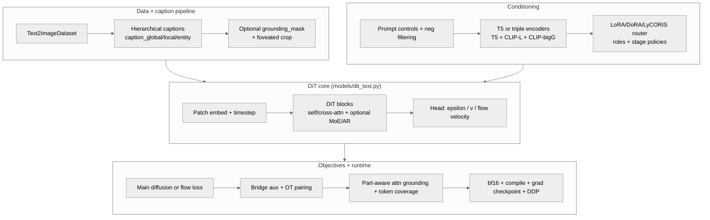
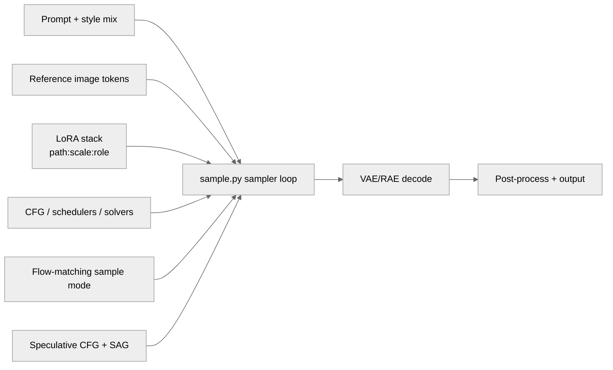

<!-- markdownlint-disable MD033 MD041 -->

<div align="center">

# SDX

### Text-to-image diffusion transformers for research and production

*One training engine, one sampling engine, modular everything else.*

<p align="center">
  <a href="https://www.python.org/"></a>
  <a href="https://pytorch.org/"></a>
  <a href="LICENSE"></a>
  <a href="docs/README.md"></a>
  <a href="https://github.com/Llunarstack/sdx/releases"></a>
</p>

</div>

---

## What SDX is

SDX is a modular text-to-image codebase centered on:

- `train.py` for diffusion/flow training
- `sample.py` for inference and quality controls
- `models/dit_text.py` for the core DiT
- optional adapters, controls, and native acceleration

It is built for iterative research (ablation-friendly) and practical generation workflows (books/comics, prompt-heavy generation, multi-adapter style stacks).

---

## Architecture and pipeline

**End-to-end:** `data/` -> `train.py` -> checkpoint -> `sample.py` -> images.

### Core pipeline


### Current model stack (training path)



### Inference controls (sample path)



---

## Quick start

```bash
pip install -r requirements.txt
python scripts/tools/dev/quick_test.py
```

Optional NVIDIA CUDA 12.8 wheel refresh:

```bash
pip install --force-reinstall -r requirements-cuda128.txt
python -m toolkit.training.env_health
```

Minimal train and sample:

```bash
python train.py --data-path user_data/train --results-dir results
python sample.py --ckpt results/.../best.pt --prompt "cinematic portrait, dramatic lighting" --out out.png
```

---

## Latest model updates

### 1) Part-aware and grounding-aware training

- Hierarchical captions in `data/t2i_dataset.py`:
  - `caption_global`, `caption_local`, `entity_captions`
- Optional grounding masks:
  - `grounding_mask` support in dataset and batch collation
- Attention auxiliary losses in `utils/training/part_aware_training.py`:
  - foreground grounding loss from cross-attn
  - token coverage loss for prompt adherence
- Integrated into `train.py` with configurable weights and logging

### 2) LoRA / DoRA / LyCORIS upgrade

- Multi-adapter stacking in `models/lora.py`
- Per-role budgeting (`character`, `style`, `detail`, `composition`, `other`)
- Depth-aware routing policies:
  - `auto`, `character_focus`, `style_focus`, `balanced`
- Advanced CLI in `sample.py`:
  - `path:scale:role` adapter specs
  - role budgets and stage overrides
  - weighted style blending (`styleA::0.6 | styleB::0.4`)

### 3) Reproducibility and run hygiene

- `train.py` now saves:
  - `run_manifest.json`
  - `config.train.json`
- Optional strict warning policy (`--strict-warnings`)
- Cleaner train argument split:
  - `training/train_cli_parser.py`
  - `training/train_args.py`

### 4) Modern objective stack

- Flow matching (`diffusion/flow_matching.py`)
- VP bridge auxiliary loss (`diffusion/bridge_training.py`)
- OT noise-latent pairing (`utils/training/ot_noise_pairing.py`)
- Prompt-conditioning behavior improvements (reinjection/schedule hooks in config/model path)

### 5) Dataset and quality docs refresh

- Curated dataset planning:
  - `docs/HF_DATASET_SHORTLIST.md`
- Issue and quality playbook:
  - `docs/QUALITY_AND_ISSUES.md`

---

## Training overview

Core training features:

- DiT variants (including AR-capable configurations)
- T5 or triple text encoders (T5 + CLIP-L + CLIP-bigG)
- bf16, `torch.compile`, gradient checkpointing, DDP
- EMA checkpoints, validation split, early stopping
- optional latent cache and JSONL-driven data pipelines

Useful training examples:

```bash
# Triple text encoders
python train.py --data-path /path/to/data --text-encoder-mode triple

# Flow-matching training
python train.py --data-path /path/to/data --flow-matching-training

# Part-aware setup with grounding losses
python train.py --data-path /path/to/data \
  --use-hierarchical-captions \
  --attn-grounding-loss-weight 0.1 \
  --attn-token-coverage-loss-weight 0.05
```

---

## Sampling overview

`sample.py` supports:

- CFG with scheduler/solver controls
- flow-matching sample mode (`--flow-matching-sample`, `--flow-solver`)
- speculative CFG controls
- SAG-style guidance
- reference image token injection
- LoRA/DoRA/LyCORIS stacking with role-aware routing
- style controls and style mix weighting
- optional postprocess passes (e.g., face enhancement)

Example:

```bash
python sample.py \
  --ckpt results/.../best.pt \
  --prompt "hero character, dynamic pose, city at night" \
  --style "anime::0.7 | cinematic::0.3" \
  --lora char.safetensors:0.9:character style.safetensors:0.6:style \
  --lora-stage-policy auto \
  --cfg-scale 6.0 \
  --steps 40 \
  --out out.png
```

---

## Data formats

### Folder mode

Place images under `user_data/train/` with sidecar captions:

```text
user_data/train/
  subject_a/
    img_001.png
    img_001.txt
```

### JSONL mode

One object per line:

```json
{"image_path": "/abs/path/img.png", "caption": "your caption"}
```

Use:

```bash
python train.py --manifest-jsonl /path/to/manifest.jsonl --results-dir results
```

For region/part-level conditioning, include optional `parts`, `region_captions`, and grounding-related fields used by the dataset pipeline.

---

## Native acceleration and tooling

Build helpers:

- Windows: `scripts/tools/native/build_native.ps1`
- Linux/macOS: `scripts/tools/native/build_native.sh`

Native/tooling areas include:

- C++/CUDA kernels under `native/cpp/`
- Rust utilities under `native/rust/`
- Python bridge under `native/python/sdx_native/`

Details: `native/README.md` and `docs/NATIVE_AND_SYSTEM_LIBS.md`.

---

## Key docs

- Docs hub: `docs/README.md`
- Codebase map: `docs/CODEBASE.md`
- Full file map: `docs/FILES.md`
- Generation internals: `docs/HOW_GENERATION_WORKS.md`
- Prompt stack: `docs/PROMPT_STACK.md`
- Diffusion roadmap: `docs/DIFFUSION_LEVERAGE_ROADMAP.md`
- Model weaknesses and mitigations: `docs/MODEL_WEAKNESSES.md`
- Dataset shortlist: `docs/HF_DATASET_SHORTLIST.md`

---

## Repo layout

```text
sdx/
  config/       # train config and presets
  data/         # datasets, caption/manifest processing
  diffusion/    # diffusion + flow + losses/schedules
  models/       # DiT, adapters, related modules
  utils/        # training/generation/checkpoint/prompt utilities
  train.py
  sample.py
  docs/
  scripts/
  native/
```

---

## Contributing

Small focused PRs are preferred. Docs, tests, and tooling changes are welcome.

- Guide: `CONTRIBUTING.md`
- Run checks: `pytest tests/ -q`, `ruff check .`

---

## License

Apache 2.0. See `LICENSE`.

