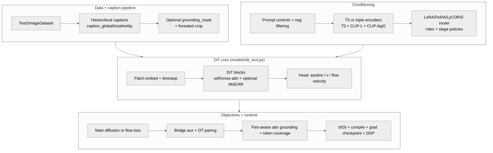
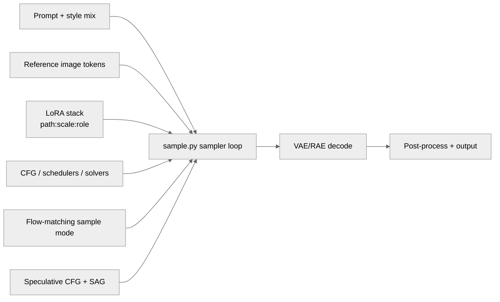
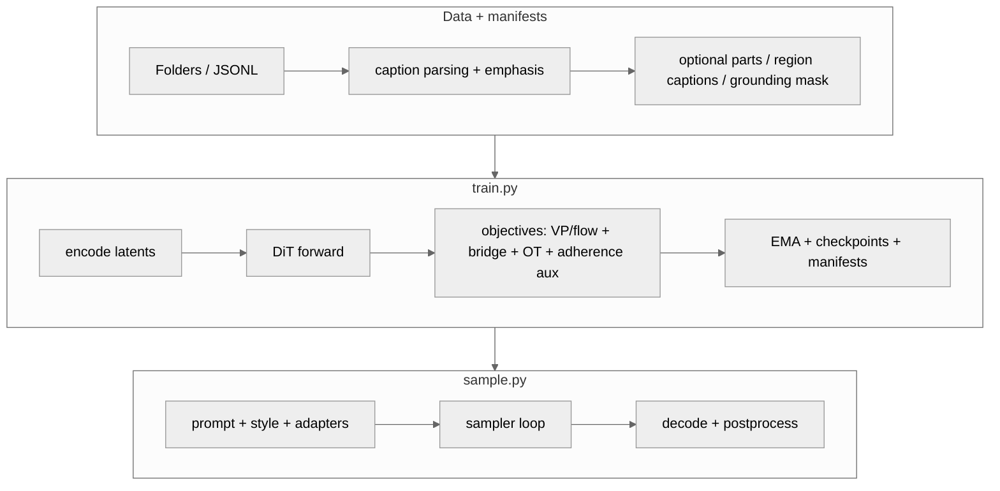

<!-- markdownlint-disable MD033 MD041 -->

<div align="center">

# SDX

### Text-to-image diffusion transformers for research and production

*One training engine, one sampling engine, modular everything else.*

<p align="center">
  <a href="https://www.python.org/"></a>
  <a href="https://pytorch.org/"></a>
  <a href="LICENSE"></a>
  <a href="docs/README.md"></a>
  <a href="https://github.com/Llunarstack/sdx/releases"></a>
</p>

<p align="center">
  <a href="#quick-start"><strong>Quick start</strong></a> ·
  <a href="#architecture-and-pipeline">Architecture</a> ·
  <a href="#training-overview">Training</a> ·
  <a href="#sampling-overview">Sampling</a> ·
  <a href="#contributors-and-community">Contributors</a> ·
  <a href="#key-docs">Docs</a>
</p>

**Stack:** DiT · T5/triple encoders · LoRA/DoRA/LyCORIS routing · flow/bridge/OT objectives · prompt-control stack · native acceleration paths.

</div>

---

## What SDX is

SDX is a modular text-to-image codebase centered on:

- `train.py` for diffusion/flow training
- `sample.py` for inference and quality controls
- `models/dit_text.py` for the core DiT
- optional adapters, controls, and native acceleration
- **Holy Grail** adaptive sampling: see repo root [`holy_grail/README.md`](holy_grail/README.md) (implementation in [`diffusion/holy_grail/`](diffusion/holy_grail/))

It is built for iterative research (ablation-friendly) and practical generation workflows (books/comics, prompt-heavy generation, multi-adapter style stacks).

---

## Find your path

| Goal | Jump to |
| :--- | :--- |
| Start fast | [Quick start](#quick-start) |
| Understand architecture | [Architecture and pipeline](#architecture-and-pipeline) |
| Train with latest features | [Training overview](#training-overview) |
| Sample with style/adapters | [Sampling overview](#sampling-overview) |
| Organize datasets | [Data formats](#data-formats) |
| Native acceleration | [Native acceleration and tooling](#native-acceleration-and-tooling) |
| Holy Grail sampling | [holy_grail/README.md](holy_grail/README.md) → code in `diffusion/holy_grail/` |
| Explore docs | [Key docs](#key-docs) |
| Contribute | [Contributors and community](#contributors-and-community) |

---

## Highlights at a glance

| Area | Current capability |
| :--- | :--- |
| Core model | DiT text-conditioned generation via `models/dit_text.py` |
| Text conditioning | T5 default + optional triple encoder mode (T5 + CLIP-L + CLIP-bigG) |
| Prompt adherence | Part-aware attention grounding + token coverage losses |
| Adapter system | Multi-LoRA/DoRA/LyCORIS stacking with role budgets and depth routing |
| Objectives | VP diffusion + flow matching + bridge auxiliary + OT coupling |
| Inference controls | CFG, flow sample mode, speculative CFG, SAG, reference-token injection, **holy-grail** adaptive sampling (see below) |
| Reliability | Run manifests, config snapshots, optional strict warnings |
| Performance | bf16, `torch.compile`, gradient checkpointing, DDP-ready |

---

## What shipped (detailed)

| Area | What shipped now |
| :--- | :--- |
| Part-aware training | Hierarchical caption fields + optional grounding masks + foveated crop path in `data/t2i_dataset.py`; cross-attention grounding + token-coverage auxiliaries in `utils/training/part_aware_training.py`. |
| Adapter routing | `models/lora.py` now supports stacked LoRA/DoRA/LyCORIS, per-role budgets, depth-aware stage policies, and automatic character/style balancing. |
| Inference adapter UX | `sample.py` supports `path:scale:role`, role budget overrides, stage-policy selection, and weighted style mixes (`style_a::w | style_b::w`). |
| Objective stack | Flow matching + bridge auxiliary + OT noise-latent coupling integrated into `train.py` and `diffusion/*`. |
| Reproducibility | Per-run `run_manifest.json` and `config.train.json` snapshots plus optional strict warning mode in `train.py`. |
| Prompt adherence path | Prompt controls + negative filtering + adherence auxiliaries are now documented and reflected in architecture/sampling docs. |
| Documentation quality | Architecture section upgraded with current-model diagrams and richer contributor-facing project context. |
| **Holy-grail sampling** | `diffusion/holy_grail/`: per-step CFG/control/adapter scheduling, CADS-style condition noise, latent refine + clamp; wired into `diffusion/gaussian_diffusion.py` and `sample.py` (`--holy-grail`, presets, sanitizer). |
| **Diffusion building blocks** | `diffusion/cfg_schedulers.py`, `diffusion/self_conditioning.py`, `diffusion/consistency_utils.py` for schedules, self-conditioning, and consistency-style helpers (importable from `diffusion`). |
| **Native ops (optional)** | CUDA/CPU helpers for RMSNorm, RoPE apply, SiLU-gate in `native/` with Python fallbacks in `sdx_native` (see `native/cuda/README.md`). |

---

## Why SDX is different

Most repos are either:

- strong research prototypes that are hard to operate, or
- polished wrappers that hide too much of the actual model stack.

SDX aims for the middle: **research depth + operator clarity**.

| Principle | What it means in practice |
| :--- | :--- |
| Transparent internals | Training and sampling stay centered in `train.py` and `sample.py` with explicit module boundaries |
| Prompt fidelity first | Part-aware grounding, token coverage, and richer prompt-control pathways are native features |
| Adapter realism | Multi-LoRA/DoRA/LyCORIS routing is treated as a first-class system, not a bolt-on |
| Reproducibility by default | Run manifests + config snapshots make results easier to track and recover |
| Evolvable architecture | Flow/bridge/OT and prompt-conditioning improvements can be added without rewriting the stack |

---

## Architecture and pipeline

**End-to-end:** `data/` -> `train.py` -> checkpoint -> `sample.py` -> images.

### Core pipeline


### Current model stack (training path)



### Inference controls (sample path)



<details>
<summary><strong>Deep-dive diagrams (expanded)</strong></summary>

### Full stack map



### Adapter routing intuition


</details>

---

## Quick start

```bash
pip install -r requirements.txt
python scripts/tools/dev/quick_test.py
```

Optional NVIDIA CUDA 12.8 wheel refresh:

```bash
pip install --force-reinstall -r requirements-cuda128.txt
python -m toolkit.training.env_health
```

Minimal train and sample:

```bash
python train.py --data-path user_data/train --results-dir results
python sample.py --ckpt results/.../best.pt --prompt "cinematic portrait, dramatic lighting" --out out.png
```

---

## Latest model updates

### 1) Part-aware and grounding-aware training

- Hierarchical captions in `data/t2i_dataset.py`:
  - `caption_global`, `caption_local`, `entity_captions`
- Optional grounding masks:
  - `grounding_mask` support in dataset and batch collation
- Attention auxiliary losses in `utils/training/part_aware_training.py`:
  - foreground grounding loss from cross-attn
  - token coverage loss for prompt adherence
- Integrated into `train.py` with configurable weights and logging

### 2) LoRA / DoRA / LyCORIS upgrade

- Multi-adapter stacking in `models/lora.py`
- Per-role budgeting (`character`, `style`, `detail`, `composition`, `other`)
- Depth-aware routing policies:
  - `auto`, `character_focus`, `style_focus`, `balanced`
- Advanced CLI in `sample.py`:
  - `path:scale:role` adapter specs
  - role budgets and stage overrides
  - weighted style blending (`styleA::0.6 | styleB::0.4`)

### 3) Reproducibility and run hygiene

- `train.py` now saves:
  - `run_manifest.json`
  - `config.train.json`
- Optional strict warning policy (`--strict-warnings`)
- Cleaner train argument split:
  - `training/train_cli_parser.py`
  - `training/train_args.py`

### 4) Modern objective stack

- Flow matching (`diffusion/flow_matching.py`)
- VP bridge auxiliary loss (`diffusion/bridge_training.py`)
- OT noise-latent pairing (`utils/training/ot_noise_pairing.py`)
- Prompt-conditioning behavior improvements (reinjection/schedule hooks in config/model path)

### 5) Dataset and quality docs refresh

- Curated dataset planning:
  - `docs/HF_DATASET_SHORTLIST.md`
- Issue and quality playbook:
  - `docs/QUALITY_AND_ISSUES.md`

### 6) Holy-grail sampling, diffusion utilities, and native extras (recent)

**Holy-grail stack** (`diffusion/holy_grail/` — see `diffusion/holy_grail/README.md`):

- Adaptive per-step **CFG**, **ControlNet scale**, and **adapter** multipliers inside `GaussianDiffusion.sample_loop` (VP and flow paths).
- **CADS-style** condition annealing: optional Gaussian noise on `encoder_hidden_states` during sampling (`--holy-grail-cads-strength`, etc.).
- **Presets**: `--holy-grail-preset` with `auto` (heuristic from prompt/style/control/LoRA) or `balanced` \| `photoreal` \| `anime` \| `illustration` \| `aggressive`.
- **Runtime guard**: `sanitize_holy_grail_kwargs` clamps unsafe values before sampling.
- **Supporting modules**: attention-entropy CFG ideas, prompt coverage metrics, latent unsharp + dynamic clamp, style/detail routing helpers.

**CLI quick flags** (all opt-in; enable with `--holy-grail` or a preset):

- `--holy-grail` · `--holy-grail-preset auto|…` · `--holy-grail-cfg-early-ratio` / `--holy-grail-cfg-late-ratio`
- `--holy-grail-control-mult` · `--holy-grail-adapter-mult` · `--holy-grail-late-adapter-boost` · `--holy-grail-no-frontload-control`
- `--holy-grail-cads-strength` · `--holy-grail-cads-min-strength` · `--holy-grail-cads-power`
- `--holy-grail-unsharp-sigma` · `--holy-grail-unsharp-amount` · `--holy-grail-clamp-quantile` · `--holy-grail-clamp-floor`

**Extra diffusion modules** (for training/experiments or custom wiring):

- `diffusion/cfg_schedulers.py` — time/SNR-aware CFG schedule helpers
- `diffusion/self_conditioning.py` — detached self-cond + blend helpers
- `diffusion/consistency_utils.py` — EMA targets, consistency delta loss, one-step refine

**Optional native acceleration**: RMSNorm rows, RoPE apply, SiLU-gate CUDA libraries + NumPy fallbacks (`native/python/sdx_native/`).

---

## Training overview

Core training features:

- DiT variants (including AR-capable configurations)
- T5 or triple text encoders (T5 + CLIP-L + CLIP-bigG)
- bf16, `torch.compile`, gradient checkpointing, DDP
- EMA checkpoints, validation split, early stopping
- optional latent cache and JSONL-driven data pipelines

Useful training examples:

```bash
# Triple text encoders
python train.py --data-path /path/to/data --text-encoder-mode triple

# Flow-matching training
python train.py --data-path /path/to/data --flow-matching-training

# Part-aware setup with grounding losses
python train.py --data-path /path/to/data \
  --use-hierarchical-captions \
  --attn-grounding-loss-weight 0.1 \
  --attn-token-coverage-loss-weight 0.05
```

<details>
<summary><strong>Train CLI quick reference</strong></summary>

| Flag | Purpose |
| :--- | :--- |
| `--flow-matching-training` | Enable flow objective path instead of VP main loss |
| `--bridge-aux-weight` / `--bridge-aux-lambda` | Add bridge regularization |
| `--ot-noise-pair-reg` | Enable OT noise-latent coupling |
| `--use-hierarchical-captions` | Enable hierarchical caption composition |
| `--attn-grounding-loss-weight` | Add grounding attention auxiliary loss |
| `--attn-token-coverage-loss-weight` | Add token coverage auxiliary loss |
| `--strict-warnings` | Escalate key warnings to errors |
| `--no-save-run-manifest` | Disable run manifest snapshot files |

</details>

---

## Sampling overview

`sample.py` supports:

- CFG with scheduler/solver controls
- flow-matching sample mode (`--flow-matching-sample`, `--flow-solver`)
- speculative CFG controls
- SAG-style guidance
- reference image token injection
- LoRA/DoRA/LyCORIS stacking with role-aware routing
- style controls and style mix weighting
- optional postprocess passes (e.g., face enhancement)
- **Holy-grail mode**: `--holy-grail` and `--holy-grail-preset auto|balanced|photoreal|anime|illustration|aggressive` (see **Latest model updates → §6**)

Example:

```bash
python sample.py \
  --ckpt results/.../best.pt \
  --prompt "hero character, dynamic pose, city at night" \
  --style "anime::0.7 | cinematic::0.3" \
  --lora char.safetensors:0.9:character style.safetensors:0.6:style \
  --lora-stage-policy auto \
  --cfg-scale 6.0 \
  --steps 40 \
  --out out.png
```

Holy-grail one-liner (preset picks heuristics from your prompt/style):

```bash
python sample.py --ckpt results/.../best.pt \
  --prompt "photoreal portrait, soft window light" \
  --holy-grail-preset auto --out holy_grail.png
```

---

## Recipe gallery (quick wins)

### 1) Character consistency + style blend

```bash
python sample.py \
  --ckpt results/.../best.pt \
  --prompt "full-body character sheet, front and side views, clean lineart" \
  --style "anime::0.65 | cel-shaded::0.35" \
  --lora char_model.safetensors:0.95:character style_pack.safetensors:0.50:style \
  --lora-stage-policy character_focus \
  --cfg-scale 5.5 --steps 36 --out character_sheet.png
```

### 2) Prompt-adherence stress test

```bash
python sample.py \
  --ckpt results/.../best.pt \
  --prompt "red umbrella behind the subject, neon sign text 'OPEN', rainy street reflection" \
  --negative-prompt "blurry text, malformed letters, extra limbs" \
  --speculative-draft-cfg-scale 4.5 \
  --speculative-close-thresh 0.02 \
  --speculative-blend 0.35 \
  --steps 42 --out adherence_test.png
```

### 3) Flow-trained checkpoint inference

```bash
python sample.py \
  --ckpt results/.../best.pt \
  --prompt "cinematic sci-fi alley, volumetric fog, ultra detailed" \
  --flow-matching-sample \
  --flow-solver heun \
  --cfg-scale 6.0 --steps 32 --out flow_sample.png
```

---

## Data formats

### Folder mode

Place images under `user_data/train/` with sidecar captions:

```text
user_data/train/
  subject_a/
    img_001.png
    img_001.txt
```

### JSONL mode

One object per line:

```json
{"image_path": "/abs/path/img.png", "caption": "your caption"}
```

Use:

```bash
python train.py --manifest-jsonl /path/to/manifest.jsonl --results-dir results
```

For region/part-level conditioning, include optional `parts`, `region_captions`, and grounding-related fields used by the dataset pipeline.

---

## Native acceleration and tooling

Build helpers:

- Windows: `scripts/tools/native/build_native.ps1`
- Linux/macOS: `scripts/tools/native/build_native.sh`

Native/tooling areas include:

- C++/CUDA kernels under `native/cpp/`
- Rust utilities under `native/rust/`
- Python bridge under `native/python/sdx_native/`

Details: `native/README.md` and `docs/NATIVE_AND_SYSTEM_LIBS.md`.

---

## Platform and repo map

| Area | Purpose |
| :--- | :--- |
| `config/` | train configuration, model build kwargs, defaults |
| `data/` | datasets, caption parsing, batching, manifest handling |
| `diffusion/` | diffusion/flow objectives, schedules, samplers, utility losses |
| `models/` | DiT core, attention blocks, adapter wrappers, optional experimental modules |
| `utils/` | training utilities, prompt stack, generation helpers, checkpoint logic |
| `training/` | train CLI parser + config mapping split from main train loop |
| `scripts/tools/` | dev, training, native, and repo maintenance utilities |
| `native/` | C++/CUDA, Rust, Python bridge modules |

---

## Roadmap momentum

### Shipped recently

- Part-aware data/training path with grounding-aware attention auxiliaries
- Adapter-router upgrades for multi-style and character-preserving blends
- Flow/bridge/OT objective support in the core training loop
- Reproducibility hardening (`run_manifest.json`, config snapshots, strict warning mode)
- Refreshed architecture and documentation indexing

### High-impact next targets

- Better long-prompt decomposition and cross-token conflict handling
- Stronger text-in-image reliability and OCR-aware generation loops
- Richer spatial relationship grounding with cleaner failure diagnostics
- More automated benchmark suites for adherence/consistency regressions

---

## Key docs

- Docs hub: `docs/README.md`
- Codebase map: `docs/CODEBASE.md`
- Full file map: `docs/FILES.md`
- Generation internals: `docs/HOW_GENERATION_WORKS.md`
- Prompt stack: `docs/PROMPT_STACK.md`
- Diffusion roadmap: `docs/DIFFUSION_LEVERAGE_ROADMAP.md`
- Model weaknesses and mitigations: `docs/MODEL_WEAKNESSES.md`
- Dataset shortlist: `docs/HF_DATASET_SHORTLIST.md`

---

## Documentation hub (recommended reading order)

| Step | Read this | Why |
| :--- | :--- | :--- |
| 1 | `docs/README.md` | Global index of docs and categories |
| 2 | `docs/CODEBASE.md` | Learn where things live before changing code |
| 3 | `docs/HOW_GENERATION_WORKS.md` | End-to-end understanding of train -> checkpoint -> sample |
| 4 | `docs/PROMPT_STACK.md` | Prompt assembly, controls, and filtering behavior |
| 5 | `docs/DIFFUSION_LEVERAGE_ROADMAP.md` | High-impact model quality priorities |
| 6 | `docs/QUALITY_AND_ISSUES.md` | Real failure patterns and practical mitigations |

---

## Repo layout

```text
sdx/
  config/       # train config and presets
  data/         # datasets, caption/manifest processing
  diffusion/    # diffusion + flow + losses/schedules
  models/       # DiT, adapters, related modules
  utils/        # training/generation/checkpoint/prompt utilities
  train.py
  sample.py
  docs/
  scripts/
  native/
```

---

## Contributing

Small focused PRs are preferred. Docs, tooling, and quality improvements are all welcome.

- Guide: `CONTRIBUTING.md`
- Run checks: `ruff check .` (and `ruff format .` before PRs; see `CONTRIBUTING.md`)

---

## Contributors and community

SDX improves through iterative, practical contributions across model code, prompts, docs, and tooling.

- **Code contributors:** architecture, training loops, sampling controls, native integrations
- **Research contributors:** objective experiments, prompt-adherence strategies, adapter routing policies
- **Data contributors:** manifests, curation workflows, quality filters, domain-specific packs
- **Docs contributors:** guides, examples, failure-mode writeups, reproducibility notes

Good first contribution areas:

- tighten docs for one module (`data/`, `diffusion/`, `models/`, `utils/`)
- validate new flags with a short `sample.py` / `train.py` dry run when practical
- improve CLI UX in `train.py` or `sample.py`
- benchmark and profile one inference/training path

If you want your contribution reflected in release notes/docs summaries, include a clear short change note in your PR.

---

## FAQ

### Is SDX production-ready?

It is production-oriented in structure and tooling, but quality depends heavily on data curation, training budget, and checkpoints.

### Do I need all native modules to use SDX?

No. Core train/sample paths work without optional native builds. Native modules improve specific workflows and performance paths.

### Is this only for anime/booru?

No. The stack is domain-agnostic; anime/manga is one strong path, but the system supports broader style/object/text domains with proper data mixes.

---

## Acknowledgements and references

SDX is inspired by and interoperates conceptually with the broader diffusion ecosystem.

- [facebookresearch/DiT](https://github.com/facebookresearch/DiT)
- [lllyasviel/ControlNet](https://github.com/lllyasviel/ControlNet)
- [black-forest-labs/flux](https://github.com/black-forest-labs/flux)
- [Stability-AI/generative-models](https://github.com/Stability-AI/generative-models)

See `docs/INSPIRATION.md` for extended context.

---

## License

Apache 2.0. See `LICENSE`.

