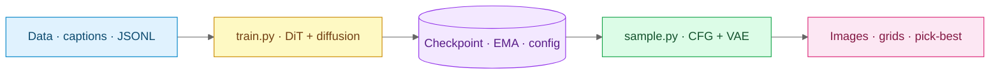
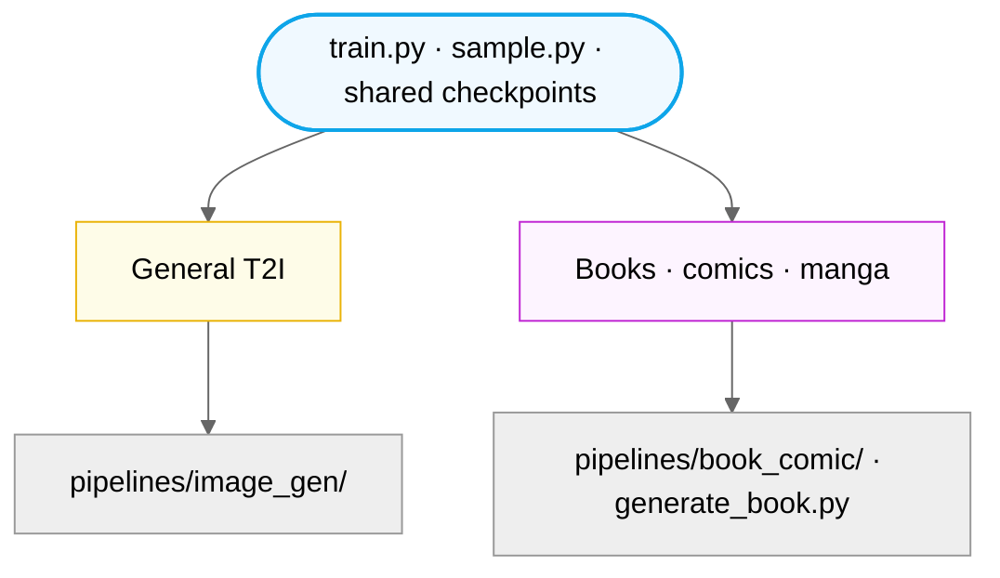
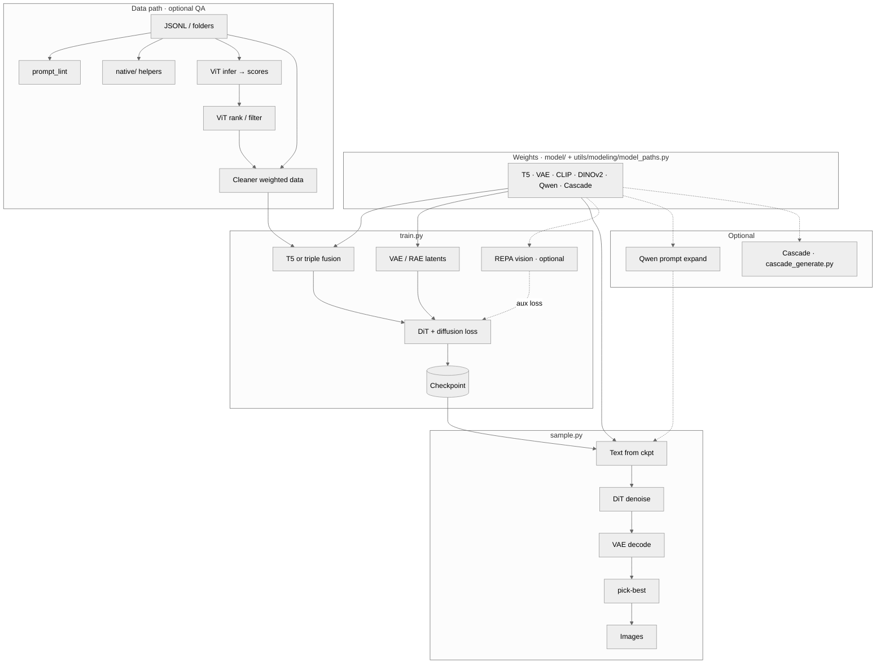
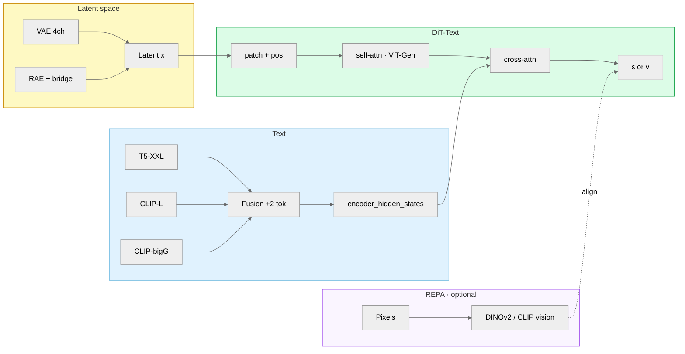
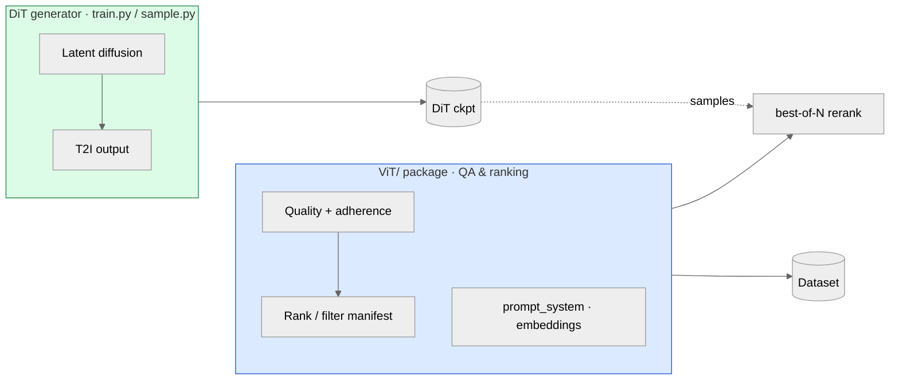
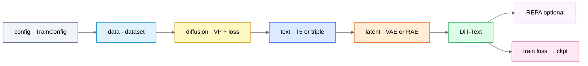

<!-- markdownlint-disable MD033 MD041 -->

<div align="center">

# SDX

### Text-to-image **Diffusion Transformers**

*Train · sample · iterate — one codebase, clear layers, real experiments.*

<p align="center">
  <a href="https://www.python.org/"></a>
  <a href="#quick-start"></a>
  <a href="https://pytorch.org/"></a>
  <a href="LICENSE"></a>
  <a href="CONTRIBUTING.md"></a>
  <a href="docs/README.md"></a>
  <a href="docs/IMPROVEMENTS.md"></a>
  <a href="https://github.com/Llunarstack/sdx/releases"></a>
</p>

<p align="center">
  <a href="#quick-start"><strong>Quick start</strong></a> ·
  <a href="#your-training-data">Your data</a> ·
  <a href="#architecture-and-pipeline">Architecture</a> ·
  <a href="#training">Training</a> ·
  <a href="#documentation-hub">Documentation</a> ·
  <a href="#contributing--community">Contribute</a>
</p>

**Stack:** DiT · `GaussianDiffusion` · T5 (optional **triple:** T5 + CLIP-L + CLIP-bigG) · xformers · AR blocks · REPA · MoE · MDM · RAE bridge · **reference tokens** (CLIP vision, IP-Adapter-style) · **SAG-style** guided sampling (blur heuristic) · **pick-best** · **face-region post-enhance** · **book/comic** pipelines + **consistency helpers**

<sub>Caption-driven training · optional **reference image** conditioning at sample time · GPU stack: **`requirements-cuda128.txt`** after base `pip` · quality follows your data and settings</sub>

</div>

---

## Why this repo exists

**SDX** is a **modular** diffusion–transformer codebase for **dataset-faithful** text-to-image research and production: **data → `train.py` → checkpoint → `sample.py`**, with clean boundaries between datasets, VP diffusion math, DiT, encoders, and tooling. Swap timestep sampling, loss weighting, or DiT variants without forking the world.

| | You get |
| :--- | :--- |
| **Researchers** | One readable pipeline: `pytest` + `ruff`, [docs/MODERN_DIFFUSION.md](docs/MODERN_DIFFUSION.md), non-uniform `t`, REPA, MoE — ablation-friendly. |
| **Builders** | JSONL manifests, val / early stopping, EMA, latent cache, DDP, book workflows ([pipelines/book_comic/](pipelines/book_comic/README.md)). |
| **Contributors** | Small PRs welcome: [CONTRIBUTING.md](CONTRIBUTING.md), [docs/CODEBASE.md](docs/CODEBASE.md), and tools under `scripts/tools/`. |

---

### Find your path

| Goal | Jump to |
| :--- | :--- |
| **Run something now** | [Quick start](#quick-start) — `python scripts/tools/dev/quick_test.py` |
| **Train (folders or JSONL)** | **[`user_data/train/`](user_data/train/)** — drop images + captions here · [Training](#training) · [Data format](#data-format) · [Training files (DiT + ViT)](#training-files-reference-what-each-part-does) |
| **Books / comics / manga** | [pipelines/book_comic/README.md](pipelines/book_comic/README.md) · [docs/BOOK_MODEL_EXCELLENCE.md](docs/BOOK_MODEL_EXCELLENCE.md) |
| **Score or filter data (ViT)** | [ViT/README.md](ViT/README.md) · [ViT/EXCELLENCE_VS_DIT.md](ViT/EXCELLENCE_VS_DIT.md) |
| **Submit a PR or doc fix** | [Contributing](#contributing--community) · [docs/CODEBASE.md](docs/CODEBASE.md) |
| **Navigate the tree** | [docs/REPOSITORY_STRUCTURE.md](docs/REPOSITORY_STRUCTURE.md) · [scripts/README.md](scripts/README.md) · [scripts/tools/README.md](scripts/tools/README.md) |
| **Browse every source file** | **[docs/FILES.md](docs/FILES.md)** — per-file roles; **[docs/REPOSITORY_STRUCTURE.md](docs/REPOSITORY_STRUCTURE.md)** — folder map |
| **Understand sampling** | [Architecture](#architecture-and-pipeline) · [docs/HOW_GENERATION_WORKS.md](docs/HOW_GENERATION_WORKS.md) · [Sampling](#sampling) |
| **Honest limits & mitigations** | [docs/MODEL_WEAKNESSES.md](docs/MODEL_WEAKNESSES.md) (gaps table, fixes) · [docs/COMMON_ISSUES.md](docs/COMMON_ISSUES.md) |
| **Diffusion upgrade ideas** | [docs/DIFFUSION_LEVERAGE_ROADMAP.md](docs/DIFFUSION_LEVERAGE_ROADMAP.md) · [docs/MODERN_DIFFUSION.md](docs/MODERN_DIFFUSION.md) |
| **Prompt pipeline (modules + flags)** | [docs/PROMPT_STACK.md](docs/PROMPT_STACK.md) · [docs/PROMPT_COOKBOOK.md](docs/PROMPT_COOKBOOK.md) · `utils/prompt/prompt_layout.py` · `sample.py --prompt-layout` / `--t5-layout-encode` · `python scripts/tools/preview_generation_prompt.py --help` |

<a id="latest-additions"></a>

### What’s new (recent work)

High-signal additions to inference, books, packaging, and docs — all on the same **`train.py` / `sample.py`** engine.

| Area | What shipped |
| :--- | :--- |
| **Reference conditioning (IP-Adapter-style)** | **`--reference-image`** + **`--reference-tokens`** / **`--reference-scale`** inject CLIP vision tokens into **`DiT_Text`** ([`models/dit_text.py`](models/dit_text.py), [`models/reference_token_projection.py`](models/reference_token_projection.py), [`utils/generation/clip_reference_embed.py`](utils/generation/clip_reference_embed.py)). Optional **`--clip-reference-model`** for the vision tower. |
| **SAG-style guided sampling** | Blur-based self-attention guidance in the denoise loop: **`--sag-blur-sigma`**, **`--sag-scale`** on [`GaussianDiffusion.sample_loop`](diffusion/gaussian_diffusion.py). |
| **Face & reference post-process** | **`--face-enhance`** (+ sharpen / contrast / padding / max faces) via [`utils/quality/face_region_enhance.py`](utils/quality/face_region_enhance.py). **`--post-reference-image`** / **`--post-reference-alpha`** for light pixel-space blend after decode. OCR repair paths forward these flags when set. |
| **NVIDIA install path** | **[`requirements-cuda128.txt`](requirements-cuda128.txt)** — after `requirements.txt`, **`pip install --force-reinstall -r requirements-cuda128.txt`** pulls **torch / torchvision / xformers** from PyTorch’s **cu128** index (avoids CPU-only PyPI torch). **`python -m toolkit.training.env_health`** prints a hint when **`+cpu`** torch is detected ([`toolkit/training/env_health.py`](toolkit/training/env_health.py)). |
| **Book / comic consistency layer** | [`pipelines/book_comic/consistency_helpers.py`](pipelines/book_comic/consistency_helpers.py) + CLI flags on **`generate_book.py`** (`--consistency-json`, character/costume/props/vehicle/setting/creature/palette/lighting/lettering, negative tiers). Prompt order: narration → **consistency block** → panel → rolling context ([`book_helpers.compose_book_page_prompt`](pipelines/book_comic/book_helpers.py)); rolling context respects **`--page-context-max-chars`** for the **full** composed string. |
| **Architecture map & 2026 docs** | **[`utils/architecture/architecture_map.py`](utils/architecture/architecture_map.py)** — themes ↔ repo hooks. **Docs:** [ARCHITECTURE_SHIFT_2026.md](docs/ARCHITECTURE_SHIFT_2026.md), [WORKFLOW_INTEGRATION_2026.md](docs/WORKFLOW_INTEGRATION_2026.md), [LANDSCAPE_2026.md](docs/LANDSCAPE_2026.md). **Leverage roadmap:** [DIFFUSION_LEVERAGE_ROADMAP.md](docs/DIFFUSION_LEVERAGE_ROADMAP.md). |
| **Gaps vs common T2I failures** | [docs/MODEL_WEAKNESSES.md](docs/MODEL_WEAKNESSES.md) — structured “what breaks / why / mitigations” (incl. hands, faces, text-in-image, composition). |
| **Tests** | [`tests/unit/test_reference_tokens_and_sag.py`](tests/unit/test_reference_tokens_and_sag.py), [`tests/unit/test_face_region_enhance.py`](tests/unit/test_face_region_enhance.py), [`tests/unit/test_consistency_helpers.py`](tests/unit/test_consistency_helpers.py), plus existing **`tests/unit/`**, **`tests/integration/`**, **`tests/diffusion/`**. |
| **Prompt lint (path)** | Canonical script: [`scripts/tools/prompt/prompt_lint.py`](scripts/tools/prompt/prompt_lint.py) (invoked by tooling / CI that still says `prompt_lint`). |
| **Layered prompts + encoders** | JSON **prompt layout** compiler [`utils/prompt/prompt_layout.py`](utils/prompt/prompt_layout.py) · `sample.py --prompt-layout file.json` · `--t5-layout-encode` (`auto` / `flat` / `blocks` / `segmented`) reshapes how **T5** reads sections. **Triple mode** (`text_encoder_mode=triple`): **CLIP-L** and **CLIP-bigG** get a compact **layout-aware** caption via `triple_clip_caption` while T5 uses the chosen layout mode ([`utils/modeling/text_encoder_bundle.py`](utils/modeling/text_encoder_bundle.py)). |
| **Native C++ / CUDA builds** | One-shot: **[`scripts/tools/native/build_native.ps1`](scripts/tools/native/build_native.ps1)** (Windows) · **[`scripts/tools/native/build_native.sh`](scripts/tools/native/build_native.sh)** (Linux/macOS). Produces **`sdx_line_stats`** (fast JSONL byte + newline count), optional **`sdx_cuda_hwc_to_chw`** (`cmake -DSDX_BUILD_CUDA=ON`), plus existing latent / timestep / beta DLLs ([`native/cpp/`](native/cpp/)). |
| **JSONL tools (no Node)** | Former `native/js/*.mjs` replaced by pure Python **[`sdx_native.jsonl_manifest_pure`](native/python/sdx_native/jsonl_manifest_pure.py)** (`python -m sdx_native.jsonl_manifest_pure stat|promptlint …`). |
| **Mojo (optional)** | **[`native/mojo/`](native/mojo/)** — **Pixi** + Modular conda (`pixi.toml` / `pixi.lock`, **linux-64**). On Windows, **native win-64 Mojo** is not on conda; use **WSL2** and [`native/mojo/install_mojo_wsl.ps1`](native/mojo/install_mojo_wsl.ps1) or `pixi install` + `pixi run mojo-run`. Python helper: [`native/mojo/mojopy/launcher.py`](native/mojo/mojopy/launcher.py). |

### Platform & repo layout (stable)

| Area | Pointer |
| :--- | :--- |
| **Native + Python bridge** | [`native/python/sdx_native/`](native/python/sdx_native/) · re-exports [`utils/native/native_tools.py`](utils/native/native_tools.py) · [native/README.md](native/README.md) · [docs/NATIVE_AND_SYSTEM_LIBS.md](docs/NATIVE_AND_SYSTEM_LIBS.md) |
| **ViT ↔ DiT AR** | [`utils/architecture/ar_dit_vit.py`](utils/architecture/ar_dit_vit.py) · [docs/AR.md](docs/AR.md) · [`ViT/train.py`](ViT/train.py) (`--no-ar-conditioning` for legacy) |
| **Config / diffusion packages** | [`config/reference/`](config/reference/) · [`diffusion/losses/`](diffusion/losses/) — [diffusion/README.md](diffusion/README.md) |
| **Your images** | **[`user_data/train/`](user_data/train/)** · [user_data/README.md](user_data/README.md) |
| **Training + inference QoL** | [`toolkit/`](toolkit/) — `python -m toolkit.training.env_health`, seeds, manifest digest ([`toolkit/README.md`](toolkit/README.md)) |

---

### On this page

| | |
| :--- | :--- |
| **Setup** | [Project status](#project-status-compute-and-expectations) · [Setup](#setup) |
| **Core** | [What’s new](#latest-additions) · [Architecture](#architecture-and-pipeline) · [Highlights](#highlights) · [Quick start](#quick-start) · [Your training data](#your-training-data) |
| **Train & sample** | [Your training data](#your-training-data) · [Training](#training) · [Training files](#training-files-reference-what-each-part-does) · [Timestep sampling](#modern-diffusion-training-timestep-sampling) · [Sampling](#sampling) |
| **Reference** | [JSONL fields](#data-jsonl-fields) · [Train CLI](#train-cli-quick-reference) · [SDXL-style features](#sdxl-inspired-training-features) · [Extra features](#extra-features) |
| **Deep dives** | [Documentation hub](#documentation-hub) · [Landscape 2026](docs/LANDSCAPE_2026.md) · [Architecture shift 2026](docs/ARCHITECTURE_SHIFT_2026.md) · [Workflow integration 2026](docs/WORKFLOW_INTEGRATION_2026.md) · [Book/comic tech](docs/BOOK_COMIC_TECH.md) · [Project layout](#project-layout) · [Contributing](#contributing--community) · [References](#references) |

<details>
<summary><strong>Table of contents (same links, expanded)</strong></summary>

| Section | Links |
| :--- | :--- |
| **Context** | [Status & expectations](#project-status-compute-and-expectations) · [Pipelines](pipelines/README.md) |
| **Start** | [What’s new](#latest-additions) · [Quick start](#quick-start) · [Setup](#setup) · [Your training data](#your-training-data) · [Data format](#data-format) |
| **Workflow** | [Architecture](#architecture-and-pipeline) · [Your training data](#your-training-data) · [Training](#training) · [Training files (DiT + ViT)](#training-files-reference-what-each-part-does) · [Timestep sampling](#modern-diffusion-training-timestep-sampling) · [Sampling](#sampling) · [JSONL fields](#data-jsonl-fields) |
| **Reference** | [Train CLI](#train-cli-quick-reference) · [SDXL-style features](#sdxl-inspired-training-features) · [Extra features](#extra-features) |
| **Deep dives** | [Documentation hub](#documentation-hub) · [Landscape 2026](docs/LANDSCAPE_2026.md) · [Architecture shift 2026](docs/ARCHITECTURE_SHIFT_2026.md) · [Workflow integration 2026](docs/WORKFLOW_INTEGRATION_2026.md) · [Book/comic tech](docs/BOOK_COMIC_TECH.md) · [Project layout](#project-layout) · [Contributing](#contributing--community) · [References](#references) |

</details>

---

## Quick start

| Step | What to run |
| :--- | :--- |
| **1 · Environment** | `pip install -r requirements.txt` |
| **2 · Smoke test** | `python scripts/tools/dev/quick_test.py` |
| **3 · Train** | `python train.py --data-path user_data/train --results-dir results` |
| **4 · Sample** | `python sample.py --ckpt results/.../best.pt --prompt "..." --out out.png` |

```bash
cd sdx
pip install -r requirements.txt
python scripts/tools/dev/quick_test.py    # env check (no dataset required)
```

**NVIDIA GPU (CUDA 12.8):** default PyPI `torch` is often **CPU-only**. After the step above, reinstall GPU wheels (same venv):

```bash
pip install --force-reinstall -r requirements-cuda128.txt
```

Confirm with `python -m toolkit.training.env_health` (`cuda_available` should be true when drivers are installed). **Windows:** `triton-windows` remains in `requirements.txt` for xformers’ `import triton`.

**Train** (single GPU — use **[`user_data/train/`](user_data/train/)** or any folder with the same layout):

```bash
python train.py --data-path user_data/train --results-dir results
```

**Sample**:

```bash
python sample.py --ckpt results/.../best.pt --prompt "your prompt" --steps 50 --width 256 --height 256 --out out.png
```

**Multi-GPU**:

```bash
torchrun --nproc_per_node=4 train.py --data-path /path/to/data --global-batch-size 256
```

### Tests (local)

| Check | Command |
| :--- | :--- |
| **Full suite** | `pytest tests/ -q` (all `tests/**`, including `unit/`, `integration/`, `diffusion/`) |
| **Fast unit** | `pytest tests/unit -q` |
| **Smoke (DiT forward)** | `python scripts/tools/dev/quick_test.py` |
| **Optional native CLIs** | `python scripts/tools/dev/quick_test.py --show-native` — lists Rust/Zig/Go, C++ DLLs (`libsdx_latent`, `sdx_line_stats`, CUDA HWC, …), Pixi/Mojo hints ([native/README.md](native/README.md)) |

**Build native libraries (optional):** `.\scripts\tools\native\build_native.ps1` or `bash scripts/tools/native/build_native.sh` — CMake **Release** for `native/cpp` (set `SDX_BUILD_CUDA=0` to skip nvcc) + **cargo** `sdx-jsonl-tools` when `cargo` is on PATH.

After pulling C++ changes, rebuild `native/cpp` so ctypes picks up new symbols (e.g. `sdx_latent_numel`, `sdx_line_stats`).

---

### Contribute in 5 minutes

| Step | Action |
| :--- | :--- |
| 1 | Fork / clone · `cd` to repo root |
| 2 | `pip install -r requirements.txt` · (GPU:) `pip install --force-reinstall -r requirements-cuda128.txt` · `python scripts/tools/dev/quick_test.py` |
| 3 | `pytest tests/ -q` · `ruff format` / `ruff check` on **files you changed** (see `pyproject.toml`) |
| 4 | Open a **small** PR — docs, tests, and tooling count. See **[CONTRIBUTING.md](CONTRIBUTING.md)**. |

> **First visit?** Run `python scripts/tools/dev/quick_test.py`, skim [**Architecture**](#architecture-and-pipeline), then pick a task from [Find your path](#find-your-path).

---

<details>
<summary><strong>Project status, compute, and expectations</strong> — scope, VRAM, roadmap</summary>

SDX is a **research-grade pipeline and architecture blueprint** — not a single vendor “model in a box.” Some configs have no pretrained weights in-repo; serious training often means **multi-GPU**, **high VRAM**, and **large storage**. Solo and academic setups are normal: the repo is designed so you can grow into bigger runs without changing stacks.

| Topic | What to expect |
| :--- | :--- |
| **What this repo optimizes for** | Modular **code**: `train.py` / `sample.py`, `GaussianDiffusion`, DiT variants, encoders, dataset tools, optional ViT QA—so “future you” or a lab can plug in compute without redesigning the stack. |
| **What we don’t claim** | A single **official** base model, fixed **leaderboard** numbers, or a gallery of **example images** for every variant—unless someone trains and publishes them (contributions welcome). |
| **Credibility without a huge model** | The implementation is **runnable**: `quick_test`, unit tests, `dit_variant_compare`, timestep previews, docs. A **tiny** training run (synthetic data + `DiT-B`) proves the full loop—see **[docs/SMOKE_TRAINING.md](docs/SMOKE_TRAINING.md)** and [docs/HARDWARE.md](docs/HARDWARE.md). |

### If you only have a consumer GPU (e.g. ~16 GB VRAM)

You can still get value **without** training a billion-parameter model:

1. **Smoke / micro-runs** — `python scripts/tools/make_smoke_dataset.py --out data/smoke_tiny` then `train.py` with **`DiT-B/2-Text`**, `--dry-run` or `--max-steps 5` ([docs/SMOKE_TRAINING.md](docs/SMOKE_TRAINING.md)).
2. **Frozen encoders + train DiT only** — Use off-the-shelf VAE + T5 (and CLIP if triple mode); memory goes mostly to the DiT forward, not retraining encoders.
3. **Infrastructure first** — Dataset JSONL, `scripts/tools/*`, ViT ranking, export scripts: these pay off before you ever touch a cluster.
4. **Memory tricks** (typical across diffusion repos): gradient checkpointing, mixed precision (bf16), smaller batch + accumulation, smaller `image-size`, fewer simultaneous options (MoE/REPA off until needed).

### Roadmap shape (not a promise of dates)

| Phase | Focus |
| :--- | :--- |
| **Now** | Architecture clarity, docs, small tests, optional micro-training. |
| **Next** | Run **[docs/SMOKE_TRAINING.md](docs/SMOKE_TRAINING.md)** on your GPU when ready; iterate from there. |
| **Later** | Serious training when you have **GPU time**, **storage**, and a **dataset** you trust. |

**Want to help?** You don’t need a cluster—see **[Contributing & community](#contributing--community)** (docs, tests, tooling, and small reproducible runs all count).

</details>

---

## Overview

| Layer | What you can do |
| :---: | :--- |
| **Model** | Text-conditioned **DiT** + cross-attention (**T5**; optional **triple** fusion), **AR** blocks, **Supreme** / **Predecessor** variants |
| **Training** | Pass-based schedule · **EMA** · **best** ckpt · val + early stopping · bf16 · compile · **DDP** · **non-uniform timestep** sampling |
| **Sampling** | CFG · **pluggable timestep schedules** + **solvers** (ddim / **heun**) · img2img / inpaint · LoRA · control · refinement · **pick-best** · **reference tokens** · **SAG** · **face enhance** / **post-reference** blend |
| **Data** | Folders + sidecars or **JSONL** · emphasis · domains · regional captions |

---

## Architecture and pipeline

**End-to-end:** `data/` → **`train.py`** → **checkpoint** → **`sample.py`** → images. Frozen weights live under **`model/`** (gitignored); paths resolve via **`utils/modeling/model_paths.py`**.

### Core pipeline



### Product pipelines (same engine)

One **DiT + diffusion** stack; docs and scripts differ by use case:



See **[pipelines/README.md](pipelines/README.md)** · [image_gen](pipelines/image_gen/README.md) · [book_comic](pipelines/book_comic/README.md).

### Repository map

| Area | Role | Consumed by |
|:-----|:-----|:------------|
| **`config/`** | `TrainConfig`, `get_dit_build_kwargs`, presets | `train.py`, `sample.py`, checkpoints |
| **`data/`** | `Text2ImageDataset`, captions | `train.py` |
| **`diffusion/`** | `GaussianDiffusion`, schedules, loss weights, **`timestep_sampling`**, respacing | `train.py`, `sample.py` |
| **`models/`** | DiT, ControlNet, MoE, RAE bridge, optional cascaded / multimodal **scaffolds** | `train.py`, `sample.py`, tests |
| **`utils/`** | Checkpoint load, **`utils/prompt/`** (content controls, neg filter, scene blueprint, RAG), text-encoder bundle, REPA helpers, **`utils/quality/`** (pick-best, face region enhance), metrics | `train.py`, `sample.py`, scripts |
| **`ViT/`** | Standalone scoring / prompt tools (**not** the DiT generator); **[ViT/EXCELLENCE_VS_DIT.md](ViT/EXCELLENCE_VS_DIT.md)** (research + checklist), **[ViT/backbone_presets.py](ViT/backbone_presets.py)** (`timm` names for `--model-name`) | CLI, optional dataset QA |
| **`scripts/`** | Downloads, tools, Cascade stub | Ops & CI |
| **`pipelines/`** | **image_gen** vs **book_comic** docs + book workflow script (no second DiT copy) | Contributors, multi-page / OCR workflows |
| **`native/`** | Fast JSONL / line-FNV / merge CLIs; C++ **`libsdx_latent`**, **`sdx_line_stats`**, optional **CUDA** HWC→CHW; **Mojo** (Pixi) | Optional; **Python bridge** [`native/python/sdx_native/`](native/python/sdx_native/) (re-exported via [`utils/native/`](utils/native/)); dataset QA and experiments — not required for core `train.py` / `sample.py` |
| **`toolkit/`** | Training QoL: env report, JSONL digest, seeds, timers | [`toolkit/README.md`](toolkit/README.md) — `python -m toolkit.training.env_health`; optional pip list in `toolkit/extras/requirements-suggested.txt` |
| **`model/`** | Downloaded HF weights | Paths via `utils/modeling/model_paths.py` |

Full index → **[docs/FILES.md](docs/FILES.md)** · **Training-only map (DiT + ViT)** → [Training files reference](#training-files-reference-what-each-part-does)

### Local weights (`model/`)

| Role | Typical folder / fallback |
|:-----|:--------------------------|
| T5-XXL | `model/T5-XXL` or `google/t5-v1_1-xxl` |
| CLIP (L + bigG) | `model/CLIP-ViT-L-14`, `model/CLIP-ViT-bigG-14` or HF ids |
| DINOv2 (REPA) | `model/DINOv2-Large` or `facebook/dinov2-large` |
| Qwen LLM | `model/Qwen2.5-14B-Instruct` (optional prompt expansion) |
| Stable Cascade | `model/StableCascade-Prior`, `model/StableCascade-Decoder` (optional; **not** DiT) |

**Download:** [docs/MODEL_STACK.md](docs/MODEL_STACK.md) · `scripts/download/download_models.py` · `scripts/download/download_revolutionary_stack.py`

### Who is who (easy to confuse)

| Name | What it is | Where |
|:-----|:-----------|:------|
| **DiT** | **Diffusion Transformer** — **generator**: patch latents, predict ε/v, **cross-attend text** | `models/dit_text.py`, `train.py`, `sample.py` |
| **ViT-style blocks inside DiT** | **ViT-Gen** (registers, RoPE, KV-merge, SSM…) — still **one DiT** | `--num-register-tokens`, `--use-rope`, … |
| **REPA vision encoder** | **Frozen** DINOv2 / CLIP **image** encoder — aux alignment loss | `--repa-weight`, `--repa-encoder-model` |
| **`ViT/` package** | **Separate** timm ViT for **QA**, ranking, embeddings — **not** DiT (see **[ViT/EXCELLENCE_VS_DIT.md](ViT/EXCELLENCE_VS_DIT.md)**) | `ViT/train.py`, `ViT/infer.py` |
| **Text triple (T5 + CLIP)** | **Text** towers fused → conditions **DiT** | `--text-encoder-mode triple` |

---

<details>
<summary><strong>Deep-dive diagrams</strong> — full stack, inside the DiT forward, ViT vs DiT</summary>

### 1 · Full stack



### 2 · Training forward · text + latent + DiT



### 3 · Generator vs ViT tooling



**More:** [ViT/EXCELLENCE_VS_DIT.md](ViT/EXCELLENCE_VS_DIT.md) · `python ViT/train.py --help` (backbone presets).

</details>

### Stage cheat sheet



| Stage | What runs |
|:------|:----------|
| **Config** | **`config/train_config.py`**: `TrainConfig` + **`get_dit_build_kwargs`** → DiT build args |
| **Data** | **`data/t2i_dataset.py`**: folders or JSONL, emphasis, latent cache |
| **Diffusion** | **`diffusion/`**: `GaussianDiffusion`, schedules, DDIM, CFG rescale, **`respace`**, loss weights |
| **Text → DiT** | Default **T5**. **Triple**: T5 + CLIP-L + CLIP-bigG → **`text_encoder_fusion`** in ckpt |
| **Image → latent** | **VAE** or **RAE** + **`RAELatentBridge`** when channels ≠ 4 |
| **DiT core** | **`models/dit_text.py`**: patch, self/cross-attn, ViT-Gen, **MoE**, **MDM** |
| **REPA** | Frozen **vision** encoder — auxiliary alignment |
| **`ViT/` tools** | Scoring / rank / prompts — **not** the generator |
| **Sample** | **`sample.py`**: CFG, decode, **`utils/test_time_pick`** |
| **API** | **`inference.py`**: programmatic sampling |
| **Other** | **Qwen** (`utils/analysis/llm_client.py`); **Cascade** (`scripts/cascade_generate.py`) — separate from DiT forward |

**Optional scaffolds** (not default `train.py`): `diffusion/cascaded_multimodal_pipeline.py`, `models/cascaded_multimodal_diffusion.py`, `models/native_multimodal_transformer.py` — see [docs/FILES.md](docs/FILES.md).

| See also | Doc |
| :--- | :--- |
| **Weights** | [docs/MODEL_STACK.md](docs/MODEL_STACK.md) |
| **Every file** | [docs/FILES.md](docs/FILES.md) |
| **Config, checkpoint, sample** | [docs/CONNECTIONS.md](docs/CONNECTIONS.md) |

---

## Highlights

Feature groups below map to flags in `train.py` / `sample.py` and deeper docs.

<details open>
<summary><strong>Core training & data</strong></summary>

| Feature | Notes |
|:--------|:------|
| **Passes, not blind epochs** | `--passes N` = N full sweeps over the dataset; optional `--max-steps` cap |
| **Quality of training** | Cosine LR, **EMA**, **save best**, optional **val split + early stopping** |
| **Captions** | `(tag)` / `((tag))` emphasis, `[tag]` de-emphasis, subject-first order; **`train.py --train-prompt-emphasis`** applies the same `( )`/`[ ]` → DiT `token_weights` as `sample.py` ([`docs/TRAINING_TEXT_TO_PIXELS.md`](docs/TRAINING_TEXT_TO_PIXELS.md)) |
| **Originality / novelty** | **`--train-originality-prob`** + **`--train-originality-strength`** inject composition tokens; **`--creativity-embed-dim`** + **`--creativity-jitter-std`** diversify the learned creativity channel |
| **Negative prompts** | Trained using cond / uncond style signal so the model learns to avoid concepts in the negative prompt |
| **JSONL** | `caption`, `negative_*`, `style`, `control_*`, `init_image`, weights, etc. |

</details>

<details open>
<summary><strong>Architecture & speed</strong></summary>

| Feature | Flag / entry |
|:--------|:-------------|
| **Block-wise AR** | `--num-ar-blocks 2` or `4` — see [docs/AR.md](docs/AR.md) |
| **xformers + compile** | Memory-efficient attention; `torch.compile`; bf16; grad checkpointing |
| **Register tokens, RoPE, KV merge** | `--num-register-tokens`, `--use-rope`, `--kv-merge-factor` |
| **SSM mixer** | `--ssm-every-n` replaces every Nth self-attn block |
| **MoE FFN** | `--moe-num-experts`, `--moe-top-k` |
| **REPA** | `--repa-weight` + vision encoder alignment |
| **Size conditioning** | `--size-embed-dim` (PixArt-style H,W → timestep) |
| **Patch SE (zero-init)** | `--patch-se` — starts as identity, learns channel gating |
| **MDM masking** | `--mdm-mask-ratio`, schedules, inpaint-friendly training |

</details>

<details open>
<summary><strong>Sampling & polish</strong></summary>

| Feature | Notes |
|:--------|:------|
| **CFG + rescale / dynamic threshold** | High-CFG friendly; see quality docs |
| **Img2img / inpaint / from-z** | `--init-image`, `--mask`, `--init-latent`, `--inpaint-mode` |
| **LoRA & control** | `--lora`, `--control-image`, style via `--style` or `--auto-style-from-prompt` |
| **Test-time pick** | `--pick-best clip\|edge\|ocr\|combo` with `--num` |
| **RAE bridge** | Checkpoints can carry `rae_latent_bridge` for non-4ch RAE latents |
| **Reference image → DiT** | **`--reference-image`** · **`--reference-tokens`** · **`--reference-scale`** · **`--clip-reference-model`** — CLIP vision projected into cross-attn ([`models/dit_text.py`](models/dit_text.py)) |
| **SAG-style guidance** | **`--sag-blur-sigma`** · **`--sag-scale`** — blur self-attention guidance during [`sample_loop`](diffusion/gaussian_diffusion.py) |
| **Face & pixel polish** | **`--face-enhance`** (+ `--face-enhance-sharpen`, `--face-enhance-contrast`, …) · **`--post-reference-image`** / **`--post-reference-alpha`** |
| **Originality at sample** | **`--originality 0.3`** (novelty tokens), **`--creativity`** + **`--creativity-jitter`** (batch diversity), **`--diversity`** — see [docs/TRAINING_TEXT_TO_PIXELS.md](docs/TRAINING_TEXT_TO_PIXELS.md) |
| **Prompt scaffolding** | `utils/prompt/content_controls.py`: `--safety-mode`, `--one-shot-boost`, `--auto-content-fix`, `--less-ai`, `--anti-ai-pack`, `--human-media`, `--lora-scaffold`, Civitai packs — see **[docs/PROMPT_STACK.md](docs/PROMPT_STACK.md)** |
| **Preview prompts (no GPU)** | `python scripts/tools/preview_generation_prompt.py --prompt "..."` — mirrors content controls + pos/neg filter |

</details>

> **Model presets** live in `config/model_presets.py`; domain prompts in `config/prompt_domains.py`; caption pipeline in `data/t2i_dataset.py`. **Prompt architecture** (inference chain): **[docs/PROMPT_STACK.md](docs/PROMPT_STACK.md)** · recipes: **[docs/PROMPT_COOKBOOK.md](docs/PROMPT_COOKBOOK.md)**.

---

## Setup

Run commands from the **repo root** (`sdx/`) so `config`, `data`, `diffusion`, `models`, and `utils` import correctly.

| Topic | Where |
|:------|:------|
| **Code layout & conventions** | [docs/CODEBASE.md](docs/CODEBASE.md) · [CONTRIBUTING.md](CONTRIBUTING.md) |
| **Format / lint** | `pip install ruff` → `ruff format .` · `ruff check .` (see `pyproject.toml`) |
| **Hardware & storage** (VRAM tiers, huge booru-scale data) | [docs/HARDWARE.md](docs/HARDWARE.md) |
| **HF gated models** | Copy `.env.example` → `.env`, set `HF_TOKEN` |
| **NVIDIA GPU wheels** | After `pip install -r requirements.txt`, run **`pip install --force-reinstall -r requirements-cuda128.txt`** — see [Quick start](#quick-start) · `python -m toolkit.training.env_health` |
| **Download weights** (T5, VAE, optional CLIP/LLM) | `python scripts/download/download_models.py --all` → `model/` |
| **Curated stack** (T5 + CLIP + DINOv2 + Qwen + Cascade, optional) | `python scripts/download/download_revolutionary_stack.py` — see [docs/MODEL_STACK.md](docs/MODEL_STACK.md) |
| **Optional native tools** (Rust/Zig/C++/Go/CUDA/Mojo + Python `sdx_native`) | [native/README.md](native/README.md) · [native/python/README.md](native/python/README.md) · [native/mojo/README.md](native/mojo/README.md) |

**Clone reference repos** (optional, for reading upstream code):

```bash
# Windows (PowerShell)
.\scripts\setup\clone_repos.ps1

# Linux / macOS
./scripts/setup/clone_repos.sh
```

Pulls **DiT**, **ControlNet**, **flux**, **Stability-AI/generative-models** into `external/`. Runtime is **pip-only**; clones are for reference.

---

## Documentation hub

Everything below is indexed in **[docs/README.md](docs/README.md)** — use it as the **master doc list**.

### Essentials

| Doc | Purpose |
| :--- | :--- |
| [user_data/README.md](user_data/README.md) | **Where to put your images** — `user_data/train/` layout + JSONL pointer |
| [docs/README.md](docs/README.md) | Index of all project docs |
| [docs/CODEBASE.md](docs/CODEBASE.md) | **Start here for code:** layers, conventions, where to edit |
| [docs/REPOSITORY_STRUCTURE.md](docs/REPOSITORY_STRUCTURE.md) | **Navigate the tree:** folders, entry points, `scripts/` layout |
| [PROJECT_STRUCTURE.md](PROJECT_STRUCTURE.md) | **Auto-generated** ASCII tree — refresh with `python scripts/tools/repo/update_project_structure.py` |
| [docs/CODEBASE_ORGANIZATION.md](docs/CODEBASE_ORGANIZATION.md) | **Rules of thumb:** layers, where to add code, what stays at repo root |
| [pipelines/README.md](pipelines/README.md) | **Two product lines:** **image_gen** vs **book_comic** (same engine; split docs + scripts) |
| [docs/SMOKE_TRAINING.md](docs/SMOKE_TRAINING.md) | Minimal `train.py` loop (synthetic data, `--dry-run`, low VRAM) |

### Training, quality & diffusion

| Doc | Purpose |
| :--- | :--- |
| [docs/DANBOORU_HF.md](docs/DANBOORU_HF.md) | Hugging Face → JSONL + images; **`hf_download_and_train.py`** one-shot |
| [docs/IMPROVEMENTS.md](docs/IMPROVEMENTS.md) | Roadmap, quality ideas, implemented vs planned (incl. §12 industry alignment) |
| [docs/MODERN_DIFFUSION.md](docs/MODERN_DIFFUSION.md) | ε / v / x₀ vs **flow matching** & **rectified flow** (ecosystem map); timestep sampling; paper pointers |
| [docs/DIFFUSION_LEVERAGE_ROADMAP.md](docs/DIFFUSION_LEVERAGE_ROADMAP.md) | High-leverage upgrades: data, latents, conditioning, objectives, inference, alignment |
| [docs/MODEL_WEAKNESSES.md](docs/MODEL_WEAKNESSES.md) | Honest gap analysis: common T2I failure modes and SDX mitigations |
| [docs/MODEL_ENHANCEMENTS.md](docs/MODEL_ENHANCEMENTS.md) | Shared blocks (RMSNorm, FiLM, DropPath), multimodal cross-attn, RAE scales |
| [docs/HOW_GENERATION_WORKS.md](docs/HOW_GENERATION_WORKS.md) | Prompt to T5 to DiT to VAE to image |
| [docs/PROMPT_STACK.md](docs/PROMPT_STACK.md) | **Inference prompt pipeline:** `content_controls`, `neg_filter`, flags, preview CLI |
| [docs/PROMPT_COOKBOOK.md](docs/PROMPT_COOKBOOK.md) | Copy-paste `sample.py` recipes (presets, quality, book) |
| [docs/CONNECTIONS.md](docs/CONNECTIONS.md) | How config, data, checkpoint, and sampling connect |
| [docs/CIVITAI_QUALITY_TIPS.md](docs/CIVITAI_QUALITY_TIPS.md) | CFG, hands, resolution, oversaturation |
| [docs/AR.md](docs/AR.md) | Block autoregressive modes (0 / 2 / 4) |
| [docs/STYLE_ARTIST_TAGS.md](docs/STYLE_ARTIST_TAGS.md) | Style and artist tags |
| [docs/INSPIRATION.md](docs/INSPIRATION.md) | Upstream repos and ideas |
| [docs/FILES.md](docs/FILES.md) | Full file map |
| [docs/REGION_CAPTIONS.md](docs/REGION_CAPTIONS.md) | JSONL `parts` and `region_captions` |
| [docs/MODEL_STACK.md](docs/MODEL_STACK.md) | Local `model/` paths, triple encoders, Qwen, Cascade |
| [docs/REPRODUCIBILITY.md](docs/REPRODUCIBILITY.md) | Seeds and determinism |
| [docs/LANDSCAPE_2026.md](docs/LANDSCAPE_2026.md) | **Industry context (2026):** authenticity, multi-stage pipelines, 4K/AR, text-in-image, grounding—mapped to SDX |
| [docs/ARCHITECTURE_SHIFT_2026.md](docs/ARCHITECTURE_SHIFT_2026.md) | **Architecture / research (2026):** flow matching, bridges, hybrid AR+DiT, Mamba, DMD, RAE — mapped to SDX ([`utils/architecture/architecture_map.py`](utils/architecture/architecture_map.py)) |
| [docs/WORKFLOW_INTEGRATION_2026.md](docs/WORKFLOW_INTEGRATION_2026.md) | **Workflow + efficiency commentary (2026):** coherency, LLaDA-class ideas, test-time compute, grounding, Mamba — **disclaimers** + SDX ([`utils/architecture/architecture_map.py`](utils/architecture/architecture_map.py)) |
| [docs/BOOK_COMIC_TECH.md](docs/BOOK_COMIC_TECH.md) | **Book/comic/manga:** consistency, layout, lettering, presets—mapped to SDX + [prompt_lexicon](pipelines/book_comic/prompt_lexicon.py) |
| [docs/BOOK_MODEL_EXCELLENCE.md](docs/BOOK_MODEL_EXCELLENCE.md) | **Production-quality books:** data + training + `--book-accuracy production`, pick-best, OCR/anchoring checklist |
| [ViT/EXCELLENCE_VS_DIT.md](ViT/EXCELLENCE_VS_DIT.md) | **ViT QA vs DiT generator:** research roadmap (Swin-DiT, FiT, reward/IQA), timm backbones, ensemble with pick-best |

---

## Your training data

Put images and sidecar captions under **`user_data/train/`** (tracked in git as an empty layout; **image files stay local** — see `.gitignore`). Full guide: **[user_data/README.md](user_data/README.md)**.

```text
user_data/train/
├── my_subject/                 ← one subfolder per group (style, character, shoot, …)
│   ├── photo_001.png
│   ├── photo_001.txt           ← caption sidecar (same base name)
│   ├── photo_002.jpg
│   └── photo_002.txt
└── another_folder/
    └── …
```

| | |
| :---: | :--- |
| **Train** | `python train.py --data-path user_data/train --results-dir results` |
| **JSONL instead** | `--manifest-jsonl path/to/list.jsonl` — see [Data format](#data-format) below |

---

## Data format

### Option A — Folder layout

- `data_path` = directory with subdirs; images + sidecar captions.
- For `img.png`, add `img.txt` or `img.caption` (one caption per file).

### Option B — JSONL manifest

One JSON object per line, e.g.  
`{"image_path": "/path/to/img.png", "caption": "your caption"}`

Use `--manifest-jsonl /path/to/manifest.jsonl` (and you can leave `--data-path` empty per your workflow).

**Hugging Face (e.g. Danbooru-style):** if the dataset includes an **`image`** column plus captions/tags, use **`scripts/training/hf_download_and_train.py`** (export + basic `DiT-B` train) or **`scripts/training/hf_export_to_sdx_manifest.py`** alone — see **[docs/DANBOORU_HF.md](docs/DANBOORU_HF.md)** (`pip install datasets`). Example datasets with **`image` + `text`** (verified in that doc): `YaYaB/onepiece-blip-captions`, `KorAI/onepiece-captioned` (`--caption-field text`). Metadata-only dumps (no images in the parquet) need a separate image-download step.

**Regional / layout labels** (optional): add **`parts`** (dict) and/or **`region_captions`** (list) so T5 sees *who/what/where* per region merged after the global `caption` (default `[layout] …`). Helps composition and part-level grounding without changing DiT. See **[docs/REGION_CAPTIONS.md](docs/REGION_CAPTIONS.md)** and `--region-caption-mode append|prefix|off`.

### Caption tips

- **Tags**: `1girl, long hair, outdoors` — `()` / `(())` emphasis, `[]` de-emphasis; subject moved forward when possible.
- **Quality tags**: `masterpiece`, `best quality`, `highres` are boosted in the dataset pipeline.
- **Negative**: JSONL `negative_caption` / `negative_prompt`, or **second line** in `.txt`.
- **Domains** (3D, photoreal, interior, etc.): see [docs/DOMAINS.md](docs/DOMAINS.md) and [docs/MODEL_WEAKNESSES.md](docs/MODEL_WEAKNESSES.md).

**Utilities**: `python scripts/tools/dev/ckpt_info.py results/.../best.pt` — config + step info.

---

## Training

**Block AR** (see [docs/AR.md](docs/AR.md)):

```bash
python train.py --data-path /path/to/data --num-ar-blocks 2
```

**Passes (recommended)**:

```bash
python train.py --data-path /path/to/data --passes 3
# Optional cap: --max-steps 100000
```

**Stronger variants**

- **`--model DiT-P/2-Text`** — QK-norm, SwiGLU, AdaLN-Zero, larger default width/depth.
- **`--model DiT-Supreme/2-Text`** — RMSNorm, QK-norm in self+cross, SwiGLU, optional `--size-embed-dim`.

**Triple text encoders** (T5 + CLIP-L + CLIP-bigG with trainable fusion — matches a full `model/` download):

```bash
python train.py --data-path /path/to/data --text-encoder-mode triple
```

Use **`--text-encoder`**, **`--clip-text-encoder-l`**, **`--clip-text-encoder-bigg`** to override paths; empty defaults use `utils/modeling/model_paths.py` (local folders first).

**Avoid overtraining** — use val loss as the quality signal:

```bash
python train.py --data-path /path/to/data --passes 5 \
  --val-split 0.05 --val-every 2000 --early-stopping-patience 3
```

Use **`best.pt`** for inference.

**Refinement training**: `--refinement-prob` (default 0.25), `--refinement-max-t`.  
**Inference refinement**: `inference.py` / sample refinements; **`--allow-imperfect`** skips refinement where applicable.

**No xformers**:

```bash
python train.py --data-path /path/to/data --no-xformers
```

**Triton + xformers (Windows):** xformers probes `import triton` for some CUDA kernels. On Windows, install the community wheel (also declared in `requirements.txt` for `win32`): `pip install triton-windows`. On Linux x86_64, `requirements.txt` pulls `triton` when present on PyPI for your Python version. Check status with `python -m toolkit.training.env_health`.

---

## Training files reference (what each part does)

SDX has **two** training tracks for **two different model families** (they stack for quality workflows: train the **generator** with `train.py`, optionally train a **ViT scorer** to clean data or rank outputs):

| Track | Entry script | What it trains |
|:------|:-------------|:---------------|
| **DiT / diffusion (T2I generator)** | [`train.py`](train.py) | **DiT** predicting noise / velocity in VAE latents, with frozen **VAE** + **T5** (or **triple** T5+CLIP fusion), optional **REPA**, **RAE bridge**, **MDM** masking, **MoE**, **EMA**, DDP, etc. Same engine for general T2I and book/comic workflows ([`pipelines/README.md`](pipelines/README.md)). |
| **ViT (quality / adherence)** | [`ViT/train.py`](ViT/train.py) | A **separate** Vision Transformer that scores images vs captions — for **dataset QA**, **manifest ranking**, and best-of-N — **not** the DiT ([`ViT/EXCELLENCE_VS_DIT.md`](ViT/EXCELLENCE_VS_DIT.md), [`ViT/README.md`](ViT/README.md)). |

### DiT block-AR ↔ ViT scorer (alignment)

If the **DiT** was trained with **block-wise AR** ([`docs/AR.md`](docs/AR.md), `--num-ar-blocks` **0 / 2 / 4**), you can tag each ViT training or inference row with the same regime so scores match generator behavior: JSONL fields **`num_ar_blocks`**, **`dit_num_ar_blocks`**, or **`ar_blocks`**. The bridge is **[`utils/architecture/ar_dit_vit.py`](utils/architecture/ar_dit_vit.py)** (4-D one-hot + parsers). ViT **`text_proj`** optionally concatenates this with caption features (`use_ar_conditioning` in checkpoint; **`--no-ar-conditioning`** in [`ViT/train.py`](ViT/train.py) for legacy 8-D–only weights). **[`ViT/infer.py`](ViT/infer.py)** and **[`ViT/export_embeddings.py`](ViT/export_embeddings.py)** read the same fields when the checkpoint expects AR side-info.

Below: files that participate in each loop. For a full repo index see **[`docs/FILES.md`](docs/FILES.md)**.

<details>
<summary><strong>Expand: per-file map</strong> — <code>config/</code>, <code>data/</code>, <code>diffusion/</code>, <code>models/</code>, <code>utils/</code>, scripts, ViT</summary>

### 1) DiT training — `train.py` and dependencies

#### Root entry

| File | Role in training |
|:-----|:-----------------|
| [`train.py`](train.py) | **Main trainer**: builds `TrainConfig`, dataset + loaders, `create_diffusion` / `GaussianDiffusion`, DiT from `DiT_models_text`, text bundle (T5 or triple), VAE/RAE encode, `training_losses` (and MDM path), REPA aux loss, EMA, validation, `CheckpointManager`, optional wandb/tensorboard. |
| [`config/train_config.py`](config/train_config.py) | **`TrainConfig`** + **`get_dit_build_kwargs()`** — all CLI fields (LR, resolution, DiT variant, diffusion, text mode, REPA, RAE, MDM, MoE, …). |
| [`config/__init__.py`](config/__init__.py) | Exports `TrainConfig`, `get_dit_build_kwargs`, defaults. |
| [`config/pixai_reference.py`](config/pixai_reference.py) | Optional **PixAI-style** model labels for logs (Haruka, Tsubaki, …). |
| [`config/prompt_domains.py`](config/prompt_domains.py) | Domain prompt hints (used by tooling/docs; not required for core train loop). |

#### Data (batches into the DiT)

| File | Role |
|:-----|:-----|
| [`data/t2i_dataset.py`](data/t2i_dataset.py) | **`Text2ImageDataset`**: folder or JSONL images, captions, optional regions/`parts`, latent **cache**, img2img fields, emphasis. |
| [`data/caption_utils.py`](data/caption_utils.py) | Tag order, **emphasis** `()` / `[]`, quality boosts, anti-blending — text fed to T5. |
| [`data/__init__.py`](data/__init__.py) | Exports dataset + **`collate_t2i`** for the DataLoader. |

#### Diffusion (noise schedule, loss, sampling math)

| File | Role |
|:-----|:-----|
| [`diffusion/gaussian_diffusion.py`](diffusion/gaussian_diffusion.py) | **`GaussianDiffusion`**: forward `q_sample`, **`training_losses`** (ε/v target, timestep weights), DDIM/DDPM-style sampling, CFG helpers used at train/samp boundaries. |
| [`diffusion/schedules.py`](diffusion/schedules.py) | VP **β schedules**: linear, cosine, sigmoid, `squaredcos_cap_v2` — used when constructing diffusion. |
| [`diffusion/timestep_loss_weight.py`](diffusion/timestep_loss_weight.py) | **`get_timestep_loss_weight`**: min-SNR, **soft** min-SNR, or EDM-style weights — shared with MDM loss in `train.py`. |
| [`diffusion/loss_weighting.py`](diffusion/loss_weighting.py) | EDM / v / eps **sigma-based** weights when `loss_weighting` is not min-SNR. |
| [`diffusion/timestep_sampling.py`](diffusion/timestep_sampling.py) | **`sample_training_timesteps`** — uniform, logit-normal, high-noise **distribution of `t`** during training. |
| [`diffusion/snr_utils.py`](diffusion/snr_utils.py) | NumPy SNR / ᾱ helpers for **analysis** (not required at runtime). |
| [`diffusion/respace.py`](diffusion/respace.py) | Timestep **respacing** for shorter sampling schedules (inference-focused; training uses full `T` unless you customize). |
| [`diffusion/sampling_utils.py`](diffusion/sampling_utils.py) | Thresholding helpers (more relevant to **`sample.py`**; shared diffusion code). |
| [`diffusion/cascaded_multimodal_pipeline.py`](diffusion/cascaded_multimodal_pipeline.py) | Optional **cascaded** multimodal scaffold — **not** wired into default `train.py`. |
| [`diffusion/__init__.py`](diffusion/__init__.py) | Package exports (`create_diffusion`, schedules, loss helpers, `sample_training_timesteps`, …). |

#### Models (DiT and optional heads)

Built via **`DiT_models_text[...]`** and **`get_dit_build_kwargs`**. Core files:

| File | Role |
|:-----|:-----|
| [`models/__init__.py`](models/__init__.py) | **`DiT_models_text`** registry (DiT-B/L/XL, DiT-P, Supreme, …). |
| [`models/dit.py`](models/dit.py) | Base **DiT** blocks (patch embed, timestep, AdaLN). |
| [`models/dit_text.py`](models/dit_text.py) | **T5 cross-attention** DiT — main generator class for T2I. |
| [`models/dit_predecessor.py`](models/dit_predecessor.py) | **DiT-P / Supreme** variants (QK-norm, SwiGLU, REPA projector hooks). |
| [`models/pixart_blocks.py`](models/pixart_blocks.py) | Extra embedders / gates (size, channel gates, …) per config. |
| [`models/attention.py`](models/attention.py) | Attention with **xformers** / SDPA fallback (training uses this every forward). |
| [`models/rae_latent_bridge.py`](models/rae_latent_bridge.py) | **RAE ↔ 4ch DiT latent** bridge + cycle loss when RAE training is enabled. |
| [`models/lora.py`](models/lora.py) | **LoRA** layers when LoRA training flags are used. |
| [`models/moe.py`](models/moe.py) | **MoE** FFN / router when MoE options are on. |
| [`models/controlnet.py`](models/controlnet.py) | ControlNet path when control training is enabled. |
| [`models/native_multimodal_transformer.py`](models/native_multimodal_transformer.py) | Experimental **native multimodal** scaffold (optional). |
| [`models/cascaded_multimodal_diffusion.py`](models/cascaded_multimodal_diffusion.py) | Two-stage **cascaded** wrapper (optional scaffold). |
| [`models/enhanced_dit.py`](models/enhanced_dit.py) | **EnhancedDiT** variants if selected (larger experimental stack). |

#### Utils (checkpointing, text, REPA, logging)

| File | Role |
|:-----|:-----|
| [`utils/modeling/text_encoder_bundle.py`](utils/modeling/text_encoder_bundle.py) | Loads **T5** and optional **triple** CLIP fusion + trainable **`text_encoder_fusion`**. |
| [`utils/modeling/model_paths.py`](utils/modeling/model_paths.py) | Resolves **`model/`** paths vs HF ids (T5, CLIP, DINOv2, …). |
| [`utils/checkpoint/checkpoint_manager.py`](utils/checkpoint/checkpoint_manager.py) | **Save / rotate** checkpoints (`best.pt`, steps, …). |
| [`utils/checkpoint/checkpoint_loading.py`](utils/checkpoint/checkpoint_loading.py) | Load DiT checkpoints for **resume** / inference (used by tooling and `sample.py`; resume logic in `train.py` overlaps). |
| [`utils/training/config_validator.py`](utils/training/config_validator.py) | **`validate_train_config`**, **`estimate_memory_usage`** before train. |
| [`utils/training/error_handling.py`](utils/training/error_handling.py) | Logging, GPU memory helpers, model info. |
| [`utils/training/metrics.py`](utils/training/metrics.py) | **MetricsTracker**, system logging. |
| [`utils/modeling/model_viz.py`](utils/modeling/model_viz.py) | **`print_model_summary`** at startup. |

*REPA (optional)*: `train.py` loads **DINOv2 / CLIP vision** via `transformers` inside **`_get_repa_vision`** / **`_repa_features`** — no separate `utils/repa.py`; encoder IDs come from `TrainConfig`.

#### Scripts & one-shots (help training without importing as a library)

| File | Role |
|:-----|:-----|
| [`scripts/training/hf_download_and_train.py`](scripts/training/hf_download_and_train.py) | HF dataset → JSONL + **`train.py`** wrapper ([`docs/DANBOORU_HF.md`](docs/DANBOORU_HF.md)). |
| [`scripts/training/hf_export_to_sdx_manifest.py`](scripts/training/hf_export_to_sdx_manifest.py) | HF → SDX manifest only. |
| [`scripts/training/precompute_latents.py`](scripts/training/precompute_latents.py) | Precompute VAE latents for faster epochs when using **`--latent-cache-dir`**. |
| [`scripts/tools/make_smoke_dataset.py`](scripts/tools/make_smoke_dataset.py) | Tiny dataset for **smoke** runs ([`docs/SMOKE_TRAINING.md`](docs/SMOKE_TRAINING.md)). |
| [`scripts/tools/training_timestep_preview.py`](scripts/tools/training_timestep_preview.py) | Histograms for **`timestep_sample_mode`** before long runs. |
| [`scripts/tools/dev/ckpt_info.py`](scripts/tools/dev/ckpt_info.py) | Inspect saved **`TrainConfig`** / step in a `.pt` file. |
| [`scripts/download/download_models.py`](scripts/download/download_models.py) | Pull T5/VAE/CLIP weights into **`model/`**. |
| [`scripts/cli.py`](scripts/cli.py) | Optional **CLI**: validate `TrainConfig`, analyze datasets, checkpoint helpers, etc. |

#### Pipelines (docs + book workflow — same `train.py` binary)

| Path | Role |
|:-----|:-----|
| [`pipelines/image_gen/README.md`](pipelines/image_gen/README.md) | General T2I training notes. |
| [`pipelines/book_comic/README.md`](pipelines/book_comic/README.md) | Book/comic data + **same checkpoints**; generation scripts, not a second trainer. |

---

### 2) ViT training — `ViT/train.py` (separate model)

Use this when you want a **classifier / regressor** on (image, caption) pairs to **score** or **filter** data — it does **not** replace `train.py` for the DiT.

| File | Role |
|:-----|:-----|
| [`ViT/train.py`](ViT/train.py) | **ViT training loop**: quality + adherence heads, optional EMA, saves `best.pt`. |
| [`ViT/config.py`](ViT/config.py) | ViT **dataclass** config. |
| [`ViT/dataset.py`](ViT/dataset.py) | JSONL dataset + text features for ViT. |
| [`ViT/model.py`](ViT/model.py) | **`ViTQualityAdherenceModel`**. |
| [`ViT/losses.py`](ViT/losses.py) | Pairwise **ranking** loss. |
| [`ViT/ema.py`](ViT/ema.py) | EMA weights for ViT. |
| [`ViT/backbone_presets.py`](ViT/backbone_presets.py) | **timm** backbone names for `--model-name`. |
| [`ViT/prompt_system.py`](ViT/prompt_system.py) | Prompt decomposition / negatives (used with ViT tooling). |
| [`ViT/tta.py`](ViT/tta.py) | Test-time augmentation for **infer** / rank. |
| [`ViT/infer.py`](ViT/infer.py) | Score a manifest (post-train; feeds better training data if you filter). |
| [`ViT/rank.py`](ViT/rank.py) | Filter/sort JSONL by ViT scores. |
| [`ViT/checkpoint_utils.py`](ViT/checkpoint_utils.py) | `load_vit_quality_checkpoint` — restores `use_ar_conditioning` / `ar_cond_dim` for tools. |
| [`ViT/export_embeddings.py`](ViT/export_embeddings.py) | Fused embeddings → `.npz`; respects AR fields when conditioning is on. |
| [`utils/architecture/ar_dit_vit.py`](utils/architecture/ar_dit_vit.py) | DiT **`num_ar_blocks`** ↔ ViT: one-hot regime + JSONL parsing (not the generator). |

**Optional experimental trainer** (separate codepath): [`scripts/enhanced/train_enhanced.py`](scripts/enhanced/train_enhanced.py) — see `scripts/enhanced/` and docs if you use that stack.

</details>

---

## Modern diffusion: training timestep sampling

Classic DDPM training draws each batch’s noise step **`t`** uniformly from `{0, …, T-1}`. Many newer text-to-image stacks treat **which noise levels you train on** as a first-class knob: if the model sees some regimes more often, it can allocate capacity where denoising is hardest or where human perception is most sensitive — **without** changing the underlying VP-DDPM forward process (`q_sample`, beta schedule).

### What SDX does

| Piece | Role |
|:------|:-----|
| [`diffusion/timestep_sampling.py`](diffusion/timestep_sampling.py) | `sample_training_timesteps(...)` — draws integer **`t`** indices for each batch. |
| [`config/train_config.py`](config/train_config.py) | `timestep_sample_mode`, `timestep_logit_mean`, `timestep_logit_std`. |
| [`train.py`](train.py) | Uses the helper for normal training and validation loss (same API as `torch.randint` before). |

**Modes** (CLI: `--timestep-sample-mode`):

| Mode | Idea | Typical use |
|:-----|:-----|:--------------|
| **`uniform`** | Same as classic `randint(0, T)` | Baseline / reproducing older recipes. |
| **`logit_normal`** | Sample continuous `u ~ sigmoid(N(μ, σ))`, map to indices (SD3-style **discrete** analogue) | Emphasize mid/high or mid/low noise depending on μ, σ; common presets use μ=0, σ=1. |
| **`high_noise`** | `u ~ Beta(2,1)` → more samples at **large** `t` | Stress heavily noised latents so the network spends more steps learning coarse structure / hard corruption. |

**Important:** Only the **distribution of `t`** changes. The noise schedule and loss definitions in `GaussianDiffusion` are unchanged—so checkpoints stay comparable, and this composes with **`--min-snr-gamma`** (per-step loss weighting) rather than replacing it.

### Why it can improve models

- **Better compute allocation:** Uniform `t` can under-train regimes that matter for final image quality; biasing `t` is a cheap way to focus optimization (similar in spirit to SNR-aware training analyses, e.g. FasterDiT-style thinking — see [docs/MODERN_DIFFUSION.md](docs/MODERN_DIFFUSION.md)).
- **Match industry practice:** Logit-normal–style time sampling appears in modern pipelines (e.g. SD3 / diffusers discussions); SDX implements a **discrete-index** version that fits the existing **1000-step VP** trainer.
- **Ablations:** Try `logit_normal` vs `uniform` on the **same** data and val protocol; use `high_noise` if samples look clean early but **weak under heavy noise** or composition breaks at high guidance.

### Tools & tests

| | |
|:--|:--|
| **Preview distributions** | `python scripts/tools/training_timestep_preview.py` — histograms / quantiles for each mode before long runs ([`scripts/tools/training_timestep_preview.py`](scripts/tools/training_timestep_preview.py)). |
| **Unit tests** | `pytest tests/diffusion/test_timestep_sampling.py` |
| **Roadmap / “OP” ideas** | [docs/IMPROVEMENTS.md](docs/IMPROVEMENTS.md) §1.7, §11.9 |

**Example:**

```bash
python train.py --data-path /path/to/data --passes 3 \
  --timestep-sample-mode logit_normal --timestep-logit-mean 0 --timestep-logit-std 1
```

---

## Sampling

```bash
python sample.py --ckpt .../best.pt --prompt "..." --negative-prompt "..." \
  --steps 50 --width 256 --height 256 --out out.png
```

**Often-used flags**: `--cfg-scale`, `--cfg-rescale`, **`--scheduler`** (timestep path: `ddim`, `euler`, **`karras_rho`**, `snr_uniform`, `quad_cosine`), **`--solver ddim|heun`** (Heun = 2 model evals/step, often sharper), **`--karras-rho`** (for `karras_rho` only), **`--timestep-schedule`** (overrides `--scheduler`), `--num N`, `--grid`, `--vae-tiling`, `--deterministic`, …

**Reference conditioning:** pass **`--reference-image path.png`** (and optionally **`--reference-tokens`**, **`--reference-scale`**, **`--clip-reference-model`**) to encode the image with CLIP vision and inject **reference tokens** into the DiT cross-attention — similar in spirit to IP-Adapter, implemented in-repo ([`models/reference_token_projection.py`](models/reference_token_projection.py)). Use **`--reference-scale 0`** to disable injection while keeping other paths unchanged.

**SAG-style guidance:** **`--sag-blur-sigma`** (e.g. small positive σ) and **`--sag-scale`** bias the denoising loop using a **blurred** copy of the current latent for a cheap self-attention guidance signal ([`diffusion/gaussian_diffusion.py`](diffusion/gaussian_diffusion.py)). Tuning is empirical; start small on σ and scale.

**Post decode:** **`--face-enhance`** runs a light **face-region** sharpen/contrast pass ([`utils/quality/face_region_enhance.py`](utils/quality/face_region_enhance.py)). **`--post-reference-image`** + **`--post-reference-alpha`** blend a reference into the output in pixel space (optional **`--face-restore-shell`** if you wire an external restorer).

**Prompt tricks**: `(word)` / `[word]` emphasis in `sample.py`; `--tags` / `--tags-file`; `--gender-swap`, anatomy/object/scene scales, `--character-sheet` JSON.

### Prompt stack (technical)

| Topic | Where |
|:------|:------|
| **Modules & order of operations** | **[docs/PROMPT_STACK.md](docs/PROMPT_STACK.md)** — `content_controls` → `neg_filter` → T5 |
| **Copy-paste recipes** | **[docs/PROMPT_COOKBOOK.md](docs/PROMPT_COOKBOOK.md)** — presets, `--less-ai`, `--naturalize`, book flags |
| **CLI preview (no checkpoint)** | `python scripts/tools/preview_generation_prompt.py --prompt "..." --safety-mode nsfw` |
| **Debug** | `SDX_DEBUG=1` if `apply_content_controls` raises in `sample.py` |

**OCR repair**: e.g. `--expected-text "OPEN" --ocr-fix` (pytesseract + masked inpaint).

**Programmatic load**: `python inference.py --ckpt .../best.pt` (use **`--allow-imperfect`** for raw output).

**Book / manga** — multi-page workflow (same `train.py` / checkpoints as general T2I; see **[pipelines/README.md](pipelines/README.md)**):

| Piece | Role |
|:------|:-----|
| [pipelines/book_comic/scripts/generate_book.py](pipelines/book_comic/scripts/generate_book.py) | Canonical script (legacy: [scripts/book/generate_book.py](scripts/book/generate_book.py) forwards here) |
| [pipelines/book_comic/book_helpers.py](pipelines/book_comic/book_helpers.py) | `--book-accuracy` presets (`none` → `production`), wiring to **`sample.py`** pick-best / CFG / post-process |
| [pipelines/book_comic/consistency_helpers.py](pipelines/book_comic/consistency_helpers.py) | Character / prop / vehicle / setting / lettering JSON + CLI — merged into **`compose_book_page_prompt`** order |
| [pipelines/book_comic/prompt_lexicon.py](pipelines/book_comic/prompt_lexicon.py) | Style snippets, merged negatives (incl. **production** tier), aspect presets, optional print/cover hints |
| [utils/quality/test_time_pick.py](utils/quality/test_time_pick.py) | CLIP / edge / OCR **combo** scoring when `--num` > 1 |
| [utils/quality/quality.py](utils/quality/quality.py) | Optional sharpen + **naturalize** after each page |
| [data/caption_utils.py](data/caption_utils.py) | **prepend_quality_if_short** when preset enables it |

**`--book-accuracy`:** `none` (legacy, single sample) \| `fast` \| `balanced` (2 candidates + combo pick + boost + light post) \| `maximum` (4 candidates + stronger post) \| **`production`** (6 candidates + stricter lexicon negatives + strongest default post). Override with `--sample-candidates`, `--pick-best`, `--post-sharpen`, `--cfg-scale`, `--vae-tiling`, etc. Full detail: **[pipelines/book_comic/README.md](pipelines/book_comic/README.md)**. Quality checklist: **[docs/BOOK_MODEL_EXCELLENCE.md](docs/BOOK_MODEL_EXCELLENCE.md)**.

**Lexicon & layout (2024–2026 patterns):** **`--lexicon-style`** (`shonen`, `shoujo`, `webtoon`, `graphic_novel`, …) augments the page prefix; **`--aspect-preset`** (`webtoon_tall`, `print_manga`, `double_page_spread`, …) sets default width/height; **`--no-lexicon-negative`** disables merged anti-artifact negatives. See **[docs/BOOK_COMIC_TECH.md](docs/BOOK_COMIC_TECH.md)** and **[pipelines/book_comic/prompt_lexicon.py](pipelines/book_comic/prompt_lexicon.py)**.

**Story → pages file:** `python scripts/tools/book_scene_split.py script.md --out pages.txt` (splits on `## Page N` / `---PAGE---`) then pass **`--prompts-file pages.txt`** to `generate_book.py`.

```powershell
python pipelines/book_comic/scripts/generate_book.py --ckpt "C:\path\best.pt" `
  --output-dir out_book --book-type manga --model-preset anime `
  --book-accuracy balanced --text-in-image `
  --prompts-file pages.txt --expected-text "OPEN" --ocr-fix --ocr-iters 2 `
  --anchor-face --edge-anchor --anchor-speech-bubbles
```

**Maximum quality (slower):** same command with **`--book-accuracy production`** (6 candidates per page, stricter merged negatives, stronger post). Add **`--lexicon-style graphic_novel`** / **`--aspect-preset print_manga`** / **`--include-print-finish`** as needed.

`pages.txt` per-line optional OCR override: `prompt text here|||OPEN`

---

## Data (JSONL) fields

| Field | Description |
|:------|:------------|
| `caption` | Positive prompt (required) |
| `negative_caption` / `negative_prompt` | Concepts to avoid |
| `parts` | Dict of regional descriptions (`subject`, `clothing`, `background`, …) merged into training caption |
| `region_captions` / `segments` | List of strings or `{label, text}` — merged with `parts` when both set |
| `style` | Style text; blended with `style_strength` |
| `control_image` / `control_path` | Control image path |
| `init_image` / `init_image_path` / `source_image` | Img2img source (with `--img2img-prob` in training) |

For `.txt`: line 1 = positive, line 2 = negative.

---

## Train CLI (quick reference)

<details>
<summary><strong>Click to expand full option table</strong></summary>

| Flag | Default | Description |
|:-----|:--------|:------------|
| `--data-path` | (required*) | Image/caption root |
| `--manifest-jsonl` | None | JSONL manifest |
| `--negative-prompt-weight` | 0.5 | Negative conditioning scale |
| `--model` | DiT-XL/2-Text | DiT-B/L/XL, DiT-P*, DiT-Supreme* |
| `--image-size` | 256 | Train resolution (latent = ÷8) |
| `--global-batch-size` | 128 | Total batch (all GPUs) |
| `--passes` | 0 | Full-dataset passes |
| `--max-steps` | 0 | Step cap |
| `--epochs` | 100 | If passes and max-steps are 0 |
| `--lr` | 1e-4 | Learning rate |
| `--num-workers` | 8 | DataLoader workers |
| `--no-bf16` | False | Disable bf16 |
| `--no-compile` | False | Disable torch.compile |
| `--no-grad-checkpoint` | False | Disable checkpointing |
| `--num-ar-blocks` | 0 | AR: 0, 2, or 4 |
| `--no-xformers` | False | PyTorch SDPA fallback |
| `--min-lr` | 1e-6 | Cosine floor |
| `--refinement-prob` | 0.25 | Refinement training probability |
| `--refinement-max-t` | 150 | Refinement t cap |
| `--no-save-best` | False | Disable best-by-train-loss ckpt |
| `--beta-schedule` | linear | `linear` \| `cosine` \| `sigmoid` \| `squaredcos_cap_v2` |
| `--prediction-type` | epsilon | `epsilon` (noise) · `v` (velocity) · `x0` (direct clean latent; must match at sample time) |
| `--noise-offset` | 0 | SD-style noise offset |
| `--min-snr-gamma` | 5 | Min-SNR / soft min-SNR weighting (0=off) |
| `--loss-weighting` | min_snr | `min_snr` \| `min_snr_soft` \| `unit` \| `edm` \| `v` \| `eps` |
| `--timestep-sample-mode` | uniform | `uniform` \| `logit_normal` (SD3-style) \| `high_noise` |
| `--timestep-logit-mean` | 0 | For `logit_normal` mode |
| `--timestep-logit-std` | 1 | For `logit_normal` mode |
| `--resume` | None | Resume path |
| `--val-split` | 0 | Val fraction |
| `--val-every` | 2000 | Val frequency |
| `--early-stopping-patience` | 0 | Early stop (0=off) |
| `--val-max-batches` | None | Cap val batches |
| `--deterministic` | False | Reproducible mode |
| `--latent-cache-dir` | None | Precomputed latents |
| `--img2img-prob` | 0 | Img2img training prob |
| `--mdm-mask-ratio` | 0 | MDM patch mask ratio |
| `--mdm-mask-schedule` | None | `t,r,...` schedule |
| `--mdm-patch-size` | 2 | MDM patch size |
| `--mdm-min-mask-patches` | 1 | Min masked patches |
| `--no-mdm-loss-only-masked` | False | Loss on full latent |
| `--moe-num-experts` | 0 | MoE experts |
| `--moe-top-k` | 2 | MoE top-k |
| `--moe-balance-loss-weight` | 0 | Router balance loss |
| `--text-encoder` | auto | T5 path or HF id; empty → `model/T5-XXL` if present |
| `--text-encoder-mode` | t5 | `t5` or `triple` (T5 + CLIP-L + CLIP-bigG fusion) |
| `--clip-text-encoder-l` | "" | CLIP-L path (triple mode) |
| `--clip-text-encoder-bigg` | "" | CLIP-bigG path (triple mode) |

</details>

---

## SDXL-inspired training features

Training options aligned with common Stable Diffusion / SDXL practice (offset noise, Min-SNR, v-pred, cosine schedule, modern timestep sampling).

| Feature | Flag | Description |
|:--------|:-----|:------------|
| Offset noise | `--noise-offset` | Light/dark balance in latents |
| Min-SNR | `--min-snr-gamma` + `--loss-weighting min_snr` | Per-timestep loss balance |
| Spectral SFP (prototype) | `--spectral-sfp-loss` | FFT-weighted **pred−target** error; use with **`--prediction-type x0`** to frequency-weight **predicted vs true clean latent** — [docs/MODERN_DIFFUSION.md](docs/MODERN_DIFFUSION.md) |
| Soft min-SNR | `--loss-weighting min_snr_soft` | Smooth alternative to hard min-SNR (`diffusion/timestep_loss_weight.py`) |
| Timestep sampling | `--timestep-sample-mode` | Non-uniform training `t` (logit-normal / high-noise bias) — [docs/MODERN_DIFFUSION.md](docs/MODERN_DIFFUSION.md) |
| V-pred | `--prediction-type v` | Velocity parameterization |
| x0-pred | `--prediction-type x0` | VP clean-latent target (not Flow Matching); min-SNR + timestep sampling help at high noise (incompatible with ε/v ckpts) |
| Cosine / sigmoid / squaredcos v2 | `--beta-schedule cosine` (or `sigmoid`, `squaredcos_cap_v2`) | Noise schedule variants (`diffusion/schedules.py`) |

**Sampling:** DDIM-style loop with cond/uncond; use `--cfg-rescale`, `--num`, `--vae-tiling` when needed.

---

## Extra features

<details>
<summary><strong>Expand: resume, logging, export, ViT-Gen, REPA, RAE, book workflow, …</strong></summary>

| Feature | How |
|:--------|:----|
| Resume | `--resume path/to/best.pt` |
| Sample weights | JSONL `weight` / `aesthetic_score` |
| Crops | `--crop-mode center\|random\|largest_center` |
| Layout / regional text | JSONL `parts` / `region_captions`; `--region-caption-mode append\|prefix\|off`, `--region-layout-tag` — [docs/REGION_CAPTIONS.md](docs/REGION_CAPTIONS.md) |
| Caption dropout schedule | `--caption-dropout-schedule 0,0.2,10000,0.05` |
| Polyak average | `--save-polyak N` |
| WandB / TensorBoard | `--wandb-project`, `--tensorboard-dir` |
| Dry run | `--dry-run` |
| Log samples | `--log-images-every`, `--log-images-prompt` |
| Data quality script | `scripts/tools/data/data_quality.py` |
| Native JSONL QA (optional Rust build) | `data_quality.py` `--native-preflight` / `--native-stats` / `--native-validate`; `op_preflight.py` `--native-manifest-check`; `jsonl_merge.py`; `quick_test.py` `--show-native` — [native/README.md](native/README.md) |
| Timestep sampling preview | `scripts/tools/training_timestep_preview.py` (compare `--timestep-sample-mode` distributions) |
| DiT size compare | `scripts/tools/dit_variant_compare.py` (params / GiB / patch tokens; `--vae-scale`) |
| ViT checkpoint inspect | `scripts/tools/vit_inspect.py` (config + optional module tree) |
| ViT QA training | `python ViT/train.py --manifest-jsonl …` — **`--model-name`** timm backbone ([ViT/backbone_presets.py](ViT/backbone_presets.py)); **`python ViT/train.py --help`** lists suggestions |
| ViT vs DiT (docs) | [ViT/EXCELLENCE_VS_DIT.md](ViT/EXCELLENCE_VS_DIT.md) |
| Smoke training data | `scripts/tools/make_smoke_dataset.py` + [docs/SMOKE_TRAINING.md](docs/SMOKE_TRAINING.md) |
| HF → JSONL (Danbooru-style) | `scripts/training/hf_export_to_sdx_manifest.py` + [docs/DANBOORU_HF.md](docs/DANBOORU_HF.md) |
| Download + train (basic DiT-B) | `scripts/training/hf_download_and_train.py` (or `--demo` without HF) |
| Book scene → line per page | `scripts/tools/book_scene_split.py` → `pages.txt` for `generate_book.py` |
| Export ONNX | `scripts/tools/export/export_onnx.py` |
| Latent cache | `scripts/training/precompute_latents.py` + `--latent-cache-dir` |
| AdaGen / PBFM | `sample.py` `--ada-early-exit`, `--pbfm-edge-boost`, … |
| Test-time pick | `--num 4 --pick-best clip\|edge\|ocr\|combo` |
| Reference tokens + SAG + face post | `sample.py` `--reference-image`, `--sag-blur-sigma`, `--face-enhance`, `--post-reference-image` — [Sampling](#sampling) |
| RAE bridge | Train with RAE + bridge; ckpt stores `rae_latent_bridge` |
| Safetensors export | `scripts/tools/export/export_safetensors.py` |

</details>

---

## Styles, ControlNet, LoRA

- **Style**: Train with `--style-embed-dim 4096` (match T5 dim) + `style` in JSONL. Sample: `--style "..." --style-strength 0.7` or `--auto-style-from-prompt`.
- **Control**: Train `--control-cond-dim 1` + control paths in JSONL. Sample: `--control-image ... --control-scale 0.85`.
- **LoRA**: Sample-only: `--lora path.safetensors` or `path.pt:0.6`, optional `--lora-trigger`.

Keep strengths moderate (e.g. style 0.6–0.8, control 0.7–1.0) to avoid muddy blending.

---

## Img2img · inpainting · from-z

| Mode | Usage |
|:-----|:------|
| Img2img | `--init-image path.png --strength 0.75` |
| Inpaint | `--init-image ref.png --mask mask.png` — try `--inpaint-mode mdm` |
| From latent | `--init-latent z.pt --strength 0.8` |
| Output size | `--width` / `--height` (decode/resize) |
| Train img2img | JSONL `init_image` + `--img2img-prob 0.2` |

---

## Project layout

<details>
<summary><strong>Directory tree</strong></summary>

```
sdx/
├── config/           # TrainConfig, presets; long lists in reference/ — config/README.md
├── data/             # Text2ImageDataset, caption_utils
├── diffusion/        # gaussian_diffusion, schedules, losses/ — diffusion/README.md
├── docs/             # All markdown docs
├── pipelines/        # image_gen vs book_comic workflows (docs + book script)
├── model/            # Downloaded weights (gitignored)
├── models/           # dit_text, attention, controlnet, moe, cascaded_multimodal_diffusion, …
├── ViT/              # Quality scoring, prompt breakdown, EMA/ranking; EXCELLENCE_VS_DIT.md, backbone_presets.py
├── native/           # Rust/Zig/C++/Go/CUDA/Mojo + native/python/sdx_native; build_native.ps1/.sh; native/README.md
├── tests/            # pytest: unit/ integration/ diffusion/ fixtures/ (see tests/unit/README.md)
├── scripts/          # see scripts/README.md
│   ├── cli.py        # optional unified CLI (dataset, config, checkpoints)
│   ├── setup/        # clone external refs
│   ├── download/     # HF download scripts
│   ├── training/     # precompute_latents, self_improve, …
│   ├── tools/        # see scripts/tools/README.md
│   ├── enhanced/     # EnhancedDiT train/sample (optional)
│   └── cascade_generate.py
├── utils/
├── train.py
├── sample.py
├── inference.py
├── requirements.txt
├── requirements-cuda128.txt
└── README.md
```

</details>

---

## Contributing & community

**Pull requests welcome.** Small, focused changes beat large rewrites — docs, tests, tooling, and reproducible bug reports matter as much as new architectures. Start with **[Contribute in 5 minutes](#contribute-in-5-minutes)** above, then read **[CONTRIBUTING.md](CONTRIBUTING.md)** (ruff, pytest, doc links).

| Why here | |
| :--- | :--- |
| **Clear code boundaries** | Own `diffusion/`, `models/`, `data/`, or `scripts/tools/` without redesigning the stack. |
| **Impact without a cluster** | [docs/SMOKE_TRAINING.md](docs/SMOKE_TRAINING.md), `quick_test`, `pytest`, cross-links in [docs/FILES.md](docs/FILES.md). |
| **Room to experiment** | Timestep sampling, REPA, MoE, triple encoders — pair code with a short note in `docs/` or [docs/IMPROVEMENTS.md](docs/IMPROVEMENTS.md). |

| Contribution type | Examples |
| :--- | :--- |
| **Docs** | CLI recipes, [docs/DANBOORU_HF.md](docs/DANBOORU_HF.md), README fixes, [Train CLI](#train-cli-quick-reference) gaps. |
| **Tests** | New flags, `diffusion/` sampling, dataset edge cases. |
| **Tooling** | `scripts/tools/*`, HF helpers, `dit_variant_compare`, `vit_inspect`. |
| **Robustness** | Clear errors, low-VRAM defaults, repro steps (OS, GPU, torch version). |

**PR hygiene:** say *what* and *why*; prefer one concern per PR. **License:** Apache-2.0 — see [CONTRIBUTING.md](CONTRIBUTING.md).

---

## References

| Project | Link | Role |
|:--------|:-----|:-----|
| **DiT** | [facebookresearch/DiT](https://github.com/facebookresearch/DiT) | Transformer diffusion baseline |
| **ControlNet** | [lllyasviel/ControlNet](https://github.com/lllyasviel/ControlNet) | Structural conditioning |
| **FLUX** | [black-forest-labs/flux](https://github.com/black-forest-labs/flux) | Modern diffusion reference |
| **generative-models** | [Stability-AI/generative-models](https://github.com/Stability-AI/generative-models) | SD3-era reference |

Local clones: `external/` after running the clone scripts.

---

## License

Licensed under the **Apache License 2.0**. See [`LICENSE`](LICENSE).

---

<div align="center">

**SDX** — *modular diffusion transformers, documented for builders.*

[Quick start](#quick-start) · [Contributing](#contributing--community) · [Documentation hub](#documentation-hub) · [docs/README.md](docs/README.md)

</div>
