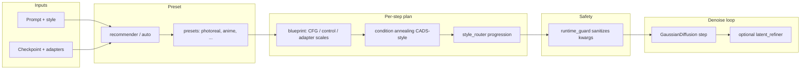

# Holy Grail adaptive sampling (how it fits together)

**Holy Grail** is SDX's name for **per-step inference policy**: CFG strength, ControlNet scale, adapter scales, and optional latent refinement change across denoise steps instead of staying fixed.

Implementation code lives under [`diffusion/sampling_extras/`](../diffusion/sampling_extras/) (import path `diffusion.sampling_extras`; `diffusion.holy_grail` re-exports for compatibility). Runtime wiring is in `diffusion/gaussian_diffusion.py` and `sample.py` (`--holy-grail-preset`, related flags).

## End-to-end flow

## Design intent

| Idea | Role |
|------|------|
| **Presets + auto** | Pick a schedule bundle from prompt/style heuristics (`presets.py`, `recommender.py`). |
| **Blueprint** | Single struct per step: `cfg_scale`, `control_scale`, `adapter_scale`, refine strength (`blueprint.py`). |
| **Guidance fusion** | Modulate CFG from attention / signal proxies (`guidance_fusion.py`). |
| **Condition annealing** | CADS-like decay of condition strength late in sampling (`condition_annealing.py`). |
| **Latent refiner** | Light post-step clamp / detail pass (`latent_refiner.py`). |
| **Runtime guard** | Clamp nonsense CLI combos before they hit the loop (`runtime_guard.py`). |

## Further reading

- [`diffusion/sampling_extras/README.md`](../diffusion/sampling_extras/README.md) — module list and CLI starter.
- [`diffusion/holy_grail/README.md`](../diffusion/holy_grail/README.md) — compatibility entry point.
