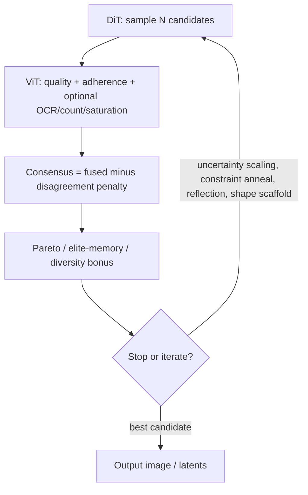

# TCIS — Tri-Consensus Iterative Synthesis


**TCIS (Tri-Consensus Iterative Synthesis)** is a **control layer** on top of SDX: DiT (and optional AR behavior from the checkpoint) **proposes** candidates; a **ViT quality head** **critiques** them; the stack **ranks** with disagreement-aware scoring and can **iterate** with stricter guidance or prompt updates.

It does **not** replace DiT or `vit_quality` training; it orchestrates them for hard prompts and test-time scaling.

## Closed-loop flow



## Consensus sketch

For each candidate, SDX uses a **disagreement penalty** so "pretty but wrong prompt" does not automatically win:

- `fused = wq * quality + wa * adherence`
- `consensus = fused - lambda * abs(quality - adherence)`

Exact weights and extra metrics are CLI flags on the hybrid tool.

## Where to run it

```bash
python -m scripts.tools hybrid_dit_vit_generate --help
```

Shape / scaffold helpers: `utils/prompt/shape_scaffold.py`.

---

## Architecture, flags, and usage
 Tri-Consensus Iterative Synthesis

TCIS is a new model-design layer built on top of the existing SDX stack.  
It is not a replacement for DiT or ViT; it is a control architecture that combines them into a closed-loop generator.

## Why this is different

Most pipelines do one of these:

- generate once and return,
- generate many then rank once.

TCIS does:

1. **Propose**: DiT (with AR behavior from checkpoint) generates multiple candidates.
2. **Critique**: ViT predicts quality and prompt-adherence per candidate.
3. **Consensus**: rank by a disagreement-aware score, not just raw quality.
4. **Self-correct**: if adherence is weak, inject strict guidance and run another round.
5. **Select globally**: choose the best candidate across all iterations.

## Consensus objective

For each candidate:

- `fused = wq * quality + wa * adherence`
- `consensus = fused - lambda * abs(quality - adherence)`

The penalty term prefers candidates where both heads agree, reducing fragile "looks good but wrong prompt" outcomes.

## Where it is implemented

- `scripts/tools/ops/hybrid_dit_vit_generate.py`
  - `--iterations`
  - `--vit-disagreement-penalty`
  - `--consensus-ocr-weight`
  - `--consensus-count-weight`
  - `--consensus-saturation-weight`
  - `--pareto-elite`
  - `--pareto-topk`
  - `--adaptive-num` / `--adaptive-threshold` / `--adaptive-max-num`
  - `--constraint-anneal`
  - `--uncertainty-threshold` / `--uncertainty-extra-iterations` / `--uncertainty-max-iterations`
  - `--elite-memory-size` / `--diversity-bonus-weight`
  - `--reflection-update`
  - `--self-correct-prompt`
  - `--self-correct-threshold`
  - `--auto-shape-scaffold`
  - `--shape-scaffold-strength`
  - `--shape-max-actors`
- `utils/prompt/shape_scaffold.py`
  - prompt -> shape-first scene blueprint synthesis
  - compiles blueprint into positive/negative controls

## Quick usage

```bash
python -m scripts.tools hybrid_dit_vit_generate \
  --ckpt results/run/best.pt \
  --vit-ckpt vq/runs/best.pt \
  --prompt "hero character, full body, cinematic rain, readable title text" \
  --out outputs/tcis.png \
  --num 8 \
  --iterations 3 \
  --auto-shape-scaffold \
  --pareto-elite \
  --adaptive-num \
  --reflection-update \
  --self-correct-prompt \
  --pick-best combo_hq
```

## Expected gains

- Better prompt faithfulness on hard prompts.
- More stable quality under seed variation.
- Cleaner "best of N" decisions due to disagreement-aware ranking.
- Improved constraint handling via OCR/count/saturation-aware consensus.
- More robust elite selection with Pareto-front filtering.
- Better failure recovery via uncertainty-triggered test-time scaling.
- Less mode collapse in iterative loops through elite-memory diversity bonuses.

## Next upgrades

- Add branch-level prompt search (2-3 prompt branches per iteration with budget cap).
- Add richer diversity embeddings (CLIP-image novelty instead of color-signature novelty).
- Distill TCIS choices into a train-time preference set for DPO.
