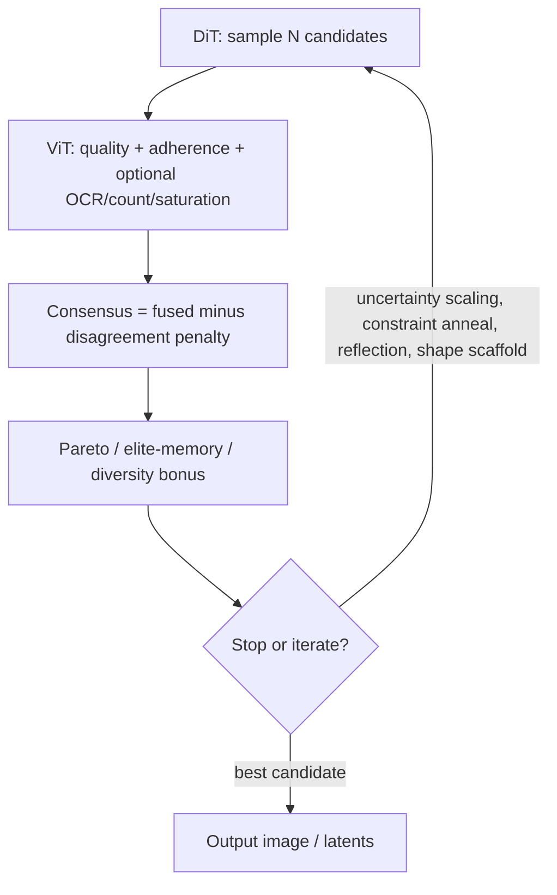

# TCIS hybrid loop (how it fits together)

**TCIS (Tri-Consensus Iterative Synthesis)** is a **control layer** on top of SDX: DiT (and optional AR behavior from the checkpoint) **proposes** candidates; a **ViT quality head** **critiques** them; the stack **ranks** with disagreement-aware scoring and can **iterate** with stricter guidance or prompt updates.

It does **not** replace DiT or `vit_quality` training; it orchestrates them for hard prompts and test-time scaling.

## Closed-loop flow



## Consensus sketch

For each candidate, SDX uses a **disagreement penalty** so "pretty but wrong prompt" does not automatically win:

- `fused = wq * quality + wa * adherence`
- `consensus = fused - lambda * abs(quality - adherence)`

Exact weights and extra metrics are CLI flags on the hybrid tool.

## Where to run it

```bash
python -m scripts.tools hybrid_dit_vit_generate --help
```

Shape / scaffold helpers: `utils/prompt/shape_scaffold.py`.

## Further reading

- [`docs/TCIS_MODEL.md`](TCIS_MODEL.md) — architecture notes, flag cheat sheet, and design rationale.
