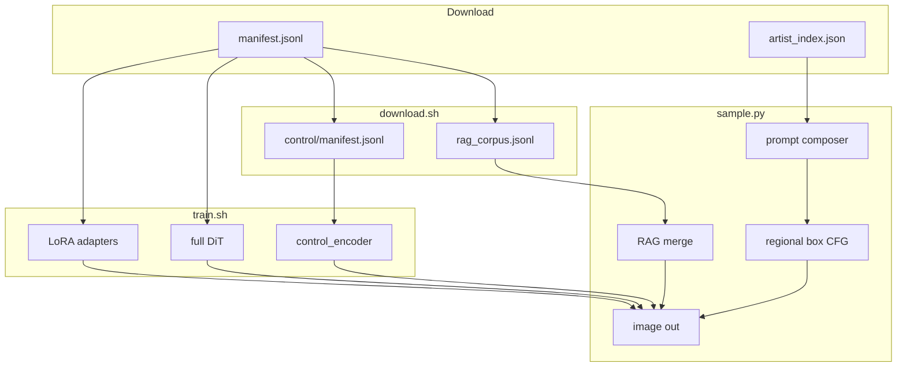

# SDX image generation pipeline (RunPod)

End-to-end flow for **image gen only** (video pipeline excluded). Everything below
is wired and tested against `train.py` / `sample.py`.

**Run everything in one shot:**

```bash
bash runpod/run.sh
```

See `python scripts/run_pipeline.py --help` for `--skip-*`, `--from`, and `--only`.

## 1. Download + index

```bash
bash runpod/setup.sh
bash runpod/download.sh              # models + scrape + enrich/RAG/control
```

| Output | Purpose |
|--------|---------|
| `enriched/manifest.jsonl` | Full T2I / LoRA training (VLM+RAG+LLM captions when `SDX_PROMPT_RESEARCH=1`) |
| `artist_index.json` | `@AnyArtist` resolution at inference |
| `rag_corpus.jsonl` | Local RAG at inference (`sample.py --local-rag-jsonl`) |
| `control/manifest.jsonl` | ControlNet training — uses **enriched** captions + canny pairs |

## 2. Training modes

```bash
# Full model (default)
bash runpod/train.sh

# LoRA style/character adapter (~few MB, fast)
SDX_TRAIN_MODE=lora SDX_INIT_CKPT=/path/to/base.pt bash runpod/train.sh

# In-DiT ControlNet encoder (canny/edge conditioning)
SDX_TRAIN_MODE=control bash runpod/train.sh

# LoRA + control encoder together
SDX_TRAIN_MODE=lora_control SDX_INIT_CKPT=/path/to/control_base.pt bash runpod/train.sh
```

**Note:** `--control-cond-dim 1` must match at init and resume. Use a checkpoint
trained with control enabled for `lora_control`, or train `control` first.

## 3. RAG search (inference)

RAG does **not** run during training. It enriches prompts at sample time:

1. `build_rag_corpus.py` indexes caption/tag text from your dataset.
2. `sample.py --local-rag-jsonl` runs TF-IDF retrieval and prepends top facts.

```bash
python sample.py \
  --ckpt $SDX_RESULTS/best.pt \
  --prompt "1girl in a sunflower field, detailed" \
  --local-rag-jsonl $SDX_DATA/rag_corpus.jsonl \
  --local-rag-top-k 8
```

For multimodal enrichment (reference image → novel prompt ideas):

```bash
python sample.py --creative-rag --creative-rag-image ref.png --prompt "..."
```

## 4. Ideogram box layout (inference)

Regional composition without retraining. JSON boxes + per-region prompts:

```bash
python sample.py \
  --ckpt $SDX_RESULTS/best.pt \
  --prompt "cohesive illustration" \
  --box-layout examples/box_layout.example.json \
  --box-layout-mode regional_cfg
```

Each region: `name`, `box` [x0,y0,x1,y1] normalized 0–1, `prompt`, optional `priority`.

**Training bridge:** use `[layout] name: prompt | ...` in manifest captions
(`--region-caption-mode append`) so T5 learns labeled regions. Box JSON itself
is inference-only spatial CFG.

## 5. Draw + label (inference)

**Draw:** stroke arrays inside a region (`strokes` in box JSON) bias masks and
can drive scribble ControlNet when no `--control-image` is set.

```bash
python sample.py \
  --box-layout examples/box_layout_sketch.example.json \
  --box-layout-mode regional_cfg \
  --prompt "masterpiece illustration"
```

**Label:** structured subject labels via `--prompt-layout`:

```bash
python sample.py \
  --prompt-layout examples/prompt_layout.example.json \
  --t5-layout-encode blocks
```

Training: put `prompt_layout` inline in JSONL rows for multi-subject CLIP/T5 sections.

## 6. Prompt composer (`@artist` + `+category`)

```bash
python sample.py --prompt "@wlop +character: fox girl +building: cathedral +car: red sports car"
```

See `runpod/README.md` for full `+category` list.

## 7. Sampling cheat sheet

```bash
# All-in-one RunPod helper
SDX_PROMPT="@kantoku +character: 1girl, sunset" \
SDX_BOX_LAYOUT=examples/box_layout_sketch.example.json \
bash runpod/sample.sh

# LoRA + control
python sample.py --ckpt best.pt --lora best_lora.pt:0.9 \
  --control-image controls/canny/abc.png --control-type canny \
  --prompt "1girl, detailed"
```

## Architecture map



## What is NOT in image training (by design)

| Feature | Training | Inference |
|---------|----------|-----------|
| RAG fact merge | — | `--local-rag-jsonl` |
| Box regional CFG | text `[layout]` only | `--box-layout` |
| Sketch strokes | — | box JSON `strokes` |
| Video model | excluded | `pipelines/video/` |
